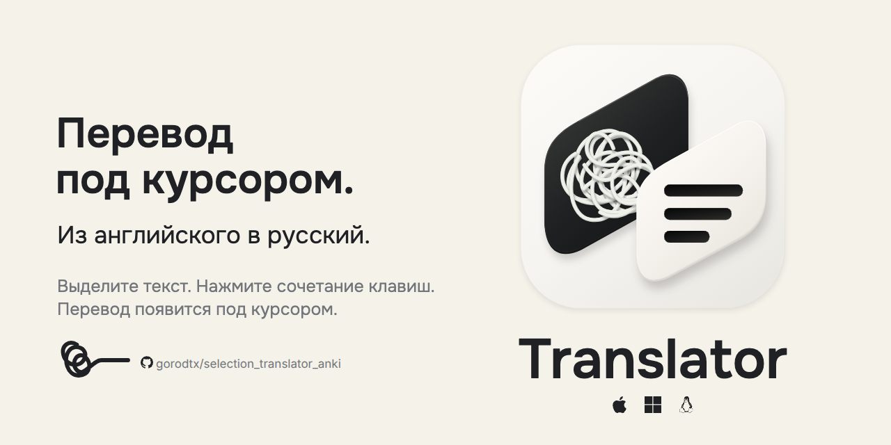
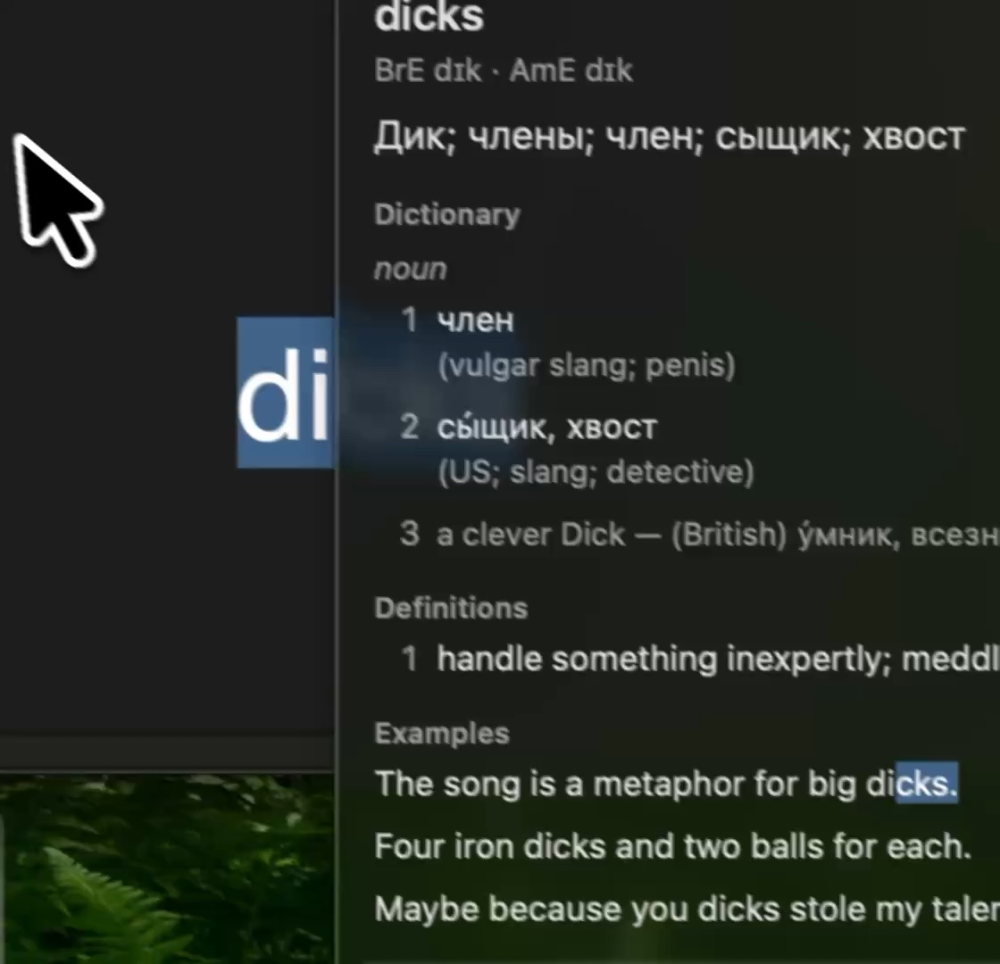
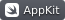

  <a href="https://github.com/gorodtx/selection_translator_anki/releases/download/v0.3.1-rc.2/Translator-0.3.1-macos-arm64.dmg"><strong>🍎 Скачать для Mac</strong></a> ·
  <a href="https://github.com/gorodtx/selection_translator_anki/tree/gnome#русский"><strong>🐧 GNOME / Arch Linux</strong></a> ·
  <a href="https://github.com/gorodtx/selection_translator_anki/issues">💬 Обратная связь</a>

Apple Silicon · macOS 26+ · DMG 27,40 МБ

Выделите английский текст и вызовите Translator сочетанием клавиш. Русский перевод появится под курсором; история и добавление в Anki — рядом.

## ▶ Демонстрация

[Смотреть демо · 44 секунды](site/assets/translator-demo.mp4)

## 🛠 Технологии

macOS и Linux · Python backend · SQLite · Anki. [Код и разработка](docs/development.md).

## 📚 Офлайн-базы

| База | Содержимое |
| --- | --- |
| [`primary.sqlite3`](https://github.com/gorodtx/selection_translator_anki/releases/download/db-a6f07d1e1c28/primary.sqlite3) | Основные англо-русские примеры и лексикон |
| [`fallback.sqlite3`](https://github.com/gorodtx/selection_translator_anki/releases/download/db-a6f07d1e1c28/fallback.sqlite3) | Дополнительные англо-русские примеры |
| [`definitions_pack.sqlite3`](https://github.com/gorodtx/selection_translator_anki/releases/download/db-a6f07d1e1c28/definitions_pack.sqlite3) | Английские определения |

Базы скачиваются из настроек приложения и хранятся локально; с каждым обновлением приложения повторная загрузка не нужна. [Готовый комплект и SHA256](https://github.com/gorodtx/selection_translator_anki/releases/tag/db-a6f07d1e1c28).

---

© 2026 Translator contributors · [Лицензия MIT](LICENSE)
