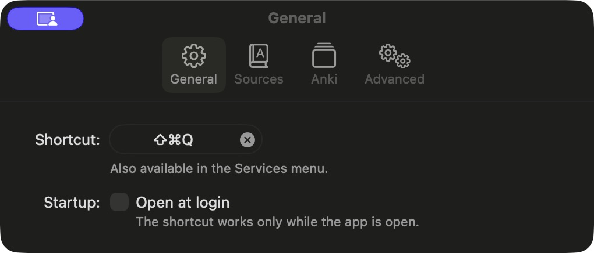
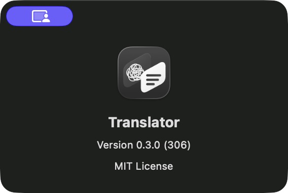
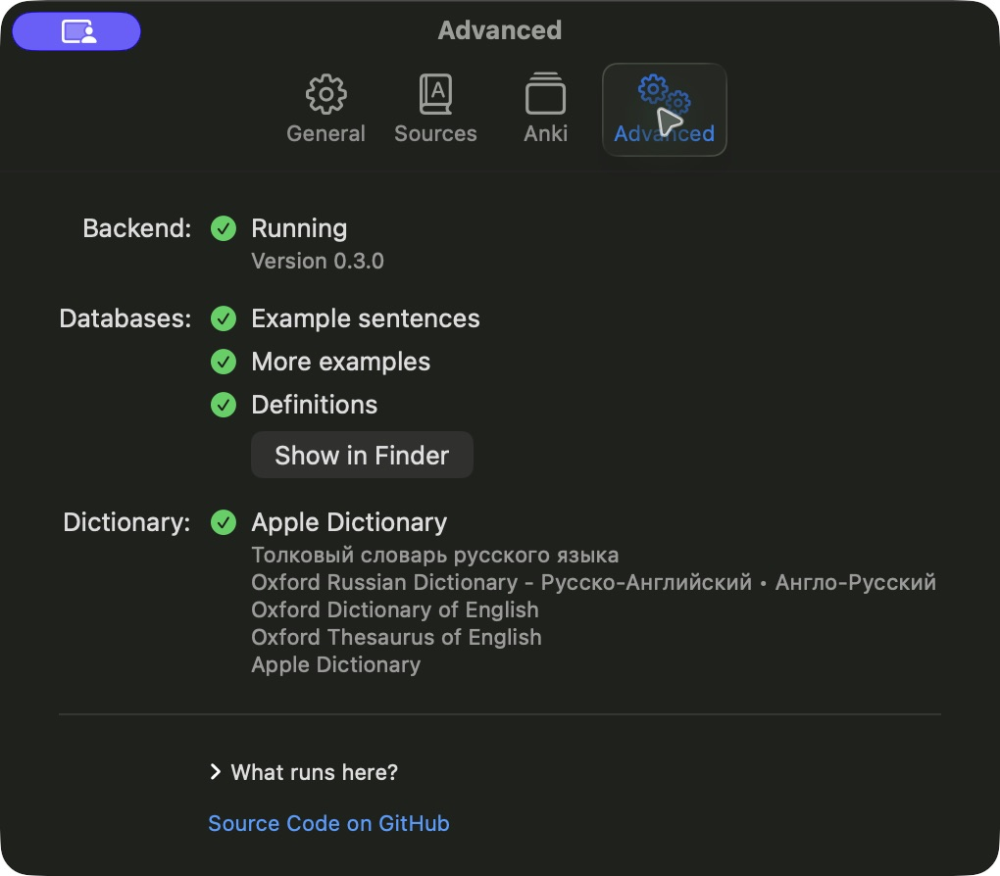

# Translator Mono — журнал внедрения

История дополняется; PASS требует измерения на соответствующем уровне. Экспорт, сборка, установленное приложение, browser, upload, push и CI не подменяют друг друга. Epic — [EPIC-INTEGRATION.md](EPIC-INTEGRATION.md).

## B001 — 05.10.2026, запуск и владение

База: `/Users/den/Documents/dev/selection_translator_anki`, `mac`, HEAD `6931540ad76a6ab7a5abe70d49c513e93e881d36`. Dirty подготовка сохранена. Прочитаны текущие AGENTS, четыре применимых навыка, CONTINUE, независимая история и handoff. Final manifest: 12/12 файлов совпали по SHA256/bytes и с источниками. Повторная генерация не запускалась.

Run `run_9d43c4e32803`. Ровно три самостоятельные сессии Orca:

| Роль | Terminal handle | Native ID и восстановление | Состояние |
|---|---|---|---|
| Translator-Brand-GitHub | `term_d2396908-a619-4d51-8870-c7db61de6df1` | `01a1030e-0fcc-7430-8c9d-070c3f569b23`, проверен собственным `CODEX_THREAD_ID`; `codex resume 01a1030e-0fcc-7430-8c9d-070c3f569b23` из cwd проекта | Coordinator, README/design/GitHub/Git |
| Translator-Brand-macOS | `term_efe4aa70-1e38-42f6-8007-cd19a98aa55c` | `01a10c36-041c-73d3-b4a5-b96090075d82`; fresh ID подтверждён собственным индексированным сообщением сессии; `codex resume 01a10c36-041c-73d3-b4a5-b96090075d82` из cwd проекта | task `task_da34bd59e066`, dispatch `ctx_55a74ec40a6c`, turn_started и ACCEPTED |
| Translator-Brand-Web | `term_ff8490f9-add0-4475-b0a3-7b058e318f08` | Ранее сохранённый `01a10317-15e0-7c12-a4ac-dcfddc86ce9d`; live ID повторно проверяется владельцем | task `task_431645af094f`, dispatch `ctx_3f3fce8391c7`, turn_started и ACCEPTED |

До resume проверить, что native ID не выполняется в другой вкладке/приложении. Заблокированная попытка старого macOS ID завершилась в shell; новый native ID отдельный. Модель macOS фактически показана TUI как GPT-6.1-Sol xhigh, YOLO mode; общие launcher permissions не менялись. Существующие Root/Web TUI также показывают GPT-6.1-Sol xhigh. Subagents/Agent/workflow/--bg не использовались.

Owned paths каждой роли — handoff; macOS/Web не используют index/commit. Root — единственный владелец общего журнала и редактор Penpot. Desktop GUI lock первоначально у Root для Social preview; остальные выполняют source/build или свои browser checks. Пользовательский лимит 40% daily сохранён; точный daily meter этой сессии недоступен, процент не выдумывается. Большие DB/VM проверки не повторяются.

## B002 — GitHub и исходники

`forge-access remote` подтвердил `github.com/gorodtx/selection_translator_anki.git` HTTPS. `forge-access auth github`: аккаунт `gorodtx`, user HTTP200, push ещё не проверен. Metadata repo GET: admin/push=true, default branch mac, homepage пустой. `gorodtx/gorodtx` GET404; полный доступный список аккаунта содержит 12 репозиториев, profile match отсутствует. Карточка профиля — NOT_DONE с зависимостью от существующего profile repository; новый репозиторий не создаётся автоматически.

README локально использует final PNG и принятую русскую подпись. Platform/download/ad-hoc ограничения сохранены. Remote render, общий push и CI ещё не проверены.

Penpot Root doctor: PASS, pluginConnected=true и ожидаемые file/page IDs. Более поздние doctor/overview соседей: `fetch failed`, UNKNOWN для их вызова. Изменения runtime/autostart не выполнялись.

## B003 — 05.10.2026, GitHub Social preview

Через существующий Firefox открыт отдельный tab целевых Settings, подтверждён аккаунт `gorodtx`. Выбран `design/final/github-repo-card.png` через штатный file picker. AX нажатие пункта upload само по себе не открыло picker; keyboard Tab/Return на реально выбранном пункте сработал. Coordinate action вернул `noWindowsAvailable`, сохранён как непройденная попытка, обходных UI технологий не использовалось. PNG1280×640/104880 bytes выбран по точному пути. После upload карта лично просмотрена в Settings.

Первый screenshot после reload не показал картинку: [наблюдение](</Users/den/Documents/dev/translator-evidence/2026-10-05/brand/github/social-preview-after-reload.png>). Оно не выдано за положительную проверку, причина пустого отображения отдельно не установлена. Независимый GraphQL read после reload подтвердил `usesCustomOpenGraphImage=true` и сохранённый [public image URL](https://repository-images.githubusercontent.com/1123960100/5166e0fa-be57-4ed3-8f02-de94d7fb5ef1). Фактический CDN GET: HTTP200, image/png, 104880 bytes; SHA256 `78e5d0c85926e507ee4ce7fa808111e3acda6db5c2d3db4836b7f60630af2deb` точно совпал с утверждённым источником. [Скачанный и лично просмотренный PNG](</Users/den/Documents/dev/translator-evidence/2026-10-05/brand/github/published-social-preview.png>), [saved metadata](</Users/den/Documents/dev/translator-evidence/2026-10-05/brand/github/saved-open-graph.json>), [проверка hashes](integration/github-assets.json).

Upload/save/persistence/actual image: PASS. Кеши и распространение в Telegram/других внешних платформах: NOT_DONE. macOS получил GUI lock для установки и приёмки. Общий push/CI пока NOT_DONE.

## B004 — выбор Git scope

Корневая `design/` содержит 231 файл/62 144 381 bytes на момент inventory. Подготовленные архивы сохраняются локально и исключены через `design/.gitignore`; ещё исключена точная дублирующая menu-bar `.penpot` копия. Канонический `.penpot`, геометрия, генераторы/codec, optical exports, reference и final assets сохраняются в Git. По именам private account/compose/cookies/credentials/token/.env совпадений нет; это ограниченный inventory, не заявление о всеобщем secret audit. Оба архива не применяются к runtime сборке и не входят в DMG.

## B005 — 05.10.2026, первый commit и проверка Web

Нормальный commit `db03fd9f9540eebcb6dadeafc4cb8c094337dcae` — `feat: adopt the approved Translator Mono identity`: 231 поимённо выбранный файл GitHub/design, без native/Web production paths. Первый gate остановил commit из-за ссылки на ещё не созданный native report; ожидаемый путь записан обычным текстом, normal commit повторён без bypass. Ruff, Python format и mypy прошли. [Первый FAIL](</Users/den/Documents/dev/translator-evidence/2026-10-05/brand/github/commit-design.log>), [повторный PASS](</Users/den/Documents/dev/translator-evidence/2026-10-05/brand/github/commit-design-retry.log>). База `6931540` остаётся предком HEAD.

Web returned `worker_done/succeeded` для локального scope, retained `ctx_3f3fce8391c7` без process action. Его native ID `01a10317-15e0-7c12-a4ac-dcfddc86ce9d` подтверждён независимым Orca search по собственному прежнему сообщению, title/cwd/branch; это исторический native mapping, отдельный live UUID пока не прочитан. Exact resume из cwd проекта: `codex resume '01a10317-15e0-7c12-a4ac-dcfddc86ce9d'`, только после остановки существующей сессии.

Root независимо перепроверил 13/13 production/report SHA и 6/6 screenshot SHA по manifest `a2521fd7526d882c6d8ee959ef9409446742fee3178ebcb2ca432a2b02d7d33b`, повторил оба `node --check`, просмотрел исходный diff и лично [desktop light](</Users/den/Documents/dev/translator-evidence/2026-10-05/brand-web/desktop-light.png>), [mobile390 dark/subpath](</Users/den/Documents/dev/translator-evidence/2026-10-05/brand-web/mobile-dark-subpath.png>) и [keyboard focus](</Users/den/Documents/dev/translator-evidence/2026-10-05/brand-web/keyboard-focus.png>). Исходный SF/system, blue-neutral, одна колонка и реальный пустой video slot сохранены. Browser/HTTP execution принадлежит Web и подтверждается его logs; Root не выдаёт чужой запуск за свой. Chromium PASS, Safari/WebKit NOT_DONE, видео ожидается, public deploy NOT_DONE. Полный отчёт: [web.md](integration/web.md).

Native build305 установлен с восстановимым backup304. Root прочитал resource-loading/packing diff; все три representations имеют 28×18 pt и `isTemplate`, оба builders копируют MenuBar до codesign. Меню/Settings/grant ещё проверяются владельцем: пользователь ответил «Settings открыты», ответ передан напрямую macOS в 13:38 UTC. Старый ad-hoc grant стал false — сохранение grants не объявляется PASS, TCC reset/auto-grant не выполняются.

## B006 — 05.10.2026, Web/native commits и независимое чтение bundle

`c2cd5c6` — `feat: integrate approved Translator Mono web branding`, ровно13 paths с manifest Web. `bb8ed09bdbe407e6b159abaaf79d84127dbedd06` — `feat: integrate Translator Mono native icons`, ровно12 frozen native paths, открытый native report не включён. Каждый normal commit прошёл Ruff/format/mypy; native дополнительно Swift release build94,43s. [Web gate log](</Users/den/Documents/dev/translator-evidence/2026-10-05/brand/github/commit-web.log>), [native gate log](</Users/den/Documents/dev/translator-evidence/2026-10-05/brand/github/commit-native.log>). Shared index пуст после commit; остальные changes — только журналы/отчёт.

Root проверил12/12 frozen native source hashes, strict installed codesign EXIT0, десять image representations ICNS и все три MenuBar PNG installed=source=approved. Реальный bundle305 сохраняет ID/LSUIElement, корневой `design/` в Resources отсутствует. [Фактический read-only результат](</Users/den/Documents/dev/translator-evidence/2026-10-05/brand/github/installed-resource-review.json>). Первый временный harness ошибочно считал `TOC ` image representation; затем исправлены счётчик и опечатка синтаксиса временного скрипта. Product/source для прохождения проверки не менялись.

Root лично просмотрел native [Finder](</Users/den/Documents/dev/translator-evidence/2026-10-05/brand/native/installed305-finder.png>), [Get Info](</Users/den/Documents/dev/translator-evidence/2026-10-05/brand/native/installed305-get-info.png>) и [local DMG](</Users/den/Documents/dev/translator-evidence/2026-10-05/brand/native/local305-dmg-finder.png>). Menu screenshots и actual native translation/history пока UNKNOWN: после ручного открытия Settings три поддерживаемых CUA attempts владельца всё ещё timeout, перезапуск приложения/подписи/инструментов не выполняется. Авторитетный false измерен собственным таймером приложения; Root отправил пользователю отдельную проверку ручного доступа, ⇧⌘T и History, ответ ожидается.

Повторный actual Settings screenshot GitHub теперь показывает сохранённую Social card в нижней части viewport: [UI capture](</Users/den/Documents/dev/translator-evidence/2026-10-05/brand/github/social-preview-saved-ui.png>). Полный CDN PNG проверен отдельно. Native Firefox coordinate scroll вернул `noWindowsAvailable`, keyboard Next не переместил viewport; это ограничения инструмента, не скрытые PASS. Повторная загрузка изображения не выполнялась.

## B007 — 05.10.2026, delivery checkpoint

Явный `forge-access push --transport token --ref HEAD:refs/heads/mac` dry-run завершился EXIT0 для source SHA `bb8ed09bdbe407e6b159abaaf79d84127dbedd06`: [receipt](</Users/den/Documents/dev/translator-evidence/2026-10-05/brand/github/push-dry-run.log>). Это ещё не actual branch acceptance. Последующий `--execute` запущен с теми же transport/ref; final receipt ожидается. Проверки выполняются штатным shared hook в отдельном checkout; их не отключали ради скорости. Пока этот Git процесс активен, index и новые commits не используются.

В 13:52 UTC native owner заморозил отчёт [macos.md](integration/macos.md): 17591bytes/SHA `1f0d045d0d284de27dab8628b7319241ba83cc853f45837044d7b3015ad658c4`, Root совпадение проверил. Сессия остаётся live, task `task_da34bd59e066` не закрыта, `worker_done` не прислан. Замороженный checkpoint содержит открытые B06/B08 и pending пользовательский ответ; freeze не является native UI PASS.

В 13:55 UTC Root выполнил read-only `defaults read com.translator.desktop accessibilityTrusted` → `0`, `hotKey` → `17:768`. Это собственное сохранённое состояние приложения, обновляемое его Settings timer; Root не выдал его за самостоятельный вызов AX API. Native PID/identity не менялись агентом. Пользовательский ответ на перевод/History пока отсутствует.

Повторный независимый Orca search нашёл актуальное собственное сообщение Web 05.10.2026 13:35:31 UTC с тем же native ID `01a10317-15e0-7c12-a4ac-dcfddc86ce9d`, cwd и branch. Таким образом mapping подтверждён текущим provider журналом этого захода, а не только старой заметкой. Дубликат сессии не запускался. Root/macOS/Web registry и точные resume commands сохранены выше; перед resume сначала проверить отсутствие live копии ID.

## B008 — 05.10.2026, source push, опубликованный README и CI

В14:06:37 UTC `forge-access ... --transport token --ref HEAD:refs/heads/mac --execute` завершился EXIT0, remote SHA ровно `bb8ed09bdbe407e6b159abaaf79d84127dbedd06`, `verified=true`: [фактический receipt](</Users/den/Documents/dev/translator-evidence/2026-10-05/brand/github/push-source.log>). Source push PASS. Общие hooks не отключались; большие БД/публичные release assets не отправлялись этой операцией.

[CI source commit](https://github.com/gorodtx/selection_translator_anki/actions/runs/37322053249) завершился `completed/success`: lint/types/tests, linux engine parity, swift sidecar, swiftui shell и app bundle —5success; notarize —skipped. Проверен именно headSha `bb8ed09…`. Bundle job отдельно прошёл runtime smoke, строгую подпись после tests, DMG contract и upload CI artifact. CI artifact не объявляется новым GitHub release. Следующий evidence commit требует собственной remote/CI проверки; её финальный receipt сохраняется вне Git после получения фактического SHA, чтобы не создавать бесконечный цикл документационного самоописания.

[Опубликованный README](https://github.com/gorodtx/selection_translator_anki/blob/mac/README.md): API blob SHA `3457bb3575deb6dff7c3ef75be3fe999bd43238d`. Actual server-rendered HTML содержит утверждённый img80×80 с alt и подписью; [выбранные image tags](</Users/den/Documents/dev/translator-evidence/2026-10-05/brand/github/published-readme-image-tags.json>). Его **реальный src** `/gorodtx/selection_translator_anki/raw/mac/design/final/translator-logo-1024.png` после redirect вернул HTTP200/image/png/213345bytes и SHA `f03ec4613c4c05c86ddde54441b46bec8e016519c27a362442b24979d9ffbcf7`, совпавший с final export. [Полученный PNG](</Users/den/Documents/dev/translator-evidence/2026-10-05/brand/github/published-readme-exact-src.png>) лично просмотрен Root. Published HTML/assets PASS; browser screenshot UNKNOWN. Native CUA navigation сначала отставала, clipboard read timeout, затем AX title/URL показали README; actual capture уже показал постороннюю текущую вкладку после смены desktop. Посторонний снимок не выдан за README evidence, перенесён в recoverable Trash, в Git не включён. Дальнейший desktop input остановлен, чтобы не мешать пользователю.

В14:16 UTC native owner получил явное решение **keep dispatch waiting**; idle TUI projection не трактуется как смерть/завершение сессии. Для бюджета40% он ожидает фактический grant/translation/History outcome через один blocking ask, без активных model polling циклов, новых sessions, signing и тестов. Пользовательский вопрос остаётся pending. B06/B08 открыты и весь epic не отмечен завершённым.

## B009 — 05.10.2026, финальный CI и новый native feedback

Root прочитал текущий Git: `mac`, HEAD `4236912364798b1358edd0ae84964e17f866c9ec`, до этого дополнения worktree чист. Actual push evidence commit ранее завершился14:28:46 UTC с точным remote SHA. Его [CI run37325030574](https://github.com/gorodtx/selection_translator_anki/actions/runs/37325030574) теперь `completed/success`, проверен exact headSha: lint/types/tests, swift sidecar, linux engine parity, swiftui shell, app bundle success; notarize skipped. Watch process завершился EXIT0. Результат сохранён отдельно в [final-delivery.json](</Users/den/Documents/dev/translator-evidence/2026-10-05/brand/github/final-delivery.json>), чтобы journal commit не создавал бесконечный цикл самоописания.

Root лично просмотрел [пользовательский снимок включённого Translator](</Users/den/Documents/dev/translator-evidence/2026-10-05/brand/github/user-305-accessibility-enabled.png>) и [одновременно оставшееся предупреждение в приложении](</Users/den/Documents/dev/translator-evidence/2026-10-05/brand/github/user-305-accessibility-warning.png>). Оригинальные PNG скопированы без изменения bytes; [source paths/размеры/SHA](</Users/den/Documents/dev/translator-evidence/2026-10-05/brand/github/user-305-feedback.json>). Первая попытка чтения до compaction дала усечённый tool output и не считалась просмотром; повторное индивидуальное чтение каждого изображения успешно. Toggle enabled PASS как факт снимка; current process authoritative grant UNKNOWN по этим снимкам; предупреждение Accessibility FAIL; обычный перевод/History UNKNOWN.

Пользователь также отверг иконку. В кадре видна квадратная AppIcon системной строки, очень тёмная и с плохим различением светлых деталей. Root лично просмотрел approved light/dark128 PNG: светлая передняя панель и клубок присутствуют в обоих. Их отличие от системного отображения передано native owner; причины пока UNKNOWN. Menu-bar icon в новых снимках отсутствует, его вид не объявляется проверенным. B05 визуальная приёмка переоткрыта, исходные approved exports не перезаписаны.

В14:39:29 UTC blocking ask native owner `msg_30289e89282b` получил ответ `msg_78b13e98944f` с точными фактами/путями и запросом минимального измеренного диагноза и ремонта, без blind TCC reset, trust bypass, нового signing/restart ради наблюдения или широкой очистки. Владелец macOS продолжает работу в прежней полной сессии; root владеет Git index, desktop input не выполняется. Новый пользовательский steering дополняет epic, общий результат ещё не готов.

Позднее пользователь явно уточнил: отвергнута квадратная **AppIcon**, не знак menu bar. Root передал уточнение владельцу в том же ходу; изменения утверждённой линии не запрашиваются. Native owner отдельно измерил прежние exact PID/strict signature/source hashes и false собственной trust настройки; hotKey теперь `12:768`, отличается от исторического `17:768`. Это peer report, не собственный Root запуск; пользовательскую настройку shortcut не перезаписываем. Команда discovery `orca orchestration wait --help` вернула Unknown command, не запустила ожидание или worker; неизвестный API не применяется. Первый patch текущего README отклонён из-за пустого hunk, исправленный patch применён без изменений native source.

## B010 — 05.10.2026, Root подтвердил источник permission mismatch

В14:47 UTC `uv run --no-sync python` открыл system TCC SQLite только mode=ro и выбрал только `kTCCServiceAccessibility/com.translator.desktop`: auth_value2, csreq40bytes, CDHash build304 `0c68ccaa11c25394a315a7f36ebe4bced537e088`. `ps -p37501 -o pid=,comm=` подтвердил exact live installed path. `codesign -d -r- /Applications/Translator.app` вернул designated305 `5dae68c3706841f4366dcf6d820e0ece6063a230`; normal `codesign --verify -R` проверка старого literal requirement →EXIT3/does not satisfy, текущего →EXIT0. Независимая проверка **сходится** с измерением native owner. [Целевой read-only artifact](</Users/den/Documents/dev/translator-evidence/2026-10-05/brand/github/independent-tcc305-review.json>). Первый harness пропустил обязательный `=` перед literal requirement и получил invalid specification; исходный FAIL сохранён, синтаксис исправлен, продукт и разрешения для прохождения проверки не менялись.

Таким образом системный тумблер авторизует старую304подпись, не текущую305. App warning не является просто застывшей UI настройкой. Root передал проверку напрямую native owner `msg_16bfa33d6917`, ранее указал порядок `msg_82f24c9bb536`: сначала возможный AppIcon repair/финальная подпись, затем один точный reauthorization сценарий. Нельзя повторять просьбы переключить старую строку или признавать её достаточным proof. Пользовательский shortcut12:768 сохраняется; native сообщил его фактическое отображение ⇧⌘Q, исходная инструкция ⇧⌘T устарела.

## B011 — 05.10.2026, AppIcon render воспроизведён

Root лично просмотрел [Icon Services32pt@2x](</Users/den/Documents/dev/translator-evidence/2026-10-05/brand/native/workspace305-32pt-2x.png>) и [тот же рисунок в Aqua context](</Users/den/Documents/dev/translator-evidence/2026-10-05/brand/native/workspace305-32pt-2x-NSAppearanceNameAqua.png>). Оба совпадают по видимой проблеме с пользовательским кадром: тёмный рельеф вместо светлых панелей/клубка. Прочитан [native diagnostic output](</Users/den/Documents/dev/translator-evidence/2026-10-05/brand/native/native-icon-service-appearances.txt>): current installed path выбран, две rollback copies зарегистрированы, но не выбраны; workspace.isTemplate=false/32 Icon Services reps, directICNS10 reps. Это запуск владельца плюс личный Root просмотр, не выдаётся за собственный Root AppKit harness.

Root отдельно read-only `defaults read -g AppleIconAppearanceTheme` и `AppleIconAppearanceTintColor` подтвердил ClearDark/Graphite. Системные настройки и caches не изменялись. Native source и MenuBar byte hashes остаются прежними. Root согласовал поддерживаемый app-owned appearance resource repair `msg_a4b432c6eceb`, сохраняя геометрию и ICNS fallback; workflow resource scope узко расширен на `.github/workflows/macos-icon-assets.yml`. Source plan проверяется по Apple sample/schema; production edit и compiler PASS пока не заявлены. CI source/evidence прежнего SHA остаётся зелёным, но не является приёмкой будущего исправления. Требования и результаты дописаны в epic.

## B012 — 05.10.2026, resource contract и source identity

Root прочитал официальный Apple sample `.icon` schema в [apple-landmarks-icon.json](</Users/den/Documents/dev/translator-evidence/2026-10-05/brand/native/apple-landmarks-icon.json>); сам ranged download выполнял native owner, его reported total101898bytes/full336MB archive не скачан. Native подготовка новых `Resources/AppIcon.icon/` и `AppIcon-source.json` началась в owned paths, они ещё не объявлены frozen, compiled или installed. Existing approved ICNS/menu hashes сохраняются.

Root source inspection `scripts/macos_bundle_manifest.py:source_digest` обнаружил, что hash из production Resources включает только AppIcon.icns, а MenuBar PNG/новые appearance inputs остаются вне stable-tree guard. Владельцу немедленно отправлен дефект и узкое расширение ownership на этот Python script для production-resource hashing/contract `msg_f261e6054c48`. Новые B14/B15 добавлены в epic; failure не спрятан successful старым CI. Первые filename searches с zsh wildcard без совпадений были отклонены до чтения; исправленные `rg --files`/точные пути успешно прочитали script и runtime-checker/workflow references. Product/source не менялись этими поисками. Root Git index пока не используется: native files ещё в подготовке.

## B013 — 05.10.2026, проверка frozen compiler source

Native передал сначала9-file readiness, затем добавил согласованный Python guard и обновил freeze до10paths. Root allowlist check остановился на дополнительном `scripts/macos_bundle_manifest.py` до staging: stale9-scope receipt не использован. Следующее readiness `msg_81189227e85a` явно подтвердило10paths/normal Python checks и3изолированных resource mutation checks. Root прочитал Python diff/guard evidence, повторно сверил **10/10 SHA** и **5/5 точных SVG subtrees** с master; [собственный результат](</Users/den/Documents/dev/translator-evidence/2026-10-05/brand/github/probe-source-review.json>). `sh -n`/`git diff --check` PASS, base693 остаётся ancestor. Freeze SHA `4c4032f5fabb460f58fb8c1ad940b5b11040b2365c3fb2564dc52d8c27d7cad9` и guard evidence SHA `dbc31be30cc589f3b30db210e60e7274ed826ea8a7d3b3c79a0b402b4e59fc26` измерены Root. Ошибочный неполный hash в сообщении владельца заменён им точным measured hash, исходная ошибочная строка не считается доказательством.

Source guard теперь включает sorted production AppIcon.icon/CompiledAppIcon и явные MenuBar/source/compiler inputs, исключая корневые design/research/docs; перед подписью сравнивает реальные bundled ICNS/MenuBar bytes. Native3/3 mutations в isolated copies меняли source digest и отклоняли manifest before signing; Root сверил evidence/diff, но этот mutation harness самостоятельно не запускал. Generated Assets.car/source/provenance equality будет проверена на следующем packaging этапе; presence-only guard подготовительный.

Поимённый stage ровно10 implementation paths, отдельный normal commit начат15:04 UTC, журналы/отчёт macOS в него не включены. Ruff/format/mypy уже PASS, Swift release gate ещё идёт: [commit log](</Users/den/Documents/dev/translator-evidence/2026-10-05/brand/github/commit-appearance-probe.log>). Official compiler и actual ClearDark candidate pending; installed305/данные/grants не изменены. Native owner держит source freeze и получит compiler outcome через один ask, чтобы не расходовать budget на повторный polling.

Дополнение: normal commit завершился EXIT0, `252d89c0e3e620ea79c9c1250e7d9e862558508e` — `build: add native app icon appearance compilation`; Ruff/format/mypy и Swift release50,26s PASS. Root начал explicit token dry-run `HEAD:refs/heads/mac`, result пока pending; Git index после commit пуст, dirty только пять журналов/отчётов. Native owner ожидает один blocking ask `msg_0c7b91da9dbb` с exact compiler run/head/artifact, source edits удерживаются. Compiler probe не объявлен установленной новой сборкой.

В15:09:30 UTC explicit token dry-run source252d89c завершился EXIT0: [receipt](</Users/den/Documents/dev/translator-evidence/2026-10-05/brand/github/push-appearance-probe-dry-run.log>). Actual `--execute` запущен с тем же `HEAD:refs/heads/mac`, результат/remote пока pending: [ожидаемый receipt](</Users/den/Documents/dev/translator-evidence/2026-10-05/brand/github/push-appearance-probe.log>). До его завершения index/new commits не используются; source freeze и старый installed305 сохранены. Нормальные gates не обходились ради resource compiler.

В15:15:44 UTC actual token push завершился EXIT0, `remote_sha=source_sha=252d89c0e3e620ea79c9c1250e7d9e862558508e`, verified=true; [actual receipt](</Users/den/Documents/dev/translator-evidence/2026-10-05/brand/github/push-appearance-probe.log>). После этого Root запросил `gh workflow run macos-icon-assets.yml --repo gorodtx/selection_translator_anki --ref mac`. Workflow resource-only/manual, без app launch/sign/release; run headSha и compiler artifact проверяются отдельно. [Dispatch receipt](</Users/den/Documents/dev/translator-evidence/2026-10-05/brand/github/appearance-workflow-dispatch.log>). Source252 push PASS не является ни compiler PASS, ни ClearDark native acceptance.

## B014 — 05.10.2026, official compiler FAIL и узкий следующий ремонт

Manual dispatch EXIT0 создал [run37331657219](https://github.com/gorodtx/selection_translator_anki/actions/runs/37331657219), exact head252d89c, job111835995198. Root прочитал завершённый result `failure`, compile step failure/diagnostic upload success; watch EXIT1. Из exact named artifact скачан [actool.log](</Users/den/Documents/dev/translator-evidence/2026-10-05/brand/native/compiler-252d89c-run37331657219/actool.log>), лично прочитан: `Too many visible groups. This icon exceeds the maximum group limit of four.` Ещё два CoreSVG errors без подробностей. [Xcode provenance](</Users/den/Documents/dev/translator-evidence/2026-10-05/brand/native/compiler-252d89c-run37331657219/xcode-version.txt>) —26.6/build17F113, SDK26.5. Failed run создал partial Assets.car/AppIcon.icns/plist, но не manifest; эти файлы не принимаются и не устанавливаются. Во внешнем mutable receipt один промежуточный hardcoded in_progress snapshot после уже завершённого failure сразу исправлен на actual completed/failure; он не использован как доказательство успеха.

Native owner получил ответ на single ask `msg_0c7b91da9dbb` с exact run/job/head/artifact и ошибкой; делает narrow grouping/import fix с сохранением artwork. Root Git/source freeze после нового handoff проверит заново. B15 дополнен group-limit/error-output требованием; installed305/grants остаются прежними. Неуспешный compiler не спрятан зелёным source push или существованием файла Assets.car.

Root отдельным exact-head API запросом нашёл source push [CI37331381562](https://github.com/gorodtx/selection_translator_anki/actions/runs/37331381562), head252d89c; последующий direct run view подтвердил completed/success, пять jobs success/notarize skipped. Первый `gh run list --workflow macos.yml` показал старые341…runs и не использован как proof текущего CI или его отсутствия. По head_sha query получены оба разных результата: source success и appearance compiler failure.

Native owner публичным NSImage SVG decode с bounded `CORESVG_VERBOSE=1` воспроизвёл `SVGGradient Attribute parse error: gradientTransform`. Найдены пустые `gradientTransform=""` attributes: identity/no-op, но CoreSVG не принимает пустое значение. Root согласовал удаление только этих атрибутов в **производных** inputs, pixel identity и normalized geometry checks обязательны; master/final не меняются. Совместимые front/text/highlights объединяются, итого3groups. Новый retry freeze ещё ожидается. Owner source edits возобновлены только для этого узкого ремонта.

## B015 — 05.10.2026, retry остановлен: обнаружены пустые native buffers

Native передал frozen retry8guard paths/6changed с5/5 matching raster hashes и нулём parser errors. Root прочитал полный diff/check artifact и заметил, что back-panel/front-panel/text имеют **один** SHA несмотря на разную геометрию. Прочитанный public harness [inspect-svg-layers.swift](</Users/den/Documents/dev/translator-evidence/2026-10-05/brand/native/inspect-svg-layers.swift>) хеширует raw CGImage dataProvider, actual dimensions по его log2048×2048; первоначальное описание1024px было logical size. Root независимо посчитал нулевые buffers16/32/64MB: именно32MBнулей дали exact SHA `83ee47245398adee79bd9c0a8bc57b821e92aba10f5f9ade8a5d1fae4d8c4302`, совпавший с тремя слоями. [Собственный counterexample](</Users/den/Documents/dev/translator-evidence/2026-10-05/brand/github/blank-raster-counterexample.json>). Формат native buffer ещё проверяется; равенство пустых outputs **FAIL как positive render proof**.

Root не стал staging/commit/retry компиляции. Отправил находку владельцу сразу `msg_d398d0013cc4`, затем конкретный zero-buffer proof `msg_7eb024a3e1c1`. Новый blocking ask `msg_d2874bc5d74e` отвечен в15:32:34 UTC `msg_ab8b2b085f3f`: прежний readiness отклонён, source repair возобновляется, необходимо подтвердить видимое содержимое/alpha bounds, supported import и source geometry. Прежние проверки/ошибочные equivalence statements сохранены как история с явной коррекцией. Master/final/.icns/menu/installed305/user grants не менялись. Epic дополнен positive-control требованием; model/compiler/export успехи не подменяют рисунок.

## B016 — 05.10.2026, supported PNG imports проверены независимо

Native owner подтвердил actual SVG buffer2048×2048/16bpc/64bpp/33554432bytes и0nonzero у трёх слоёв; прежний render PASS явно отозван в native report. Прямые gradient candidate дали отличие до28/255 и отклонены. Вместо этого пять неизменённых master subtrees сохранены в production AppIcon-layer-sources, экспортированы обычным approved Sharp0.34.5/librsvg renderer в PNG; importer теперь содержит три groups и пять PNG.

Root сверил14/14 frozen SHA, самостоятельно сравнил5/5 XML subtrees с историческим master, подтвердил неизменный ICNS fallback. Затем самостоятельно декодировал PNG: alpha counts245305/95825/196907/31784/3476, bounds и RGBA hashes5/5 совпадают с native controls. Все пять PNG лично просмотрены Root. [Проверка геометрии](</Users/den/Documents/dev/translator-evidence/2026-10-05/brand/github/png-source-review.json>) и [положительные pixel controls](</Users/den/Documents/dev/translator-evidence/2026-10-05/brand/github/png-positive-review.json>). Source guard/provenance охватывают исходные слои. Compiler и native ClearDark appearance ещё не объявлены PASS; installed305, menu bar и grants не изменены. Readiness передан владельцу напрямую,19-path named source delivery выполняет Root.

При named staging контроль первоначально использовал default rename display и получил assertion: Git сворачивает пять переносов SVG в renames. Индекс не содержал посторонних файлов; исправленный собственный check с `--no-renames` подтвердил exact19-path allowlist. Normal commit gates продолжаются, обхода checks нет.

## B017 — 05.10.2026, PNG input source commit

Normal commit `305a485a3f51584f7d5e5a8575952231a231c3ce`, `fix: use visible PNG layers for native icon appearances`, создан Root. Exact named scope19 paths: Git отображает14 changes после пяти100% SVG renames. Root check `--no-renames` подтвердил все19 и отсутствие чужих files. Ruff/129-file format/108-file mypy PASS; native release build52.63sec PASS; pre-commit/commit-msg PASS. [Полный normal gate log](</Users/den/Documents/dev/translator-evidence/2026-10-05/brand/github/commit-positive-icon-inputs.log>). Remote/account заново проверены forge-access: gorodtx/HTTPS/целевой repository. Dry-run push выполняется, compiler ещё не dispatched; native installation остаётся305.

B017 remote delivery PASS: dry-run0/actual push0, remote SHA305a485a3f51584f7d5e5a8575952231a231c3ce verified15:58:56 UTC через forge-access/normal gates. [Dry receipt](</Users/den/Documents/dev/translator-evidence/2026-10-05/brand/github/push-positive-icon-dry-run.log>), [actual receipt](</Users/den/Documents/dev/translator-evidence/2026-10-05/brand/github/push-positive-icon.log>). Official resource retry dispatched один раз после remote verification; outcome ещё ожидается.

### Кадры пользовательского отказа build305

Исходные кадры сохранены byte-for-byte, Root лично просмотрел их. Первый показывает включённую системную строку со старой identity и неудовлетворительное затемнение квадратной AppIcon, второй — authoritative Accessibility warning текущего305. Это **FAIL**, не подтверждение успешного native сценария.

## B018 — 05.10.2026, exact-head compiler retry

Один manual dispatch после verified remote305a485 создал [resource run37337286809](https://github.com/gorodtx/selection_translator_anki/actions/runs/37337286809). Root exact-head API подтвердил head305a485/eventworkflow_dispatch/pathmacos-icon-assets.yml/in_progress. Отдельно [source run37337202277](https://github.com/gorodtx/selection_translator_anki/actions/runs/37337202277), тот же head/eventpush/pathmacos.yml/in_progress. Native blocking ask остаётся pending до измеренного compiler outcome; источник и installed305 held, новых параллельных sessions нет. Точные роли/native IDs из существующего registry сохраняются.

B018 **official compiler PASS**: direct run view37337286809 completed/success, exact head305a485; job111855173961 success16:00:08UTC. Download exit0 в [artifact directory](</Users/den/Documents/dev/translator-evidence/2026-10-05/brand/native/compiler-305a485-run37337286809>), Root лично прочитал actool.log: только compilation results, без errors. Xcode26.6 build17F113/SDK26.5. [Собственный provenance check](</Users/den/Documents/dev/translator-evidence/2026-10-05/brand/github/compiled-positive-provenance-review.json>):13source +7generated hashes/source_digest2003629a… совпали. Compiler Assets.car SHA75740f4b…; partialInfo содержит CFBundleIconFile/AppIcon и CFBundleIconName/AppIcon. Native appearance acceptance в manifest — pending, не подменена compiler PASS. Blocking askmsg_0eb22cc8f2c3 отвечен exact outcome/artifact черезmsg_444d325c550a; owner продолжает isolated unlaunched small Icon Services check, далее оба builder/strict provenance guard. Установка и grants305 не менялись.

## B019 — 05.10.2026, compiled candidate: визуальная проверка FAIL

Root лично просмотрел actual staged Icon Services32pt@2x/128pt и named asset32pt@2x. Все показывают две пустые панели: утверждённые светлый клубок и три строки исчезли. PNG inputs positive и compiler PASS не гарантируют composition contract. [Собственный review/screenshots hashes](</Users/den/Documents/dev/translator-evidence/2026-10-05/brand/github/candidate-appearance-failure.json>). Product install остаётся305, неуспешный candidate не принят. Native owner немедленно получил находкуmsg_1c0b448ba91d и должен измерить actual candidate/load identity и supported fill/composition correction, сохраняя готовый рисунок. Следующий retry требует нового source freeze и Root review.

B019 owner independently подтвердил visual FAILmsg_73131f3e97b1: candidate `appearance-probe-305a485/TranslatorIconProbe.app`, isolated unique BIDcom.translator.desktop.artwork-probe.305a485, installed app не запускает. Собственный provenance13/7 также сходится; ClearDark/Graphite/Dark re-read unchanged. Исчезновение knot/text наблюдается и workspace16/32/128pt, и named asset — не объясняется только внешним checkbox или icon cache. Root предложил рассматривать array stack order как **гипотезу**, сверять schema/sample и при нескольких вариантах делать bounded resource-only diagnostic batch с отдельной provenance для каждого. Ни одна гипотеза не выдана за измеренный fix.

B017 source CI **PASS**: Root direct run view37337202277 completed/success, exact head305a485a3f51584f7d5e5a8575952231a231c3ce. Все пять применимых jobs success: Linux parity, Swift sidecar, SwiftUI shell, lint/types/tests, app bundle; notarize skipped. Этот source green не закрывает B019 native composition FAIL.

## B020 — 05.10.2026, compiled stack order измерен

Native сообщил конкретную причину черезmsg_a978fdcb50a4. Root **самостоятельно** выполнил `assetutil --info` на verified downloaded Assets.car305a485 и сравнил с committed JSON. Source groups back/chaos/front превращаются в compiled Gradient/front/chaos/back; source front/text/highlights превращаются в compiled highlights0/text1/front2. [Собственный компактный proof](</Users/den/Documents/dev/translator-evidence/2026-10-05/brand/github/compiled-stack-order-review.json>). Так panels оказываются поверх деталей, что сходится с просмотренными кадрами. Все image renditions существуют, проблема не в отсутствие PNG inputs.

Root прочитал exact Apple sample: appearance specialization list содержит default `value` без appearance и dark, без одновременного plain fill. Предыдущий Mono palette/background не обнаружен в compiled colors; precedence fill против fill-specializations пока **вывод**, нуждается в следующей official compilation. Согласован узкий source serialization repair: source stack top-to-bottom, exclusive appearance specialization form, все прежние image/color values сохраняются. Owner готовит positive composition proof и freeze; installing/builders запрещены до нового native visual PASS. Весь epic по-прежнему открыт.

Дополнение к B08 manual acceptance: исторический сохранённый12:768 отображается как⇧⌘Q. Это системный Log Out по [Apple Support](https://support.apple.com/en-ie/102650). Root сразу передал ownermsg_15d4ee3a5c2d: не просить нажимать его вслепую, не менять preference без пользователя; сначала проверить actual key label/registration и safe menu/Services translation после final signature/grant. Root прочитал production HotKey.swift: Carbon register возвращает false при отказе; ShortcutAvailability проверяет system/menu conflicts. Ни текущая регистрация, ни override системной команды чтением исходника не доказаны. Icon repair продолжается, назначение shortcut не изменено.

B020 positive reproduction: native numeric composition-order-checks.json вычислил0% видимости knot/text при measured compiled order и91.3038%/100% при approved order. Root лично просмотрел composition-compiled305-256.png и composition-approved-256.png: первый совпадает с two-panel failure, второй восстанавливает принятые knot/lines теми же PNG. Это source composition proof владельца + независимый Root просмотр, ещё не actual повторная Apple compilation. Owner готовит два JSON paths для очередного freeze, history/master/fallback/menu сохраняются.

## B021 — 05.10.2026, order/appearance source freeze принят

Owner передал exactly два JSON paths, hashes21642a4c…/3858c875…; Root сверил их и15unchanged resources. Собственная semantic comparison построила expected JSON из committed305a485 только reverse groups/layers и переноса прежнего fill в unnamed default specialization. **Полное structural equality PASS**, прежние palette/artwork/config values сохранены. AppIcon-source.json меняет только pending status и явный composition contract; пять PNG/vector hashes и fallbackICNS совпадают. [Собственный proof](</Users/den/Documents/dev/translator-evidence/2026-10-05/brand/github/order-source-review.json>). Named stage двух paths выполнен, normal commit gates running. Source holder и installed305 сохраняются; blocking askmsg_5730e3223222 отвечается после конкретного compiler outcome. Compiler/nativе acceptance ещё pending.

B021 normal source commit **2de2b68e3c1074792737d0d6fb7513918a783a83**, `fix: preserve native icon layer order and appearances`:2paths, all commit gates PASS, Swift release80.91sec. [Normal log](</Users/den/Documents/dev/translator-evidence/2026-10-05/brand/github/commit-icon-order.log>). Remote/account revalidated16:23:25UTC; explicit dry-run running, compiler/native пока pending.

Budget observation16:23:25UTC: Root прочитал только rate_limits из своего exact native transcript. Provider сообщает primary used95%, window10080min (неделя), planprolite; secondary/individual_limit отсутствуют, credits0. Это **не daily meter** и не доля затрат этой задачи. Нельзя обещать соблюдение40%day по weekly counter. Сосед получил measured budget и узкий finish scope; optional research/variants прекращены, необходимые проверки остаются. Секреты/raw env/transcript content не выводились, прочитаны только quota fields.

B021 delivery **PASS**: explicit dry-run0/actual push0/remote SHA2de2b68e3c1074792737d0d6fb7513918a783a83 verified16:32:47UTC. [Actual receipt](</Users/den/Documents/dev/translator-evidence/2026-10-05/brand/github/push-icon-order.log>). Один resource compiler retry dispatched после equality; compiler/generated colors/native render ещё pending.

## B022 — 05.10.2026, order retry compiler FAIL по schema

Один [run37341701294](https://github.com/gorodtx/selection_translator_anki/actions/runs/37341701294), exact head2de2b68, completed/failure; job111870108229 failed. Diagnostic download0 в [artifact folder](</Users/den/Documents/dev/translator-evidence/2026-10-05/brand/native/compiler-2de2b68-run37341701294>). Root прочитал actool.log: `The data couldn’t be read because it isn’t in the correct format`, exception nil object в selectCatalogIconComposerItemsFromCollection. Generated provenance не принят, install/builders не менялись.

Root structural source review доказывал узкий diff, но не compiler-valid schema. Apple sample доказывает exclusive specialization в **layer**, тогда как его root сохраняет plain fill. Обобщение этой формы на root не было проверено и отклонено compiler; оно не объявляется PASS. Blocking askmsg_5730e3223222 отвечен exact run/job/error/artifact и узким исправленным направлением: сохранить измеренный stack и layer form, вернуть поддерживаемый/sample root fill; готовые artwork/color values не менять. При сохраняющейся неоднозначности diagnostic variants batch, не цепочка неподтверждённых production guesses. Весь epic открыт; installed305/grants прежние.

Уточнение B022: слово «mandatory» в Root reply было **выводом** из known compiler-PASS source/sample, не полем, названным generic nil-format error. Root сразу уточнил это directly owner. Для изоляции root/layer schema при невозможности локальной проверки разрешён один bounded resource batch preferred restored-root/exclusive-layers и known-valid restored-root/previous-layers control, оба с corrected order, отдельными input/hash/provenance/outcomes. CI job success не считается selected-candidate PASS. Не добавлять serial blind guesses или install failed artifact.

## B023 — 05.10.2026, supported root declaration freeze

Owner передал новый two-file freeze сroot schema restored. Root сверил2SHA/15unchanged и самостоятельно сравнил: root fields **exactly** равны известному compiler-PASS305a485; corrected groups/layers **exactly** равны2de2b68. [Собственный proof](</Users/den/Documents/dev/translator-evidence/2026-10-05/brand/github/root-schema-source-review.json>). Source manifest меняет только pending status/schema description. Named normal commit gates running. Один конкретный supported retry выполняется без optional variants; если вновь formatFAIL, следующая попытка обязана быть bounded control batch. Нельзя объявлять generic nil ошибку доказательством обязательного rootfield до изоляции compiler result. Source/install held; blocking askmsg_6aacdf422a77 ожидает measured outcome.

B023 normal commit **78924115f9cdf2534f9e2547cc26b408aabe6fe3**, `fix: retain the supported Icon Composer root fill`, два JSON paths. Ruff/format/mypy/Swift release52.36sec/pre-commit/commit-msg PASS. [Normal log](</Users/den/Documents/dev/translator-evidence/2026-10-05/brand/github/commit-supported-root-fill.log>). Remote/account revalidated16:40:06UTC; explicit dry-run running. Root old source CI2de2b68 ещё4jobs success/app bundle in_progress, не подменён compiler schema FAIL; current789CI/native pending.

B021 source CI **PASS** по direct run view: [37341662861](https://github.com/gorodtx/selection_translator_anki/actions/runs/37341662861), exact head2de2b68, completed/success,5jobs/notarize skipped. Его resource compiler schemaFAIL остаётся отдельным результатом B022. Current7892411 actual push ещё выполняется.

B023 delivery **PASS**: explicit dry-run0/actual push0/remote exact78924115f9cdf2534f9e2547cc26b408aabe6fe3 verified16:49:20UTC. [Actual receipt](</Users/den/Documents/dev/translator-evidence/2026-10-05/brand/github/push-supported-root.log>). One official resource retry dispatched; compiler/native pending.

## B024 — 05.10.2026, root-only retry insufficient; bounded control batch

[Resource run37343812567](https://github.com/gorodtx/selection_translator_anki/actions/runs/37343812567), exact7892411, completed/failure; job111877261631 failed. Diagnostic download0 в [artifact folder](</Users/den/Documents/dev/translator-evidence/2026-10-05/brand/native/compiler-7892411-run37343812567>); Root прочитал повторный generic invalid-format/nil object log. Root restoration alone **не является достаточным fix**, прежняя гипотеза не подтверждена. Публикация source/normal gates не меняет этот FAIL; app305/grants нетронуты.

Blocking askmsg_6aacdf422a77 отвеченmsg_67f45b0e280f exact run/job/error/artifact. Native обязан подготовить один bounded diagnostic batch: control — exact known-valid305a485 declarations плюс только measured order reversal; preferred — known-valid root/corrected order плюс exclusive layers с **только** default/dark полями, реально показанными Apple sample. Tokenmono в source не был подтверждён sample/schema; его поддержка остаётся UNKNOWN. Исключение appearance только в изолированном diagnostic variant явно записывается, не выдаётся за сохранение всех деклараций. Все image/vector bytes сохраняются. Отдельные variant JSON/hash/provenance/exit status и native small renders нужны до выбора production. CI job success не подменяет status каждого варианта, installation не выполняется. Дополнительные production guesses запрещены; quota-aware finish scope сохраняется.
## B025 — 05.10.2026, независимая проверка diagnostic batch

Root самостоятельно выполнил только генератор входов, без локального compiler: baseline byte-for-byte совпадает с compiler-PASS `305a485`; control сохраняет прежние fill declarations и исправляет порядок; preferred дополнительно использует sample-форму exclusive default/dark только для layers, без неподтверждённого raw token mono. В обоих случаях13 source hashes и11 неизменных artwork файлов подтверждены. [Собственный результат](</Users/den/Documents/dev/translator-evidence/2026-10-05/brand/github/diagnostic-batch-source-review.json>). Root reviewed freeze3/3, shell syntax/diff PASS. Normal commit `5c2747aca18805e7f0c4fcea9d38377767fd9d3a`, `build: isolate native icon schema diagnostics`: ровно3 frozen paths; Ruff/129-file format/108-file mypy/Swift release50.63sec/commit hooks PASS. [Gate log](</Users/den/Documents/dev/translator-evidence/2026-10-05/brand/github/commit-icon-diagnostics.log>). Dry-run доставки выполняется; compiler outcomes пока NOT_DONE. Production `.icon`, installed305, menu bar и grants не изменены.

Root direct view [source CI37343756373](https://github.com/gorodtx/selection_translator_anki/actions/runs/37343756373) подтвердил completed/success, exact head `78924115f9cdf2534f9e2547cc26b408aabe6fe3`, пять применимых jobs success/notarize skipped. Это не исправляет отдельный compiler FAIL37343812567. Native получил exact review/commit черезmsg_7a225da74ddf; его blocking askmsg_24db06c0b6ec остаётся pending до отдельных результатов control/preferred.

B025 delivery **PASS**: explicit dry-run0/actual0/remote exact `5c2747aca18805e7f0c4fcea9d38377767fd9d3a` verified17:17:05UTC. [Actual receipt](</Users/den/Documents/dev/translator-evidence/2026-10-05/brand/github/push-icon-diagnostics.log>). Затем ровно один batch [run37347290607](https://github.com/gorodtx/selection_translator_anki/actions/runs/37347290607) dispatched; exact-head API подтвердил workflow_dispatch/macOS icon resources/queued. Отдельный [sourceCI37347271230](https://github.com/gorodtx/selection_translator_anki/actions/runs/37347271230) того же head/eventpush также queued. Compiler/native пока NOT_DONE; promotion не выполнен. Native отправлены exact results/run IDs. Source review temporary fixture был удалён после проверки; сохранён JSON результата, ссылка output_dir в нём является исторической, не текущим artifact location.

## B026 — 05.10.2026, оба diagnostic case compiler PASS

[Batch37347290607](https://github.com/gorodtx/selection_translator_anki/actions/runs/37347290607) completed/success, job111888956735, exact head5c2747a. Root downloaded artifact exit0 и лично прочитал оба actool.log: только compilation-results, без format/CoreSVG errors. Control exit0/provenance присутствует; preferred exit0/provenance присутствует. Root независимо подтвердил exact variant semantics,13 source hashes/7 generated hashes/source digest в каждом case и sourceRevision5c2747a. [Собственный proof](</Users/den/Documents/dev/translator-evidence/2026-10-05/brand/github/compiled-diagnostic-batch-review.json>). Control CAR119d9a04…; preferred CAR4fc7395f…; Xcode26.6 build17F113/SDK26.5. Эти results доказывают valid compiler inputs, ещё не качество иконки или поддержку любого raw appearance token.

Blocking askmsg_24db06c0b6ec отвечен17:19:16UTC черезmsg_ec9aca9a9d4a с обоими отдельными outcomes/artifact. Native продолжает isolated unlaunched Icon Services/named asset16/32pt Retina/current ClearDark/Graphite/Default/Dark review, выбирает candidate только после фактического просмотра. Original input bytes/provenance должны сохраняться при promotion, отдельный receipt фиксирует выбор. Production/installed305/grants/menu нетронуты; весь эпик открыт. [Artifact directory](</Users/den/Documents/dev/translator-evidence/2026-10-05/brand/native/compiler-batch-5c2747a-run37347290607>).

B026 independent catalogue review: Root `xcrun assetutil --info` прочитан для обоих CAR. Первоначальная упрощённая assertion ожидала три group entries, но каталог содержит по три appearance-qualified entries каждой group. Root ошибочно отправил PASS после assertion failure в sequential tool invocation; немедленно отозвалmsg_28cf380cb4dd черезmsg_956e9cc2b4fe. Исправленная проверка валидирует **все девять** entries каждого из3stacks: back[DarkAqua,Aqua,Tintable]/chaos[те же]/front[те же], и все9groups/слои front-panel0,text1,highlights2. [Фактически записанный proof](</Users/den/Documents/dev/translator-evidence/2026-10-05/brand/github/compiled-batch-order-review.json>) PASS; переданmsg_90cab2ad50fa. Прежний premature PASS не используется. Это catalogue order, actual Icon Services visibility ещё не подтверждена.

## B027 — 05.10.2026, staged visual PASS и выбор control

Native проверил оба unlaunched unique bundle при текущих ClearDark/Graphite/Dark; Root лично просмотрел control workspace32pt@2x,16pt@2x,128pt@1x, preferred workspace32pt@2x и control named32pt@2x Aqua/DarkAqua. Светлая передняя панель, клубок и три убывающие строки восстановлены. Root independently сравнил30paired PNG hashes:28equal, отличаются только workspace16pt Aqua1x/2x. Native decoded diff6/1024components max3/255 и10/4096max2/255 прочитан Root, не объявлен собственным decode. Owner сразу исправил прежнюю формулировку «128px differences»; correction сохранён. [Root visual/pair proof](</Users/den/Documents/dev/translator-evidence/2026-10-05/brand/github/batch-native-visual-review.json>).

Выбран **control**: такая же видимая идентичность с сохранением known-valid appearance declarations. Root сообщилmsg_6df571b4f076: интегрировать byte-identical inputs/immutable compiler provenance/separate promotion receipt, оба builders и strict B14 mutation guards; передать полный source freeze до Git/build/install. Curated10-repICNS/menu/grants не менять. **PASS относится только к staged visual**, installed/actual OS-mode UI/перевод/History ещё NOT_DONE. User global theme не менялся.

## B028 — 05.10.2026, source CI FAIL и узкое улучшение теста

[SourceCI37347271230](https://github.com/gorodtx/selection_translator_anki/actions/runs/37347271230) exact5c2747a completed/failure:4jobs success, app bundle job111890548721 failed на signed-bundle post-tests, `test_cold_apple_primary_gets_its_engine_budget[True-True]` получил FetchError;1failed/300passed/1skipped70.62sec. Actual build/initial signature/backend smoke до этого шага прошли, post-test signature/DMG/delivery не выполнены. [Точный failure log](</Users/den/Documents/dev/translator-evidence/2026-10-05/brand/github/source-icon-diagnostic-batch-failed.log>). Native получил finding напрямуюmsg_21a74efb02ba до пользовательского отчёта. Отдельный icon compiler обоих cases по-прежнему PASS.

Root прочитал failing test: mocked Apple dictionary ждёт sleep0.45 при engine budget0.6sec;4/4cases локально PASS1.93sec. Scheduling sensitivity — **гипотеза**, не измеренная причина CI. Root согласовал narrow ownership `tests/test_provider_failures.py` напрямуюmsg_4ee0ece641b0: вместо wall-clock wakeup используется Event до выбора pipeline budget, проверяется actual exact engine budget, перевод, отсутствие cancellation и network calls. Production timeouts/feature code не меняются.31provider tests PASS2.89sec, Ruff/format PASS. Дополнительный in-memory-only regression control с прежним enrichment0.35sec **отклонён** новым тестом; source/app файлы mutation не менял. Normal named test-only commit выполняется отдельно от native resource commit. Fresh final same-head CI ещё обязателен; исторический5cFAIL не переписан в PASS.

B028 test-only normal commit **354bc923eb9c8576a7258623fb68833e04d3f08c**, `test: make Apple fallback budget checks deterministic`, exactly `tests/test_provider_failures.py`. Ruff/129-file format/108-file mypy/commit hooks PASS. [Normal gate log](</Users/den/Documents/dev/translator-evidence/2026-10-05/brand/github/commit-deterministic-fallback-test.log>). Source base5c2747a остаётся предком; индекс после commit пуст. Native resource changes не staged вместе с тестом. Push будет общий после native freeze, не отдельная повторная доставка этого теста.

## B029 — 05.10.2026, оба builder/strict guards проверены Root

Native передал10-path production promotion freeze. Root independently сверил10SHA, byte equality всех13 compiler inputs с выбранным control, CAR/provenance с immutable artifact. Полный diff обоих builders/common helper/workflow/README прочитан. Новая packing CLI устанавливает iconName после exact source/CAR/receipt validation;7реальных packaged files включают opticalICNS,3menuPNG,CAR и2resource records. Design/research/diagnostic fixture в bundle не копируются.

Root **самостоятельно** выполнил positive pack/verify и4isolated mutations: shippedCAR, missingIconName, sourceJSON, compiledSourceCAR — каждый отклонён exact error. Production inputs не менялись. [Собственный proof](</Users/den/Documents/dev/translator-evidence/2026-10-05/brand/github/promotion-source-and-guard-review.json>). Source digest теперь включает short builder; guards проверяют bytes, не только наличие. Named normal commit10frozenpaths выполняется отдельно от test-only354bc92 и документов. Installed305/история/БД/Anki/grants ещё прежние; candidate не объявлен установленным PASS. Native blocking askmsg_de7f90db7278 отвечает после exact committed HEAD, затем локальные short/full build306 и reviewed installation.

B029 normal resource commit **bfac4d1f736716f9ba41a1ae2927ac3cb11edb6b**, `fix: package validated native icon appearance resources`, exactly10frozenpaths. Ruff/129format/108mypy/hooks PASS; Swift release50.27sec PASS. [Gate log](</Users/den/Documents/dev/translator-evidence/2026-10-05/brand/github/commit-validated-icon-resources.log>). Blocking askmsg_de7f90db7278 отвечен exact production HEAD и разрешёнными short/full build306; конкретный signed bundle должен быть reviewed Root до replacement. Push ещё NOT_DONE для354bc92/bfac4d1; обычная installation305 неизменна. Общая доставка будет после build/evidence checkpoint, чтобы не создавать лишнюю delivery cycle.

## B030 — 05.10.2026, local short/full306 independently PASS

Оба builders завершились0 из production commitbfac4d1. Root **самостоятельно** выполнил `codesign --verify --deep --strict` и actual artwork verifier на обоих bundles, проверил Info/version0.3.0/build306/BIDcom.translator.desktop/LSUIElementtrue, native executable SHA/CDHash, exact source digest и full build-info revision. SourceDigestc3231b87928d687d0030929e16ee3df32454e7fa5d56beb62279b32e2bb41420. FullCDHash86db3a69b875b1037903f8dc3c4f92bf386aa19e; shortCDHashe242cadfe4abcbda9dc6614e517b84b5894828dc. CAR119d9a04…/opticalICNSca1f8328… неизменны. В обоих bundles SQLite и design directory отсутствуют. [Root proof](</Users/den/Documents/dev/translator-evidence/2026-10-05/brand/github/local-build306-review.json>).

Full signed bundle ready: `/Users/den/Documents/dev/translator-evidence/2026-10-05/brand/native/full306/Translator.app`. Root принял для восстановимой exact replacement по уже данному task authorization. Shared desktop UI input/capture запрещены до нового положительного ответа пользователя; вопрос доступности отправлен после конкретного reviewed bundle. Прежние305/history/БД/Anki/grants пока не объявлены заменёнными/проверенными. Ad-hoc/no DeveloperID/notary остаются фактом; publicrelease не выполнен. После final installed signature — один точный штатный grant и safe menu/Services перевод/History; ⇧⌘Q вслепую не нажимать.

### Переносимые кадры AppIcon для проверки в GitHub

В `design/integration/evidence/app-icon/` сохранены byte-identical лично просмотренные Root renders и [SHA/bytes manifest](integration/evidence/app-icon/manifest.json). Это только изображения проекта, без постороннего desktop или пользовательских данных. Before — Icon Services установленной305; after — accepted **unlaunched** control candidate, не установленная306. Эти документы/кадры не входят в app bundle.

Операционная коррекция17:47UTC: обрезанный terminal preview macOS содержал `usage limit resets`; Root проверил exact terminal source и увидел обычный generic `/usage` tip, **не provider error**. Native takeover/перезапуск/четвёртая сессия не выполнялись. Projection live и последние public tool calls показывают pre-replace backend checks; actual installation outcome ожидается. Weekly95% observation B021 остаётся историческим наблюдением, этот tip не обновляет meter и не доказывает исчерпание.

## B031 — 05.10.2026, реальная установка306 independently verified

Native выполнил восстановимую замену только установленного Translator: native37501 завершён exactSIGTERM, его backend37573 — штатным own UDS shutdown. Root самостоятельно проверил `/Applications/Translator.app`:0.3.0/306, strictcodesign/resource guard PASS, nativeSHAf8fdb1ed…/CDHash86db3a69… совпадают с reviewed signed bundle, sourceRevisionbfac4d1/sourceDigestc3231b87…. Actual process chain54745native→54753backend→54755helper использует этот installed path. [Root proof](</Users/den/Documents/dev/translator-evidence/2026-10-05/brand/github/installed306-review.json>).

Native before/after config/history hashes совпали, historycount1, threeDB size/mtime сохранены, shortcut12:768 не изменён. Root прочитал verification и свежий installed ping: protocol1/historypersistence true/3DBpresent/pendingbytes0/apple dictionary+translation installed/stalefalse. Это source+preservation/backend-health levels, **не пользовательский перевод/History UI**. TCC не сбрасывался, AX status0 до final grant.

Root отправил один final current306 grant и safeServices translation/History вопрос пользователю, отдельно спросил качество реальной квадратной иконки. Нового signing/build после этого нет. Shared-desktop availability ещё pending; CUAinput/capture не выполнены. macOS report append/freeze и targeted cleanup generated duplicate rollback/probe bundles выполняются владельцем; oneverified305rollback archive должен сохранять восстановимость. Publicrelease/site не публикуются этой установкой.

## B032 — 05.10.2026, установленная AppIcon в Icon Services PASS

Root сам выполнил существующий public inspector на **actual** `/Applications/Translator.app`, output только в own evidence. Exit0: workspace32reps/fallback10/named5, `isTemplate=false`. Root лично просмотрел actual workspace16pt@2x/32pt@2x/128pt и named32pt@2xDarkAqua: светлая передняя панель, клубок и три строки восстановлены. Hashes совпали с принятым control на просмотренных workspace sizes. [Root executed/viewed proof](</Users/den/Documents/dev/translator-evidence/2026-10-05/brand/github/installed306-icon-services-review.json>). Drawing Aqua/DarkAqua contexts не меняет global OS mode. Это **PASS installed-file Icon Services**, ещё не CUA/actual menu bar/Finder screenshot/user design approval.

Root live UDS ping independently PASS: backend54753/protocol1/DB3present/pending0/historycapability; cached Apple statusinstalled, полученный snapshotstalefalse. [Own health proof](</Users/den/Documents/dev/translator-evidence/2026-10-05/brand/github/installed306-health-review.json>). Первый harness излишне требовал combined pending0/non-stale и получил assertion; raw first reply не сохранялся, exact failed operand не изолирован. Repeat check сохраняет фактический cache flag и не выдаёт ping за fresh translation/History UI. Final пользовательские ответы/GUIavailability всё ещё pending. Native уведомлён о выполненном installed rendering напрямуюmsg_192a5c27b251; повторный probe не нужен.

## B033 — 05.10.2026, cleanup и восстановимость проверены Root

Native удалил9точных generated backup/old-full/probe/resource-check `.app` paths, сохранил PNG/log/hash/provenance/source/final306/userdata. Единственный retained305rollback ZIP SHA `bb379199c439b304438f32b18dad366c740e37addb2c2eed594875c9e13ffafc`. Native restore1199file/symlink equality proof сохранён. Root **самостоятельно** сверил ZIP hash и отсутствие всех9paths, распаковал его в own isolated temp, проверил strict codesign/build305/nativeSHAa9e51ac…/старыйCDHash5dae68c…, затем удалил свою temporary restoration. Installed306 strictcodesign повторно PASS. [Root proof](</Users/den/Documents/dev/translator-evidence/2026-10-05/brand/github/cleanup-rollback-review.json>).

Активная установка одна — `/Applications/Translator.app`; final full306 и short source-build остаются проверенными build outputs, rollback представлен одним ZIP. Broad glob/cache/Trash/TCC cleanup не использован. Native report final freezeSHA7b35e25dc1bb1b734b482e0f7c0e212f4546152a93f743a7335ca243c86d6f82 передан Root; source/app signature frozen. Общий evidence commit/push/actual same-head CI выполняются, final grant/Services translation/History/icon feedback и desktop availability всё ещё pending.

## B034 — 05.10.2026, состояние standalone sessions перед общей доставкой

Cwd всех трёх — `/Users/den/Documents/dev/selection_translator_anki`, branch `mac`, исходная база6931540ad76a6ab7a5abe70d49c513e93e881d36 остаётся предком productionHEADbfac4d1. Общий runrun_9d43c4e32803, Git index/commits/push только Root. Source/test/resource normal commits354bc92/bfac4d1 готовы; installed306 exactbfac production digest/signature frozen. Следующий docs commit содержит только согласованные журналы/отчёты и6product-proof files. Final Git/remoteSHA/его CI проверяются **после** commit и сохраняются в [delivery receipt](</Users/den/Documents/dev/translator-evidence/2026-10-05/brand/github/final-delivery.json>), чтобы не создавать бесконечную цепочку self-reference commits. Исторический5cCI FAIL остаётся в B028.

| Роль/nativeID | Ownership и текущее состояние | Точное восстановление только после остановки |
|---|---|---|
| GitHub,01a1030e-0fcc-7430-8c9d-070c3f569b23 | README/design/GitHub/Git; narrow deterministic `tests/test_provider_failures.py` repair. Выполняет docs/source delivery/CI, затем reconciliation final user results. Summary: этот журнал + integration/github.md + delivery receipt | `cd /Users/den/Documents/dev/selection_translator_anki && codex resume 01a1030e-0fcc-7430-8c9d-070c3f569b23` |
| macOS,01a10c36-041c-73d3-b4a5-b96090075d82 | Native resources/builders/UI, resource-only workflow/common manifest расширены согласованно. Source/build/install/IconServices/cleanup PASS на своих уровнях; active waiting questionmsg_0b2efe5d270c для final grant/Services translation/History/icon feedback и desktop availability. Summary: integration/macos.md/этот журнал | `cd /Users/den/Documents/dev/selection_translator_anki && codex resume 01a10c36-041c-73d3-b4a5-b96090075d82` |
| Web,01a10317-15e0-7c12-a4ac-dcfddc86ce9d | Owned site/dated presentation notes, c2cd5c6. Local Chromium/root-subpath/light-dark/mobile/focus/motion acceptance PASS; retained user-requested session. Safari/WebKit/publicsite/video NOT_DONE. Summary: integration/web.md + docs/presentation/PROGRESS-DELIVERY.md | `cd /Users/den/Documents/dev/selection_translator_anki && codex resume 01a10317-15e0-7c12-a4ac-dcfddc86ce9d` |

Не запускать live nativeID второй раз. После настоящего resume перечитать текущие AGENTS/Git/steering, reconcile reports и owned paths; старые результаты не текущий runtime grant. Root и macOS не заявлены worker_done/task_complete. Epic_complete=false: final native acceptance ожидает пользовательских действий; профиль/video/DeveloperID/publichosting/newrelease имеют отдельно названные зависимости. Дополнительные agents/model variants/research не запускаются; daily attribution UNKNOWN, weekly95% изB021 не подменяет daily budget.

## B035 — 05.10.2026, 18:07 UTC: пользовательская приёмка установленной 306

Пользователь ответил на final current306 вопрос: «Перевод появился и запись есть в History». Проверялся английский `bank` через штатный Services → Translate with Translator после штатного обновления Accessibility записи для `/Applications/Translator.app`. На отдельный вопрос о квадратной иконке ответ: «Новая квадратная иконка выглядит нормально». Обе строки — **PASS_USER_REPORTED**; Root не подменяет их собственным GUI-прогоном или новым authoritative AX измерением. Installed path/build/CDHash остаются из B031, новых сборок или подписи после final grant нет. Native уведомлён напрямую `msg_1095038c231b`, blocking вопрос `msg_25bf1daf6b9b` получил ответ с этими фактами.

Разрешённое пользователем окно рабочего стола было доставлено macOS-сессии в 18:02:39 UTC, истекло в 18:03:39. Обязательное восстановление CUA documentation переполнило доступный контекст инструмента; восстановление завершилось в 18:05:21. В этом окне **не было UI input, capture или screenshots**. Actual menu/Settings/About проверка остаётся NOT_DONE. Доступность не продлена молча; после готовности документации отправлен новый вопрос на три минуты. Native report разрешено дополнить этими результатами; source/signature/global settings остаются frozen.

Normal docs commit предыдущего checkpoint: `c919274b23da20c0297da90fddf526e80b97e844`, 11 поимённых paths, Ruff/format/mypy/commit hooks PASS, индекс и дерево были чисты. После нового результата запланирован отдельный логический acceptance addendum, затем один общий push с remote SHA и реальным CI. Epic остаётся открытым до оставшихся фактических проверок; исторические ошибки, source CI FAIL и NOT_DONE уровни сохранены.

## B036 — 05.10.2026: actual306 GUI evidence и изменение объёма приёмки

В новом ограниченном окне 18:15:07–18:18:07 UTC macOS-сессия лично просмотрела настоящие тёмные General Settings, About и Advanced установленной 306. About показывает исправленную AppIcon и Version 0.3.0 (306); Advanced — Backend Running, три базы Available, Apple Dictionary Available. Root самостоятельно просмотрел все три кадра и проверил их exact SHA/формат/размеры. Полученные CUA bytes оказались JPEG: имена `.png` исправлены на `.jpg` без перекодирования или повторного capture. [Переносимый manifest](integration/evidence/native306/manifest.json), [Root review](</Users/den/Documents/dev/translator-evidence/2026-10-05/brand/github/installed306-cua-peer-review.json>).

Root read-only проверил собственный ключ приложения `com.translator.desktop/accessibilityTrusted`: **1**. В коде его пишет `AppModel.refreshAccessibilityTrust` из authoritative `SelectionCapture.isTrusted`; General не показывает Setup warning. Это положительный app-reported persisted статус, отдельно от fresh AX invocation и фактической доставки хоткея. Сохранённая ⇧⌘Q не менялась и вслепую не нажималась.

Нарушение desktop lease не скрыто: последний возврат на General начался в 18:18:08.841, на **1.841 секунды позже** deadline, завершился в 18:18:09.987. Значения настроек не менялись; последний capture завершился в 18:16:58.684, снимков после deadline нет. Lease compliance — **FAIL**, не дефект приложения. Все desktop operations остановлены, точные вызовы/AX/timestamps сохранены в native/cua-installed306/cua-commands-and-ax.json.

Пользователь затем уточнил: «заканчивай без тестов компьютер юза — но всё равно убедись во всём на сто процентов». Новые CUA/computer-use tests, desktop capture и запросы нового окна **прекращены**. Непросмотренные actual MenuBarExtra/light/physical Retina/Finder Get Info/Settings через status menu поверх другого приложения/global shortcut delivery остаются **NOT_DONE_USER_STOPPED_CUA**, а не PASS. Далее выполняются только проверяемые source/bundle/signature/resource/CLI packaging/Git/CI уровни. Три role reports и история сохранены; абсолютная уверенность не приписывается ненаблюдённому поведению.

Общий source/evidence push **6f02a17a06f9e11a8f38eb2dbdde5c8d515c3d36** PASS, remote SHA verified 18:20:05 UTC. Его реальный CI [37355151825](https://github.com/gorodtx/selection_translator_anki/actions/runs/37355151825): четыре jobs PASS, app bundle ещё in progress на момент записи. После финального dated GUI/CLI report checkpoint — последняя логическая docs delivery и actual CI её SHA, результаты в delivery receipt без бесконечных self-reference commits. Installed306 не переподписывается; public v0.3.0/site не меняются.

## B037 — 05.10.2026: заключительная CLI/delivery сверка без computer-use

Source CI **37355151825 / 6f02a17** completed/success: все пять jobs PASS; notarize skipped. Root прочитал actual app-bundle steps/log: build, bundle contract, backend smoke, проверки отсутствия записи в signed bundle, package и DMG release contract PASS; **301 passed, 1 skipped, 57.14s**. Исторический5cFAIL сохранён; narrow deterministic354bc92 реально проверен новым CI. [Source CI](https://github.com/gorodtx/selection_translator_anki/actions/runs/37355151825).

Native собрал local306 DMG из уже проверенного full bundle, без нового build/signing/relaunch. `Translator-0.3.0-macos-arm64.dmg`: **27396598 bytes**, SHA256 `eb255c0974606bbff16092ff36942acd80f16c021540b787835cf3df848b0a55`. Владелец проверил1202file/symlink entries, потом Root **самостоятельно** выполнил hdiutil verify, read-only/nobrowse/noautoopen attach, strict codesign/CDHash/native SHA, common7-artwork guard и полное сравнение всех файлов/symlinks с reviewed full306. Root entries ровно Translator.app + Applications→/Applications; SQLite/design/agent docs отсутствуют. Оба точных временных mount удалены после detach. [Root independent proof](</Users/den/Documents/dev/translator-evidence/2026-10-05/brand/github/dmg306-root-review.json>). LocalDMG не публичный release; [готовый local306 DMG](</Users/den/Documents/dev/translator-evidence/2026-10-05/brand/native/dmg306/Translator-0.3.0-macos-arm64.dmg>).

Final macOS report freeze SHA `0f31483b7735f7e7d18b597a6c5a554fb61a083161b867bbef27b03b850897c6` independently matched. Root final docs commit содержит ровно пять согласованных MD и четыре native306 evidence files; master artwork/site/native sources после productionbfac не изменены. Следующие exact commit/push/remote SHA/final CI записываются в [delivery receipt](</Users/den/Documents/dev/translator-evidence/2026-10-05/brand/github/final-delivery.json>) после Git операций, без новых self-reference commits.

Состояние при уточнённом пользователем завершении:

| Уровень | Измеренное состояние |
|---|---|
| Artwork/master/geometry/export hashes | PASS; утверждённые источники сохранены |
| Official compiler/stack/native appearance | PASS; выбран byte-verified control, старые ошибки сохранены |
| Short/full builders/guards/signature | PASS; resource packing до подписи, positive+negative controls |
| Installed306/data/backend | PASS independently на signature/source/resources/process/health; user data сохранены |
| Translation/History/AppIcon | PASS_USER_REPORTED для actual306; installed Icon Services/About Root viewed PASS |
| Settings/About/Advanced dark | PASS_CUA + Root personally reviewed JPEGs |
| Accessibility | PASS own-app persisted authoritative report=1; fresh helper AX не подменён этим результатом |
| Actual menu/Settings over another app/light/physical Retina/global shortcut | NOT_DONE_USER_STOPPED_CUA; никаких дальнейших desktop tests |
| Desktop lease compliance | FAIL1.841s late tab restoration; значения не менялись, поздних captures нет |
| Local306 DMG | PASS native и independent Root; временные mount очищены |
| README/Social preview | PASS published HTML/asset и saved exact CDN bytes; README browser frame UNKNOWN, внешние кеши NOT_DONE |
| Profile/Pinned | Exact dependency: доступный public gorodtx/gorodtx не найден; snippet/assets готовы, avatar/Pins не менялись |
| Web | PASS local Chromium/root/subpath/light/dark/mobile/focus/motion; Safari/WebKit NOT_DONE, видео не поступило |
| Public site/new release/notarization | NOT_DONE: новая публикация не выбрана текущей передачей; Developer Program отсутствует |
| Git/source CI | 6f02a17 push/remote/5-job CI PASS; final docs delivery/CI фиксируются receipt |

Три самостоятельные сессии/IDs/точные resume commands сохранены в B034; native final edited path — только integration/macos.md, productionsourcebfac4d1, summary — этот журнал/role report/external receipt. Web retained, macOS retained после scoped completion, Root закрывает Git/CI checkpoint. Не запускать nativeID второй раз. Этот wrap-up заканчивает разрешённое внедрение и проверки в уточнённом объёме; более широкие video/profile/publichosting/release зависимости не объявлены выполненными и общий epic не выдан за безусловный100%PASS.

## B038 — 05.10.2026, новый разрешённый release scope

Root/Translator-Brand-GitHub, native `01a1030e-0fcc-7430-8c9d-070c3f569b23`, cwd `/Users/den/Documents/dev/selection_translator_anki`, branch `mac`, base `3a5f2a541b3d0753e683ee12c44c91f00b097142`; чистое дерево проверено перед работой. Peer Web/native retained завершены, дубликаты сессий/children не запускались. Пользователь разрешил публикацию нового релиза и README GNOME/Arch link.

Live forge remote/auth: gorodtx, github.com/gorodtx/selection_translator_anki.git HTTPS, API200; это не push proof. `gnome` HEAD `a1dc855d5cf36d16a302b16e9b72665f737ad862`, README содержит русские GNOME/Wayland/X11 instructions. Latest stable API — `v0.2.8`, Linux assets присутствуют; новый RC не меняет этот stable URL. Предлагаемый tag `v0.3.1-rc.1` remote404 и локально отсутствует. `uv run --no-sync python dev/scripts/release_metadata.py verify-db-release --db-lock scripts/db-bundle.lock.json` EXIT0: pinned3SQLite/names/bytes/digests/manifest verified, SQLite payload transfers0. Evidence: `/Users/den/Documents/dev/translator-evidence/2026-10-05/release031rc1/preflight.json`.

Owned scope Root расширен текущей publication задачей на CI RC version/notary selection и узкое обновление `site/index.html`, `site/README.md`, `docs/macos.md` download facts; native resources/layout/code не меняются. RC parsing принимает numeric version плюс `-rc.N`, для native plist используется numeric часть. Notary skipped только explicit RC; stable gate сохранён. Новый публичный DMG будет взят из actual tag CI; old295/publicv0.3.0 и local306 остаются неизменными. На этом checkpoint publication/tag/push/CI — IN_PROGRESS, не PASS.

Перед stopping: resume `cd /Users/den/Documents/dev/selection_translator_anki && codex resume 01a1030e-0fcc-7430-8c9d-070c3f569b23` только после проверки отсутствия live duplicate. Summary: этот журнал + external release receipt. Оставшееся: normal gates, new tag/build/artifact, public upload/download verification, exact cleanup и финальное delivery evidence.

## B039 — 05.10.2026, release source/tag delivery

Logical commits: `e44c5d8` — explicit RC CI version/notary policy (1path); `940e899ce9cd3aada28d70d3888aac4d06eeb369` — GNOME/Arch/RC download facts и dated epic/journals (7paths). Оба normal commit: Ruff PASS, format129checked/14unchangedlegacy PASS, mypy108sources PASS. YAML parsed; actual Build Translator.app shell stable/RC version/invalid-tag controls PASS; stable notary guard unchanged in scope. Evidence: external `release031rc1/workflow-controls.json`, `commit-ci.log`, `commit-release.log`.

Annotated tag `v0.3.1-rc.1` object `d8d8af147865222df1d561c92043719e66e7b3c4` targets exact `940e899`; numeric app version0.3.1/build324. `forge-access` explicit token/ref dry-run EXIT0; execute independently repeats mandatory gates, EXIT0 and remote object SHA verified19:23:06 UTC. [Actual tag CI37363014226](https://github.com/gorodtx/selection_translator_anki/actions/runs/37363014226) started/queued for exact head/tag, итог pending. Current branch README ещё не доставлен; он будет pushed после public asset acceptance. Tag delivery не выдана за release publication.

Installed306 independently baseline: CDHash86db3a69b875b1037903f8dc3c4f92bf386aa19e, sourceDigestc3231b87928d687d0030929e16ee3df32454e7fa5d56beb62279b32e2bb41420, nativeSHAf8fdb1edacb5cd54ce4032f495278087422feb810218d64fc9427bd75f24eb5c. Current source digest тоже c323…; application code/approved resources совпадают с accepted306, version меняется только в новом release artifact. Подпись текущей установки не тронута. Старый v0.3.0 ref live still84b185256ccdcc7eae5a8a0114f6cec6f09c3004. DB metadata verification PASS, transfers0; native/browser CUA не возобновлялись.

## B040 — 05.10.2026, GitHub queue и независимый local RC

Tag CI долго queued; primary GitHub status API сообщает Actions `degraded_performance`, updated19:11:58UTC. Источник/evidence — `release031rc1/github-actions-status.json`. Jobs начали выполняться позже: Linux engine parity actual PASS35s, Python/native всё ещё pending; queued не трактуется как выполненные tests. Для полезной работы во время очереди собран отдельный local0.3.1(324) bundle, без изменения installed306, exact tag324 revision/sourceDigestc323. `--skip-swift` допустим: native source не менялся и текущие release outputs проверены предыдущими native gates; все bundles подписаны и resource contracts проверены заново.

Local DMG **27389077 bytes**, SHA256 `eb79372f40ea0c5f71fed064ce07b5f8144c0c62533d2fc76a99f43d04edc999`: hdiutil verify/read-only nobrowse noautoopen mount, strict signature before/after, 4arm64 executables, bundleID/LSUIElement/minmac/version/build,7artwork/provenance/source guards, exact pinned DB lock PASS. SQLite/design/agent docs/tests отсутствуют; third-party licenses сохранены. Native+shell backend entrypoints реально ping/history capability/shutdown в empty isolated profile/minimal PATH/poisonedcwd PASS;2ownedprocesses/socket/profiles cleanup PASS, signature сохранилась. Exact temp mount detached/deleted. Proof: external local-dmg-verification.json и local-runtime.json. Это local PASS, не public upload и не actual tag CI PASS.

Root independently public HTTP200 проверил GNOME branch и stablev0.2.8 links; Linux desktop test не выполнялся на Mac, работоспособность сообщена пользователем. Site diff только3downloadfact lines, JS syntax PASS и typography/style/assets unchanged; новые computer-use/browser tests не делались. По готовности CI будет принят его финальный artifact; временный local candidate и transport duplicates очищаются по точным собственным путям после выбора public bytes.

## B041 — 05.10.2026, public v0.3.1-rc.1 и контроль после публикации

[Релиз](https://github.com/gorodtx/selection_translator_anki/releases/tag/v0.3.1-rc.1) опубликован **19:39:24 UTC**, releaseID404053449, draft=false/prerelease=true/latest=false. Публичные5files: DMG27389077bytes, DMG.sha256, build-info.json, release-manifest.json, release-assets.sha256; ни installer.sh, ни Linux archives, ни SQLite не загружались. Local RC выбран из exact tag/source после полного local QA, поскольку GitHub Actions сообщает degraded performance и native runners недоступны. Это уточнение delivery метода, не новая версия/рисунок/ослабление QA и не подмена CI artifact.

Перед публикацией5assetnames/size/SHA256/state/uploaded, prerelease/target проверены в draft API. Первый GET-by-tag не видит draft404; контроль исправлен на authenticated release list и exact draftID, без преждевременного publicPASS. Затем штатно снят draft. **Без авторизации** скачаны все5files; HTTP200, реальные размеры и SHA256 полностью совпали с local/upload metadata. Public DMG SHA256 `eb79372f40ea0c5f71fed064ce07b5f8144c0c62533d2fc76a99f43d04edc999`. Независимый public mount: version0.3.1/build324, minimum26/arm64/bundleID/LSUIElement/revision/sourceDigest/DB-lock/artwork/signature PASS; оба backend entrypoints ping/history capability/shutdown/minimal PATH/poisonedcwd PASS; signature послеexit PASS. Все точные temporarymount/testprocess/socket/profile удалены. Evidence: external `published-release.json`, `public-download-proof.json`, `public-dmg-verification.json`, `public-runtime.json`.

Oldv0.3.0 releaseID/assets/digests/published_at и tag84b1852 прежние; stableLinuxv0.2.8 и pinnedDB release asset identities прежние, latestAPI stillv0.2.8. Installed306 before/after version/build/CDHash/nativeSHA/build-info **точно совпали**. Удалены только свои newgenerated `local-candidate` bundle, emptylocal-dmg и duplicatepublic-download; canonical public-assets DMG+checksums/metadata/evidence сохранены. Cleanup proof `cleanup.json`; user app/data/grants не менялись, global caches/VM/Trash не трогались.

Actual tag CI attempt1 **FAIL**: Python/lint/format/types и Linux parity PASS; Swift jobs CANCELLED без steps, bundle/notary SKIPPED. Exact annotation `The job was not acquired by Runner of type hosted even after multiple attempts`; notices подтверждают macOSarm64 capacity constraints. Это внешний runner failure, не прошедший native CI. `gh run view --job --log` во время незавершённого общего run отказал в logs; completed step metadata сохранена и не заменена выдуманными counts. Normal `gh run rerun --failed` accepted, attempt2 exactsamehead/tag pending. Новая попытка и её итог/branch delivery будут записаны в external `DELIVERY.json`, без изменения published assets/tag и бесконечных self-reference commits.

Owned final delivery: README download/nativebuild/actualsize + GNOME/Arch links; site only those same facts, без visual/assets/JS изменений; docs/macos current publicfacts; dated epic/progress/GitHub report. При остановке nativeID/cwd/base/resume те же B038/B034; одноимённые standalone peers не запускались повторно. Пользователь отменил CUA — новые desktop/browser tests отсутствуют. Source/tag/publicrelease/localQA PASS, finalbranch push/remote/CI ещё проверяются; общий epic не объявлен абсолютным100%PASS.
