# Прогресс Git-доставки и предварительного выпуска

Владелец: Main, полная сессия Codex в текущем workspace. Начало журнала: 04.10.2026, 00:11 MSK. Вторую полную сессию Translator1-Distribution этот журнал не заменяет. История проверок сохраняется; новые результаты дописываются.

Текущий статус: **BRANCH_PUSH_PASS_CI_TOOLCHAIN_FIX_IN_PROGRESS**.11normalcommits и protectedmacpush15f7665verified; build293/currentproductc248/runtime2/seal/DMG25.23MB/code-onlyreusePASS. ActualCI37190551447macOSgateRED(Swift6.1runner vs package6.2); A25SDKfix20targetedPASS, newcommittedcandidate/CI/tag/prerelease выполняются. D05/physical/VoiceOver/exactAnki остаются открыты, daily40%shared/currentmeterUNKNOWN.

## G001 — актуальное разрешение и границы ответственности

- Пользователь потребовал разделить изменения на логичные по объёму коммиты, сразу отправить в ветку и сделать релиз. Это новое разрешение заменяет прежнее ограничение на Git-доставку, сохранённое в старых записях как история.
- Main владеет staging/commit/push/release. Peer продолжает runtime/VM/accessibility и исправления объявленных файлов; index/HEAD он не меняет. Передача отправлена `msg_1fc9be79fa87`; уточнение версии, freeze и Anki scope — `msg_86836f70831e`.
- Для будущей публикации выбран `v0.3.0` со статусом GitHub prerelease: локальный artifact уже имеет app version 0.3.0, а критерий обычного скачанного Gatekeeper-first-launch ещё не выполнен. Это решение о предварительном выпуске не закрывает D05.

## G002 — проверенные Git/GitHub факты

- 04.10.2026, 00:11–00:19 MSK: protected helper `forge-access remote/auth` подтвердил `github.com/gorodtx/selection_translator_anki.git`, HTTPS и аккаунт `gorodtx`. Credentials не выводились и не копировались.
- Актуальный GitHub API: public repository, default branch `mac`, `permissions.push=true`, `mac` не protected, remote SHA `c7ff962dbf8e1f44bf1022cc2dd0da95ca452a3a` совпал с local HEAD. Последний опубликованный code release — `v0.2.8`; `v0.3.0` среди всех полученных tags отсутствует.
- Последний существующий branch CI на этой старой revision — [run 36465712814](https://github.com/gorodtx/selection_translator_anki/actions/runs/36465712814), `completed/success`. Это исторический CI до новых изменений.
- `forge-access push --transport token --ref HEAD:refs/heads/mac` без `--execute` завершился `dry_run_exit_code=0`. Реальный push и принятие нового ref сервером этим не доказаны.
- `orca-git-gates doctor` подтвердил активный global hooksPath, отсутствие local override. Hooks не отключались; `--no-verify` не применялся.

## G003 — конкретный профиль проверок

- Проект смешанный Python/Swift. Default Python push gate ожидает отсутствующий здесь `tests/unit -m unit`, а Makefile format-check зависит от Git, которого нет внутри staged-tree snapshot. Поэтому подготовлен реальный project profile, а не пропуск проверок.
- [Предлагаемый .orca-gates.json](/Users/den/Documents/dev/translator-evidence/2026-10-03/delivery/gate-proposal/.orca-gates.json): Ruff lint, формат всех Python, strict mypy при commit; полный pytest при push. Оба Swift-пакета собираются при изменении их файлов/profile и проходят собственные `scripts/swift-test.sh` при push.
- [Format checker](/Users/den/Documents/dev/translator-evidence/2026-10-03/delivery/gate-proposal/check_python_format.py) исключает только 17 [унаследованных файлов](/Users/den/Documents/dev/translator-evidence/2026-10-03/delivery/gate-proposal/python_format_baseline.json), если их SHA256 точно совпадает с исходными bytes HEAD. Любой изменённый legacy file и любой новый Python file снова проходят Ruff format. Ruff traversal по `.` обнаружил 16 файлов; явная проверка всех tracked Python дополнительно обнаружила неизменённый `dev/scripts/nightly_dataset.py`.
- [Проверки поведения](/Users/den/Documents/dev/translator-evidence/2026-10-03/delivery/gate-proposal/verification.json): current tree PASS; изменённый legacy с неправильным форматированием отклонён; новый malformed file отклонён. Дополнительный Ruff lint checker PASS.
- Конкретное согласие на этот профиль запрошено отдельно. [Global policy](/Users/den/.config/agent-access/git-gates/README.md) явно требует: «Custom profiles require owner/user agreement for their real gates». В проект профиль пока не применён; время ожидания не считается согласием.

## G004 — настоящий installed pre-commit hook на prospective tree

- 04.10.2026, 00:24–00:28 MSK: создан собственный отдельный local clone только для preflight первого логического коммита. Поимённо подготовлены девять путей: профиль/checker/baseline, strict mypy config и существующие изменения type hints. Main index и HEAD не менялись; probe commit не создавался.
- Вызван установленный global `hooks/pre-commit`, без изменения hooksPath. PASS: Ruff lint; 114 formatted Python files и 17 byte-identical exceptions; strict mypy 107 source files; fresh release build Translator и AppleLangHelper.
- [Полный лог](/Users/den/Documents/dev/translator-evidence/2026-10-03/delivery/gate-proposal/first-commit-preflight.log), [scope/tree/SHA и cleanup](/Users/den/Documents/dev/translator-evidence/2026-10-03/delivery/gate-proposal/first-commit-preflight.json). Это проверка предлагаемого первого staged tree, не свидетельство коммита/доставки полного приложения.
- Probe checkout и более ранний format-probe root удалены после сохранения доказательств. Пользовательские profiles и установленные приложения не затрагивались.

## G005 — проверка новых результатов полного DB download

- Peer выполнил реальную загрузку в genuinely empty profile из source415 embedded backend. [Runtime proof](/Users/den/Documents/dev/translator-evidence/2026-10-03/distribution/continuation/full-download-205755/all-db-ready.json): definitions 45 223 936 bytes, fallback 71 847 936, primary 1 779 474 432; точные pinned SHA256; все DONE, три флага ready, pending_bytes=0.
- [Повтор](/Users/den/Documents/dev/translator-evidence/2026-10-03/distribution/continuation/full-download-205755/already-present.json) вернул `started=false/files=[]`. [Собственная очистка](/Users/den/Documents/dev/translator-evidence/2026-10-03/distribution/continuation/full-download-205755/own-cleanup.json) зафиксировала завершение owner/daemon/socket и удаление test DB.
- Main независимо сравнил записанные sizes/SHA/DONE с текущим `scripts/db-bundle.lock.json`, проверил отсутствие очищенного DB path. [Cross-review](/Users/den/Documents/dev/translator-evidence/2026-10-03/delivery/full-download-peer-review.json) PASS. Primary bytes к этому моменту уже очищены, поэтому новый личный hash всего primary Main не заявляет. Это peer runtime evidence с независимой проверкой согласованности записей.

## G006 — найден новый дефект snapshot launcher

- Peer объявил отдельное владение `macos/Translator/scripts/snapshot.sh` и новым `tests/test_macos_snapshot_launcher.py`; Main прочитал launcher полностью и подтвердил source finding.
- `swift build | grep ... || true` скрывает build failure, а приложение с ненулевым exit, кроме 3, может завершить launcher успешно. Предупреждения capture и отсутствие новых PNG требуют дополнительной runtime проверки.
- Ответ `msg_8bed58317aaa` запросил isolated reproduction, fail-closed behaviour, own cleanup и проверку no-image/capture-error cases. До воспроизведения и проверки исправления этот пункт не считается PASS. Принятый production source415 artifact сохранён.

## G007 — логичные группы доставки

[Поимённый план](/Users/den/Documents/dev/translator-evidence/2026-10-03/delivery/logical-commit-plan.json) содержит десять групп:

1. Project Git gates и strict Python typing.
2. Durable history и own-parent lifecycle backend.
3. Сохранение границ строк при Anki merge.
4. Native embedded startup, runtime paths и изоляция preferences.
5. Self-contained DMG, source manifest и shared signer.
6. Exact-PID/account-home safety legacy installer.
7. Fail-closed notarization CI и окончательные checksums.
8. Fail-closed snapshot launcher.
9. Регрессионные тесты.
10. Cumulative context/epics/progress и актуальные macOS инструкции.

Текущие dirty paths сверены с планом; непредусмотренных путей не найдено. План не доказывает выполнение. Новые дефекты и результаты дополняют состав групп. Заголовки реальных коммитов будут English ASCII, staging только поимённый.

## Оставшиеся delivery gates

- Получить конкретное согласие на prepared custom profile и production source freeze.
- Проверить исправление launcher и новые тесты; завершить актуальный review всех дополнительных изменений.
- Создать нормальные логические commits, пройти их installed hooks и отправить `HEAD:refs/heads/mac` через protected helper; сверить remote SHA.
- Собрать release asset с окончательным committed revision, повторно проверить manifest/seal/DMG/SHA и runtime на этом artifact.
- Получить и честно записать текущий remote CI. Tag-only public notarization без Apple inputs ожидаемо остаётся BLOCKED; успешной её не объявлять.
- Опубликовать разрешённый prerelease с проверенными assets и точным описанием ограничения подписи. Отдельно проверить скачанные GitHub bytes/checksum.
- Дописать фактические commit hashes, release URL, CI и cleanup в этот журнал. Эпик приложения закрывать только по его реальным критериям.

## G008 — независимая приёмка snapshot regression

- 04.10.2026, 00:31 MSK: Main прочитал полный diff launcher и три новые tests, затем независимо запустил `uv run --frozen python -m pytest -q tests/test_macos_snapshot_launcher.py`. [Лог](/Users/den/Documents/dev/translator-evidence/2026-10-03/delivery/snapshot-launcher-peer-review.log): **3 passed**.
- Подтверждена передача ненулевого app exit и прекращение работы после failed build без запуска старого binary. Synthetic process/socket/PNG fixture проверяет launcher contract; это не визуальный скриншот и не native rendering PASS.
- No-image/capture-error и own cleanup случаи ещё не покрыты этими тремя тестами. Peer получил `msg_5faf19d16b4f` с точными оставшимися условиями. Историческое finding G006 сохранено; выполненная часть отделена от открытой.

## G009 — новый риск совместимости с legacy backend

- 04.10.2026, 00:33 MSK: Main прочитал actual installed daemon в существующей личной legacy установке; bytes совпадают с `c7ff962`, SHA256 `5e7a4afc7261a545f2698069f6f632d7a95168cfbcf94e6dcaf8bfdfb7bbf5c1`. Версия в нём 0.3.0, protocol 1; `HistoryPersistence` отсутствует.
- Текущий `BackendBootstrap` принимает protocol-1 backend с положительным PID без отдельной проверки возможностей. Следовательно, существующий attach ownership PASS не доказывает наличие новой persistent history при смешении новой оболочки и старого daemon. Одинаковая версия 0.3.0 сама по себе эту ситуацию не различает.
- [Source review](/Users/den/Documents/dev/translator-evidence/2026-10-03/delivery/legacy-backend-source-review.json). Личная установка, процессы и данные не менялись. Actual mixed-version runtime ещё не воспроизведён; это подтверждённая source boundary с требованием отдельной проверки, не придуманная runtime ошибка.
- Peer получил точный old source path, SHA, требование воспроизвести только в own runtime/profile, дополнить эпик migration/feature-parity условием и объявить source paths перед исправлением. До этого не обещать новые возможности при attach к старому backend.

## G010 — actual mixed-version дефект воспроизведён

- 04.10.2026, 00:38–00:39 MSK: Main запустил настоящий установленный старый embedded `TranslatorBackend` только в собственном пустом profile/socket и скомпилировал текущий production `BackendBootstrap` в Foundation harness. Launch target `/usr/bin/false` исключает незаметный запуск нового daemon; compatibility означает действительное присоединение к старому.
- [Runner](/Users/den/Documents/dev/translator-evidence/2026-10-03/delivery/legacy-compatibility/reproduce.py), [полный результат](/Users/den/Documents/dev/translator-evidence/2026-10-03/delivery/legacy-compatibility/reproduce.log), [JSON](/Users/den/Documents/dev/translator-evidence/2026-10-03/delivery/legacy-compatibility/run-20261003T213850Z/result.json). Native bootstrap сообщил ready; настоящее `bank` translation прошло, история содержала одну запись. Завершение клиента оставило чужой для bootstrap, но собственный для runner daemon живым, как и требуется контрактом ownership.
- После штатного restart только этого test legacy daemon история стала пустой: **1 → 0**, `history.json` не создавался. Статус **REPRODUCED** означает подтверждённый product compatibility defect, не успешную приёмку приложения. G009 source boundary теперь подкреплена runtime.
- Собственные PID2791/2833, owner, socket, runtime/profile и compiled harness binary очищены; source установленного приложения сохранил исходный SHA. Personal daemon и пользовательские данные не менялись. Первый вызов runner остановился до запуска процессов из-за отсутствующего import path; [setup error](/Users/den/Documents/dev/translator-evidence/2026-10-03/delivery/legacy-compatibility/reproduce-invocation-setup-error.log) сохранён, повтор использовал явный project PYTHONPATH.
- Peer получил `msg_1d0a0437b2ab`: дополнить эпик, назвать конкретные production paths и способ compatibility/migration исправления, затем добавить регрессию и перепроверить настоящий old/new сценарий с новым artifact. Старые source415 PASS сохраняются как baseline; этот дефект не скрывается под ними.

## G011 — production freeze получен

- Peer явно подтвердил freeze Python/native/bootstrap/packaging source415 сообщением `msg_fe06d6e401f5`. Snapshot launcher/tests остаются в его активном ownership; docs могут дополняться до отдельного doc freeze.
- Это закрывает ожидание первоначального production freeze. Новое подтверждённое G010 потребует согласованного открытия конкретных source paths и следующего freeze после исправления. Main не меняет peer-owned production source и не stage-ит активные файлы поверх его правок.
- Конкретное согласие на custom profile по-прежнему ожидается. Commit/push/release authorization остаётся действующим; повторно оно не запрашивалось.

## G012 — expanded snapshot launcher regression: независимый PASS

- Peer расширил launcher контракт: запрет stale PNG без удаления прежних файлов, обязательное завершение runner, отказ при capture/probe FAIL, явный probes-only режим и cleanup точных собственных PID при сигналах. В его isolated RED run дополнительные сценарии показали **6 FAIL / 4 PASS**, после исправления — **10 PASS**.
- Main полностью прочитал актуальный diff и все tests, затем самостоятельно запустил текущий suite: [лог](/Users/den/Documents/dev/translator-evidence/2026-10-03/delivery/snapshot-launcher-output-peer-review.log), **10 passed in 9.12s**. Проверяется также отсутствие fixture app/backend PID после каждого запуска и SIGTERM.
- G008 с тремя tests сохранён как прежняя частичная проверка. Теперь перечисленные missing-output/failure/cleanup cases подтверждены расширенными regressions. Synthetic PNG из fixture остаётся текстовой заглушкой, не визуальным доказательством. Peer ещё выполняет actual native rendering и сохраняет активное ownership двух launcher/test paths до отдельного freeze.

## G013 — независимый просмотр accessibility screenshots

- Main лично открыл в полном размере восемь original PNG: светлый `bank` popup и тёмный General settings в каждом из четырёх новых native variants. SHA выбранных файлов сверены с их `acceptance.json`; artifact identity source415, version 0.3.0(282), arm64 подтверждены. [Точный scope review](/Users/den/Documents/dev/translator-evidence/2026-10-03/delivery/a08-selected-native-review.json).
- Peer выполнял rendering через исправленный launcher с настоящим packaged native executable и current isolated Python backend. Synthetic background и harness error/checklist states явно обозначены в его manifest; физический ввод ими не доказывается.

| Variant | Реально записанные системные flags | Снимки / probes по peer manifest | Main лично просмотрел |
| --- | --- | --- | --- |
| Baseline | Все четыре false | 40 PNG, 22 PASS, 0 FAIL, 2 SKIP | 2 original PNG |
| Reduce Transparency | reduceTransparency=true | 40 PNG, 22 PASS, 0 FAIL, 2 SKIP | 2 original PNG |
| Increase Contrast | increaseContrast=true, reduceTransparency=true | 40 PNG, 22 PASS, 0 FAIL, 2 SKIP | 2 original PNG |
| Reduce Motion | reduceMotion=true | 40 PNG, 22 PASS, 0 FAIL, 2 SKIP | 2 original PNG |

Качественная проверка выбранных статичных views PASS: текст читается, layout и системные шрифты сохранены; Reduce Transparency уменьшает просвечивание, Increase Contrast усиливает native границы и контраст системных элементов. Не заявлены личный просмотр Main всех 160 PNG, измерение motion timing, hardware input, VoiceOver navigation или окончательный restore host settings.

Пример Reduce Transparency — настоящий popup:

Пример Increase Contrast — настоящий General settings:

Два SKIP сохраняют свои причины: Anki endpoint недоступен в этом run и recorder window не стал key. Они не превращаются в PASS. Полное закрытие A08 ожидает оставшейся приёмки peer и подтверждённого восстановления исходных system values.

## G014 — cross-review сохранённого display restore

- Peer сообщил `msg_20db3df919a7`: реальные display toggles возвращены через CUA, NSWorkspace readback совпал с originals; полный pytest завершился 269 PASS. Публикация/Git не выполнялись.
- Main прочитал [original flags](/Users/den/Documents/dev/translator-evidence/2026-10-03/distribution/continuation/a08-original-values.json) и [restore readback 21:51 UTC](/Users/den/Documents/dev/translator-evidence/2026-10-03/distribution/continuation/20261003T215141.139922Z-continuation-a08-system-restoration.log). Обе записи содержат `increaseContrast=false`, `reduceMotion=false`, `reduceTransparency=false`, `voiceOverEnabled=false`; сохранённые записи согласованы.
- Это cross-review конкретной записи restore, не новый личный live readback Main и не обещание неизменности глобальных flags во время следующего согласованного VoiceOver test. A08 целиком остаётся открытым. 269 pytest здесь пока peer report; Main независимо подтвердил именно expanded launcher 10 PASS в G012.

## G015 — согласован конкретный migration fix

- Peer прочитал actual G010, подтвердил functional blocker и предложил отдельный default namespace `Translator/run-app/backend.sock` с неизменными config/history/DB. Legacy `run/backend.sock` остаётся чужим listener; новая обычная установка запускает собственный актуальный backend. Явные socket/runtime overrides сохраняют точное значение.
- В `ping` добавляется required capability `history_persistence: true`. Общий `TranslatorCore.BackendCompatibility` проверяет её, protocol и PID как в bootstrap, так и в IPCClient **до** состояния connected. Incompatible explicit endpoint получает понятную существующую ошибку; его процесс/socket не удаляются, автоматического переключения на иной явно заданный profile нет. Pre-reply events и partial frame должны сохраняться.
- Main проверил canonical paths и согласовал адресный unfreeze. Дополнительный владелец peer: `desktop_app/platform/paths.py`, `tests/test_platform_paths.py`, `tests/test_macos_ipc.py`, новый `macos/Translator/Sources/TranslatorCore/BackendCompatibility.swift` и соответствующий `BackendCompatibilityTests.swift`. Его остальные functional/native/installer/workflow paths уже переданы ранее. `Protocol.swift` по уточнённому плану не меняется.
- Python namespace меняется только на macOS; Linux parity сохраняется. Installer healthcheck и workflow smoke должны согласоваться с новым runtime dir. После изменения требуются новая source identity, handshake regressions, actual legacy coexistence/explicit rejection/modern attach/history retention и новый artifact. Это согласованный план исправления, не его PASS; old source415 доказательства сохраняются как история.

## G016 — независимая actual legacy refusal после исправления

- 04.10.2026, 01:15–01:16 MSK: Main сохранил точные копии текущих production `BackendBootstrap.swift` и общего `BackendCompatibility.swift`, затем скомпилировал Foundation harness вне shared `.build`. [Runner](/Users/den/Documents/dev/translator-evidence/2026-10-03/delivery/legacy-compatibility/verify_rejection.py), [лог](/Users/den/Documents/dev/translator-evidence/2026-10-03/delivery/legacy-compatibility/verify-rejection.log), [результат с SHA каждого input](/Users/den/Documents/dev/translator-evidence/2026-10-03/delivery/legacy-compatibility/rejection-20261003T221547Z/result.json).
- Настоящий legacy embedded daemon исходного установленного приложения запущен только в own config/runtime/socket. Его SHA совпал с G010; `ping` не содержит required capabilities. Новый bootstrap вернул `ready=false` и понятное `This backend is incompatible with this version of Translator…`. Launch target `/usr/bin/false` и отсутствие launch trace подтверждают отсутствие замены backend.
- После отказа и `bootstrap.stop()` повторный настоящий `ping` ответил от того же PID22821. **PASS** относится к explicit legacy refusal и сохранению чужого listener, а не к full new artifact acceptance. New-default coexistence, modern attach и persistence после restart остаются отдельными проверками.
- Оба own процесса завершены; socket, profile и compiled harness binary удалены. Личный installed source сохранил SHA; production inputs не менялись во время этой проверки. Personal daemon и пользовательские данные не менялись. Исходные copies/logs/JSON сохранены как воспроизводимое доказательство.
- Peer объявил дополнительный owned `tests/test_macos_ipc_client.py` сообщением `msg_14a2049dfd1b`; Main подтвердил receipt `msg_9590a3e5e807`. Этот suite проверит реальный IPCClient до connected, initial/partial events, bounded handshake и запрет пользовательских запросов к incompatible listener. До следующего freeze его файлы не stage-ятся.

## G017 — обновлённая раскладка без изменения индекса

- Main включил новые A18 paths в [logical commit plan](/Users/den/Documents/dev/translator-evidence/2026-10-03/delivery/logical-commit-plan.json): macOS paths/shared compatibility в native/bootstrap группу; их Python/Swift regressions и actual transport harness — в отдельную test группу. Installer/workflow уже имеют свои группы. Состав не ограничен исходными десятью группами: новая подтверждённая причина может дополнить план до выполнения.
- [Path coverage](/Users/den/Documents/dev/translator-evidence/2026-10-03/delivery/logical-path-coverage.json): на момент проверки **53 dirty paths**, все имеют ровно одну предложенную группу, unmapped/multiply mapped — 0. Три подготовленных gate-файла ещё отсутствуют в repo и не действуют. Индекс пуст, HEAD по-прежнему `c7ff962`.
- Main прочитал актуальный shared gate dispatcher: pre-push проверяет сообщения всех outgoing commits и запускает static/test gates на final outgoing tree. Поэтому отдельная test группа сохраняет логическое деление без заявления, что full suite выполнен на каждом промежуточном commit. Каждая реальная commit операция должна пройти собственный installed static hook.
- Main полностью прочитал новый `tests/test_macos_ipc_client.py`: настоящий production IPCClient линкуется с built Core и общается с явно synthetic scoped UDS. Проверяются initial events/partial tail, blocking normal read после handshake, отсутствие connected/app requests/unverified events для legacy, лимиты времени/байтов/числа events и own cleanup. `msg_865433271a8b` сообщает 7 PASS и 39 component PASS; это пока peer-run результаты. Личный runtime refusal Main отдельно подтверждён в G016.
- Source freeze после A18 и конкретное custom-profile agreement ещё ожидаются. Коммиты/push/release не выполнялись; эта запись не заменяет ни фактические hooks, ни разрешение пользователя на профиль.

## G018 — installer health parser и незелёный gate runner

- Main независимо запустил текущие шесть `healthcheck_requires` regressions: [лог](/Users/den/Documents/dev/translator-evidence/2026-10-03/delivery/installer-capability-peer-review.log), **6 passed in 0.12s**. Настоящая shell-функция получает synthetic replies через scoped `nc` adapter и требует exact typed `ok`, protocol 1, PID>1 и `history_persistence=true`. Проверка не запускает installer и не меняет launchd.
- Main прочитал peer [первый affected gate log](/Users/den/Documents/dev/translator-evidence/2026-10-03/distribution/continuation/20261003T221557.474228Z-continuation-a18-unit-gates.log): strict mypy ошибся на двух imported `sys` attributes в tests. В [следующем log](/Users/den/Documents/dev/translator-evidence/2026-10-03/distribution/continuation/20261003T221806.849181Z-continuation-a18-health-fixed-gates.log) Python lint/types и шесть health cases уже PASS, но direct `swift test` остановился на `error: no such module 'Testing'`.
- Это записанные failures, а не full new-source PASS. Main направил `msg_66ec54bdce01`: использовать уже существующий `macos/Translator/scripts/swift-test.sh`, который добавляет CLT Swift Testing framework search/rpath; сохранить ошибки и вернуть реальный результат wrapper. Бypass или изменение shared Git hooks не предлагались.
- Peer объявил `macos/Translator/scripts/mock_backend.py` до fixture adapter изменения (`msg_98abf19d92ce`); Main подтвердил `msg_77b2962e54d0` и дополнил предложенную launcher группу. Его capability явно synthetic и не доказывает persistence или actual bundled backend. Проверки настоящего старого listener находятся отдельно в G010/G016.

## G019 — новая source identity и actual modern attach/persistence

- Main лично прочитал новый `build-migration/Translator.app/Contents/Resources/build-info.json` и выполнил `codesign --verify --deep --strict`: PASS. Source digest нового artifact и текущего production набора совпал: `b40ce15c38134352fdb7a01e935972c01ba19b33c40aba8a95e9fe0a3870055b`, arm64, macOS26.0+, version0.3.0/build282, Git revision пока `c7ff962`. Source415 artifact сохранён как прежний baseline; новая сборка пока не является final committed release asset.
- [Guarded runner](/Users/den/Documents/dev/translator-evidence/2026-10-03/delivery/legacy-compatibility/verify_modern_attach_guarded.py), [лог](/Users/den/Documents/dev/translator-evidence/2026-10-03/delivery/legacy-compatibility/verify-modern-attach-guarded.log), [результат](/Users/den/Documents/dev/translator-evidence/2026-10-03/delivery/legacy-compatibility/modern-guarded-20261003T222355Z/result.json): настоящий новый packaged backend отвечает с required capability при `PATH=/usr/bin:/bin`. Foundation bootstrap из exact immutable production Core/Bootstrap copies присоединяется к этому listener. На host уже есть system translation model и общие pinned DB; fresh-model acceptance этим не доказана.
- Настоящий local-only `bank` translation создал одну запись, затем после штатного daemon restart история осталась **1 → 1**, полное содержимое entries совпало и `history.json` существовал. После `bootstrap.stop()` тот же attach-only daemon остался жив. **PASS** modern compatibility/attach ownership/durable restart; actual native GUI и new-default old/new coexistence остаются отдельными scopes.
- Exact compiled input SHA сохранены; source digest до/после совпал с manifest b40. Own PID31668/31739, owner, socket/profile и compiled binary очищены; source bundle не менялся. Личные процессы/данные не менялись. Main передал peer результат сообщением `msg_600bdd14fcc4`.
- Первая exploratory modern проверка также получила 1→1, но её metadata ошибочно назвала directly compiled repo inputs «copied». [Явная correction](/Users/den/Documents/dev/translator-evidence/2026-10-03/delivery/legacy-compatibility/modern-initial-scope-correction.json) и исходные runner/log/result сохранены. Guarded repeat добавил immutable copies, exact hashes и before/after source guard; дальнейший acceptance вывод использует только его scope.

## G020 — сохранение исходного native design contract

- Main перепроверил существующие `macos/Translator/README.md` design notes и установленный `preserve-project-design` skill: native primitives/identity имеют приоритет над generic skill defaults. Нужные инструменты уже доступны; новый UI framework, fonts/palette или assets для этой проверки не требуются.
- [Exact source review](/Users/den/Documents/dev/translator-evidence/2026-10-03/delivery/native-style-source-review.json): `DesignSystem.swift`, `TranslationPopupView.swift`, `PopupPanel.swift`, `HistoryView.swift`, `SettingsLayout.swift`, `AppIcon.icns` **byte-for-byte совпадают с c7ff962**. Системная типографика, Liquid Glass/opaque fallback, исходные motion tokens и основной layout сохранены. Это source PASS шести конкретных файлов, не измерение screen-reader/animation/hardware поведения.
- Реальные accessibility views source415 ранее лично просмотрены в G013. Новый b40 меняет backend compatibility и runtime; его actual rendering ещё выполняется peer. Прежние PNG не объявляются снимками нового artifact. User requirement «существующий маковый стиль полностью соблюдён, ничего не менять» остаётся действующим.

## G021 — независимые full Python gates нового production набора

- Main сам выполнил current `uv run --frozen ruff check .`: [лог](/Users/den/Documents/dev/translator-evidence/2026-10-03/delivery/a18-ruff-independent.log), PASS. `uv run --frozen python -m mypy`: [лог](/Users/den/Documents/dev/translator-evidence/2026-10-03/delivery/a18-mypy-independent.log), **108 source files, no issues**. `uv run --frozen python -m pytest -q`: [лог](/Users/den/Documents/dev/translator-evidence/2026-10-03/delivery/a18-full-pytest-independent.log), **288 passed in 51.11s**.
- После завершения root full suite production digest вновь совпал с b40 manifest. Checks выполнялись без форматирующей мутации peer-owned source и без изменения индекса. Source tests доказывают этот локальный запуск, не remote CI или public download.
- Main также прочитал новый peer [full Python log](/Users/den/Documents/dev/translator-evidence/2026-10-03/distribution/continuation/20261003T222027.279407Z-continuation-a18-full-python-gates.log) и [реальный CLT-wrapper Swift log](/Users/den/Documents/dev/translator-evidence/2026-10-03/distribution/continuation/20261003T221945.419939Z-continuation-a18-native-core-wrapper-gate.log): peer288 PASS/strict108 и Swift167 tests/31 suites PASS согласуются с сообщением `msg_f8c2a709ff32`. Root не объявляет этот wrapper новым личным запуском. G018 failures сохранены; новый правильный runner result дополняет их.
- Главная ветка пока не коммитилась и не отправлялась. Final production/doc freeze, согласие на подготовленные real Git gates, final committed artifact/CI/release остаются открытыми delivery условиями. D05 отсутствие Apple Developer Program сохраняется отдельным public signing blocker.

## G022 — новые native b40 screenshots просмотрены лично

- Main открыл в original resolution четыре настоящих новых PNG: `popup-0-bank-light`, `popup-error-dark`, `settings-general-dark`, `settings-general-problem-light`. [Hash/scope review](/Users/den/Documents/dev/translator-evidence/2026-10-03/delivery/b40-selected-native-review.json): все SHA совпали с новым `acceptance.json`, artifact source b40.
- Проверенные выбранные states PASS: читаемый перевод и error, прежняя системная типографика/materials/отступы, Settings сохраняет native layout и переносит существующую login-error строку без обрезания. Main не объявляет просмотр всех40 PNG. Harness background/error/checklist states остаются synthetic; реальный packaged native executable использует isolated current-source uv backend, embedded runtime доказан отдельно в G019.
- Peer manifest: exit0, **22 PASS / 0 FAIL / 2 SKIP**. Причины пропусков сохранены: Anki endpoint недоступен и recorder window не стал key. System flags до/после все false. Это renderer record, не full accessibility/hardware gate.
- Main добавил `msg_91c0433d7a42`: отдельно проверить actual native presentation новой длинной compatibility error при scoped incompatible listener. Generic popup error screenshot не доказывает эту конкретную строку. Source defect визуального layout не заявлен; дизайн менять не требуется. Backend transport boundary уже доказана G016, новый UI scope остаётся открытым до actual screenshot/readback.

Новый b40 popup, лично просмотренный Main:

Новый b40 General settings, лично просмотренный Main:

## G023 — live перепроверка собственных runtime хвостов

- 04.10.2026, 01:31 MSK: [cleanup review](/Users/den/Documents/dev/translator-evidence/2026-10-03/delivery/a18-main-cleanup-review.json): exact own daemon PID22821/30261/30292/31668/31739 отсутствуют по live `ps`; profiles и compiled harness binaries трёх runtime проверок отсутствуют. Socket removal записан отдельно в каждом measured shutdown result; эта проверка не подменяет его новым неизвестным socket path.
- Signals или широкая cleanup-команда не выполнялись. Другие apps/processes, личная установка и сохранённый спорный A16 Anki profile не затрагивались. Evidence inputs/logs/JSON/PNG сохранены; это нужные доказательства, а не рабочие runtime хвосты.
- `git diff --check` PASS, индекс по-прежнему пуст. Ни Main, ни эта проверка не меняли HEAD. Проверка cleanup конкретных собственных процессов не означает завершение общего эпика или очистку ещё активного VM/runtime peer.

## G024 — actual checkout CWD shadowing воспроизведён

- Независимая новая проверка Main: [runner](/Users/den/Documents/dev/translator-evidence/2026-10-03/delivery/legacy-compatibility/verify_checkout_shadowing.py), [лог](/Users/den/Documents/dev/translator-evidence/2026-10-03/delivery/legacy-compatibility/verify-checkout-shadowing.log), [actual result](/Users/den/Documents/dev/translator-evidence/2026-10-03/delivery/legacy-compatibility/checkout-shadow-20261003T223550Z/result.json). Тот же настоящий старый installed launcher запущен с cwd=checkout, но только в own cfg/socket. Old embedded source SHA5e7a сохранён и не содержит capability; `ping` exact PID38844 сообщил `history_persistence=true`, modern bootstrap получил ready. Статус **CHECKOUT_SHADOWING_REPRODUCED** — обнаруженный import/acceptance дефект, не product PASS.
- Причина подкреплена actual runtime и source: оба launcher вызывают Python `-m` с bundled PYTHONPATH, но current working directory попадает перед ним. Поэтому repository-CWD smoke способен проверять checkout code вместо packaged code. По [официальной Python3.13 документации](https://docs.python.org/3.13/using/cmdline.html#cmdoption-P) `-P` исключает это добавление cwd; `-I` также игнорирует PYTHONPATH и не является минимальным решением для существующего bundle contract.
- Earlier G010/G016 и modern guarded G019 запускались из own profile/run, поэтому их конкретный runtime scope сохраняется. Peer migration first attempts наследовали checkout cwd и остановились на capability assertion; ошибки остаются в его журнале. Main направил `msg_32f235c22cf3`, затем actual proof `msg_b8db4524d707`; неверный draft timestamp в последнем сообщении исправлен отдельным `msg_c666d26a807a`. Документ ссылается только на существующий223550 результат.
- Own daemon/owner завершены, socket/profile/compiled binary удалены, installed source и compiled input hashes сохранены. Другие процессы/данные не менялись. A19 требует safe-path для обоих bundled entry points, meaningful poisoned-cwd regression и новой artifact identity. Main предложил отдельное ownership native launcher/test; peer сохраняет builder/workflow и завершает b40 coexistence/UI acceptance. До receipt пересекающиеся новые source paths не меняются.

## G025 — очередная проверка накопленных evidence links

- [Проверка ссылок](/Users/den/Documents/dev/translator-evidence/2026-10-03/delivery/current-documentation-links-review.json): восемь текущих Markdown documents, **660 local inline targets**, missing0. Проверяются существующие файлы, включая screenshots/logs; anchors/external URL/content accuracy и будущий staged snapshot этим не проверены. Проверка выполнена до последнего G024 дополнения, его новые exact targets отдельно существуют по текущим read results.
- Draft release notes дополнены b40288/167/runtime/render scope и явным отделением source415 baseline. Draft остаётся непубликованным; final committed revision/asset/checksum/remote CI будут внесены только после фактической delivery. Подготовленный документ не считается опубликованным релизом.

## G026 — Main исправил A19 native entry point и добавил actual regression

- Peer явно подтвердил новые Main-owned paths `macos/Translator/Sources/TranslatorBackend/main.swift` и `tests/test_macos_backend_launcher.py` сообщением `msg_d436b507245b`: он их не менял/не заявлял. Builder/workflow/smoke helper остаются peer-owned. Main изменил только эти два source/test paths и свой delivery journal; shared индекс/HEAD не менялись.
- До production изменения внешний runtime regression исполнил настоящий скомпилированный Native launcher и реальный shell runner, извлечённый из builder, с обычным CPython и fixture packaged module. CWD содержит одноимённый module, который сразу бросает `UNRELATED_CWD_MODULE_EXECUTED`. [RED](/Users/den/Documents/dev/translator-evidence/2026-10-03/delivery/a19-launcher-red.log): **2 failed**, оба entry points загрузили чужой CWD module. Fixture специально synthetic; actual legacy reproduction отдельно G024.
- Native launcher теперь передаёт `-P` перед `-m`, сохраняя explicit bundled PYTHONPATH и точное forwarding пользовательских args. Test не ищет текст `-P`: он подтверждает фактический loaded module, нулевой exit, отсутствие poison execution и forwarding `--socket` с пробелами/`--log-level`.
- Первый native rerun выполнил правильный packaged module, но literal path comparison ошибся на macOS `/var` versus `/private/var` alias: [сохранённый failure](/Users/den/Documents/dev/translator-evidence/2026-10-03/delivery/a19-native-launcher-green.log). Main исправил только test oracle на `samefile` — точная physical file identity. [Следующий run](/Users/den/Documents/dev/translator-evidence/2026-10-03/delivery/a19-native-launcher-fixed-green.log): **1 passed / 1 deselected**. Shell case ещё ожидает отдельный peer producer fix и не объявлен PASS.
- [Owned static gates](/Users/den/Documents/dev/translator-evidence/2026-10-03/delivery/a19-native-owned-static.log): Ruff lint/format и strict mypy test PASS. [Root-owned freeze](/Users/den/Documents/dev/translator-evidence/2026-10-03/delivery/a19-main-owned-freeze.json) содержит exact SHA обоих файлов; дальнейшая production редактура отсутствует без actual peer finding. Это freeze двух paths, не общего дерева.
- Peer объявил новый `scripts/check_macos_bundle_runtime.py` до создания (`msg_319a6c18deb7`); Main подтвердил `msg_cd5c2abc140e`. Checker должен испытать оба actual bundled entry points из poisoned cwd, empty own DB/config/runtime, подтвердить ping capabilities и own shutdown/cleanup; workflow не использует checkout-loaded smoke как bundled PASS. Новый artifact identity/build/runtime/CI ещё ожидается.

## G027 — actual compatibility error отсутствовал в Settings

- Peer сообщил измеренный b40 GUI failure `msg_3f2e2ce9ccec`: exact own nativePID39809 + actual own legacyPID39807 правильно логировали incompatible, но General показывал лишь Setup Error/Start Backend и stale `It starts at login`. Точный failure reason уходил в popup banner и отсутствовал в открытом Settings. Это peer-observed FAIL, Main ещё не видел durable original PNG этой конкретной проверки.
- Main одобрил адресный unfreeze/ownership `TranslatorCore/Setup.swift` и `TranslatorCoreTests/SetupTests.swift`, плюс уже переданные AppModel/SetupCard/TranslatorApp (`msg_b9f0f302b12a`). Требование: показывать реальную persistent backend error в существующем SettingsStatus, убрать stale failure при успешном reconnect и объяснять actual app-owned lifecycle. Новый дизайн или primitives не вводятся.
- b40 artifact остаётся исторической принятой границей G019/G022 и новым actual error finding. Его 40 generic renderer PNG не закрывают конкретный compatibility reason. Peer сохраняет failure, готовит исправление и actual native повтор с новой source identity. Общий эпик остаётся активным.

## G028 — final Main-owned A19 fixture cleanup и b40 coexistence cross-review

- Main добавил в собственный test fixture finalizer сразу после создания exact own temporary root. Он удаляет только этот fixture directory, включая compiled test app и synthetic modules, после проверки и setup failure. [Повтор native case](/Users/den/Documents/dev/translator-evidence/2026-10-03/delivery/a19-native-cleanup-green.log): **1 passed / 1 deselected in 0.59s**. Явный own basetemp после teardown имел0 children и был удалён; два точно известных прежних root fixture paths уже отсутствовали, другие pytest directories не очищались.
- [Final static log](/Users/den/Documents/dev/translator-evidence/2026-10-03/delivery/a19-native-owned-final-static.log): Ruff lint/format и strict test mypy PASS. [Final own freeze](/Users/den/Documents/dev/translator-evidence/2026-10-03/delivery/a19-main-owned-freeze-final.json): native source SHA778f неизменён; test SHA теперь `beaf799997872e71edb0fba791181d80e078fb56e434225c2541b251dd7fc1d1`. Initial freeze G026 сохранён как snapshot до fixture cleanup. Whole-source freeze не заявлен; shell case ждёт peer producer.
- Main прочитал actual peer [migration223528 result](/Users/den/Documents/dev/translator-evidence/2026-10-03/distribution/continuation/migration-223528/result.json) и сохранил [независимую сверку](/Users/den/Documents/dev/translator-evidence/2026-10-03/delivery/b40-coexistence-peer-review.json): old PID38514/capability отсутствует; distinct modernPID38558; modern attach и explicit old refusal сохраняют владельца; полное history entry content1→1 совпало после restart. Hash result `8e2d07c2fd445ffeea118e9072a37cf24f4a22a6b7d90437f3d7e44e11720ee0`, cleanup/source records согласованы.
- Это PASS cross-review конкретного peer run, а не новый личный default-home или GUI запуск Main. Controlled support-root mapping и explicit runtime/socket overrides сохраняют свой scope; обычный fresh-guest default root всё ещё отдельный gate. b40 не заменяет следующий combined UI/import-fix artifact.

## G029 — оба canonical launcher entry points: независимый GREEN

- После peer shell producer исправления Main самостоятельно выполнил текущий canonical parametrized native/shell suite: [лог](/Users/den/Documents/dev/translator-evidence/2026-10-03/delivery/a19-both-entry-green.log), **2 passed in 0.77s**. В каждом case настоящий native compiled launcher или реальный сгенерированный shell runner загрузил exact packaged fixture file вместо CWD poison и сохранил args с пробелами.
- Fixture cleanup сработал для whole suite: own explicit basetemp имел0 children, был удалён; Main freeze-final source/test SHA не менялись. Предыдущие RED2/alias failure/native-only GREEN сохранены как этапы. Это завершающий runtime PASS канонических двух fixture cases, не actual final self-contained bundle acceptance.
- Peer `msg_89c6e7b4f753` сообщил отдельный actual b40 checker RED2 с poison marker=true на обоих bundled entry points, seal0/own cleanup; UI planner30 GREEN и новый `build-standalone-safe` уже собираются. Main получил отчёт и ждёт новые exact identity/artifact/runtime/UI results. Generic baseline b40 screenshots не превращаются в исправленный compatibility screen.
- CUA policy peer ограничивает дополнительные UI technologies. Совет Main об Orca screenshot export G026 не использован им для обхода; текущая actual error picture просмотрена inline, отсутствие durable PNG честно сохранено. Допустимое сохранение уже captured own image не заменяет actual readback и не разрешает чтение чужих session contents или изменение permissions.

## G030 — actual packaged20bc entry points: независимый PASS

- Новый combined app identity лично прочитан Main из manifest: `20bc145fbe94467da9dacca5fd039732d97da2a6a2a7bf85e920f090f46b877f`, v0.3.0/build282, arm64, min macOS26.0, revision пока `c7ff962`. Это новая source identity после import isolation и visible backend reason, не final committed release asset.
- Main прочитал целиком новый shared runtime checker и самостоятельно выполнил его с настоящим `build-standalone-safe/Translator.app`. [Лог](/Users/den/Documents/dev/translator-evidence/2026-10-03/delivery/20bc-bundle-runtime-independent.log), [JSON](/Users/den/Documents/dev/translator-evidence/2026-10-03/delivery/20bc-bundle-runtime-independent.json): **native PASS + shell PASS**, exact PID53327/53343; minimal PATH, poison marker false, protocol/capability correct, all three own DB отсутствуют, pending bytes1,896,546,304.
- Настоящий shutdown каждого launcher дал exit0, exact own socket исчез, process stopped и temporary profile removed. После обоих запусков deep strict bundle seal exit0. Это actual embedded-runtime acceptance нового20bc, отдельный от synthetic regression G029. Другие процессы/данные не менялись.
- Peer `msg_091a7f72f735` сообщил normal makeverify291 PASS/strict108/Ruff/format72 и Swift169/31 PASS, actual native reason теперь полностью виден на двух строках без clipping/stale login text. Это пока peer gate/UI report; Main независимый runtime выполнен выше, actual spoken accessibility не заявлена.

## G031 — explicit SettingsStatus accessibility contract без visual изменения

- Peer actual CUA serialization новой error state показывала только `Setup: Error`, без Backend/reason; raw AX/speech coverage обозначена UNKNOWN. Main прочитал `SettingsStatus`: child combine, скрытый symbol, explicit value только `level.spokenName`, без explicit title label/note value. Это source boundary; ограниченный tree serializer не доказывает точное поведение VoiceOver.
- Main согласовал narrow peer ownership `macos/Translator/Sources/Translator/SettingsLayout.swift` сообщением `msg_919cb0d686ed`: explicit title label и state+nonempty note value, только accessibility modifiers existing primitive. Geometry/fonts/materials/layout не меняются. Актуальный style contract сохраняется; G020 byte identity остаётся историческим состоянием до этой semantic правки.
- Нужен новый exact identity/build и actual доступный AX readback; simple String concatenation test не подменяет системную AX/VoiceOver приёмку. VoiceOver speech остаётся UNKNOWN, ранее временные host flags restored; source improvement само по себе не закрывает A08. Root native launcher/test SHA freeze-final неизменён.

## G032 — проверка20bc gate logs и граница recovery evidence

- Main прочитал [normal makeverify log](/Users/den/Documents/dev/translator-evidence/2026-10-03/distribution/continuation/20261003T224708.971622Z-continuation-ui-a19-normal-python-gate.log) и [full Swift wrapper log](/Users/den/Documents/dev/translator-evidence/2026-10-03/distribution/continuation/20261003T224710.177556Z-continuation-ui-a19-full-native-gate.log): реальные **291 Python PASS, strict108/format72/Ruff PASS, Swift169 tests/31 suites PASS**. Эти записи согласуются с peer report. Main независимо выполнил именно packaged runtime20bc G030 и canonical fixture2 G029; новые291/169 не переименовываются в личный полный gate run.
- [Peer recovery record](/Users/den/Documents/dev/translator-evidence/2026-10-03/distribution/continuation/incompatible-ui-224846/recovery.json) лично прочитан: modernPID52780, parent49897, source20bc, capability=true, scoped `/tmp/tr-live-6b0f547b01ea/backend.sock`. В JSON нет самостоятельной before/after AX tree или PNG; поэтому он подтверждает runtime identity/capability запись, а не личный screenshot/readback Main.
- Peer `msg_637ae725a375` отдельно наблюдал actual CUA Retry против own legacy с сохранением reason/PID, затем после shutdown только own listener — Start Backend/embedded child и исчезновение Setup Error/reason. Это peer actual GUI acceptance с inline просмотром; VoiceOver/raw reason AX coverage сохраняет UNKNOWN. Peer принял независимые root source/test review и сообщает отсутствие разногласий.
- Main прочитал семантический `SettingsLayout.swift` diff: explicit title label и status+trimmed nonempty note value, visual code не менялся. Следующий actual accessibility readback/build обязан иметь новую identity; status прежнего20bc bundle остаётся его собственным историческим scope. Полный product эпик пока не завершён.

## G033 — A20: реальный network failure не должен выглядеть как пустой final

- Main прочитал actual [первый Google failure](/Users/den/Documents/dev/translator-evidence/2026-10-03/distribution/continuation/network-denial-230245/result.json) и [полную матрицу](/Users/den/Documents/dev/translator-evidence/2026-10-03/distribution/continuation/network-denial-230530/result.json). При process-scoped `sandbox-exec deny network-outbound` Google-only и Cambridge-only завершались `final` без перевода и уведомления: **FAIL2**. Все источники выключены — `error` с warning PASS; Apple Dictionary и установленная Apple Translation — реальные local **PASS2**. Это не host-wide offline проверка и не доказательство network isolation Apple broker.
- Причина подтверждена чтением: Google возвращал пустой результат при FetchError/ошибке JSON; Cambridge стирал ошибки fetch; budgets/recovery стирали timeout/exception. Main объявил точные owned paths сообщением `msg_dcfe1ab45f35`; peer подтвердил отсутствие своих edits и ownership сообщением `msg_130c2dfb247a`. Main владеет `translate_logic/application/pipeline/translate.py`, Google/Cambridge providers, новым `tests/test_provider_failures.py` и этим журналом. Domain models, executor/session и `Protocol.swift` не менялись.
- Meaningful [RED log](/Users/den/Documents/dev/translator-evidence/2026-10-03/delivery/a20-provider-red.log): **9 FAIL / 7 PASS**, в том числе actual public pipeline → существующий TranslationSession callback ошибочно `begin,final`. Не подменялось проверкой literal flags/source text.
- Реализация хранит provider failure отдельно от валидного пустого ответа; Cambridge404 считается отсутствием словарной статьи, 403/429/503 и connection failure — ошибкой доступности. Timeout/recovery сохраняют причину в отдельном request context. Ошибка выводится через существующий on_error только после Apple/local/alternate-source aggregation, если перевод отсутствует. Успешный local/network/retry ответ сохраняется. Source consent сбрасывается в finally и не протекает между последующими/параллельными запросами.
- Первичный [GREEN log](/Users/den/Documents/dev/translator-evidence/2026-10-03/delivery/a20-provider-green.log): **43 PASS**, включая existing toggles/regressions. Main отдельно запустил Ruff, формат четырёх paths, strict mypy108 production files и strict mypy нового test file: PASS. Добавлены ещё самостоятельные recovery-only и Cambridge budget-timeout checks; их результат будет дописан после запуска. Packaged acceptance новой source identity пока не выполнена; старые20bc/0ee artifacts сохраняются историческими.
- Peer параллельно сообщил `msg_f65da6d71a51`: actual0ee CUA AX содержит полный incompatibility reason, layout визуально прежний; raw AX и произнесённый VoiceOver пока UNKNOWN. Это peer GUI observation, а не лично измеренный Main screenshot. Главный эпик остаётся ACTIVE; ещё нет commits/push/tag/release, custom Git profile agreement ожидается.

## G034 — A20 source freeze и новые самостоятельные timeout checks

- [Final focused log](/Users/den/Documents/dev/translator-evidence/2026-10-03/delivery/a20-provider-final-focused.log): **46 PASS / 1.59s**, всего19 новых tests плюс27 existing source-toggle/regressions. Дополнительные checks отдельно проверяют failure только в recovery после валидного пустого первого ответа, recovery timeout и Cambridge budget timeout с отменой обоих запросов. Этот результат не заменяет полный suite/runtime UI acceptance.
- [Static log](/Users/den/Documents/dev/translator-evidence/2026-10-03/delivery/a20-owned-final-static.log): Ruff PASS,4 files formatted, strict new test PASS. [Owned source/test freeze](/Users/den/Documents/dev/translator-evidence/2026-10-03/delivery/a20-main-owned-freeze-final.json) фиксирует четыре exact file SHA и новую combined source SHA **15dd360c04e064b1fe589638940684ff2ac48fb337a66666d7680f2dc51b2f65**. HEADc7/index empty. A19 root source/test freeze не менялся.
- Main начал полный `make verify` по стабильной source identity. Peer отправлен exact handoff для независимого review и NEW packaged runtime denied-network matrix; повторный полный Python suite от peer не требуется. Это разрешение build/check, не declaration PASS. Actual UI callback использует прежний текст `Translation failed.`; новых controls/визуального оформления нет.

## G035 — Main полный suite на source15dd

- [Полный make verify log](/Users/den/Documents/dev/translator-evidence/2026-10-03/delivery/a20-main-full-verify.log), [review record](/Users/den/Documents/dev/translator-evidence/2026-10-03/delivery/a20-main-full-verify-review.json): лично выполнено Main, **310 Python tests PASS / 52.39s**, Ruff PASS,75 Python files format PASS, strict mypy108 PASS. Это полный текущий Python suite, не только новые A20 checks.
- Combined production source до/после совпала: **15dd360c04e064b1fe589638940684ff2ac48fb337a66666d7680f2dc51b2f65**. HEADc7ff962/index empty. Swift/native/runtime/CI/publication не входят в этот PASS. Новое packaged denied-network/native acceptance выполняет peer независимо.
- [Обновлённая logical path coverage](/Users/den/Documents/dev/translator-evidence/2026-10-03/delivery/logical-path-coverage.json) сопоставляет текущие файлы с11 proposed commits, в том числе отдельный A20 fix+regression. Это подготовленный план; фактических commits/push/tag/release ещё нет. Profile proposal остаётся вне repository до required owner agreement, предыдущие результаты/ошибки сохранены.

## G036 — новая A20 проверка: Cambridge404 через настоящую HTTP цепочку

- После полного source15dd suite Main обнаружил отдельную edge-case гипотезу чтением transport: `build_async_fetcher` помещал HTTP404 в failure backoff, хотя404 не относится к negative cache кандидату. Следующий такой же запрос подменял status404 genericFetchError, и A20 aggregation ошибочно сообщал outage для повторного валидного no-match.
- Гипотеза стала actual **FAIL**: [repeat404 RED log](/Users/den/Documents/dev/translator-evidence/2026-10-03/delivery/a20-repeat-404-red.log), один самостоятельный test с настоящим own ephemeral loopback HTTP404 server, aiohttp, production fetcher/backoff и двумя public pipeline requests. Первый запрос EMPTY; повторный ошибочно FetchError. Own server/session/writers закрываются context/finally; host network/settings не меняются.
- Main направил `msg_adeb506a5466`, объявил дополнительный clean owned path `translate_logic/infrastructure/http/transport.py` и приостановил окончательную упаковку15dd до amended freeze. Peer transport не менял по прежнему A20 handoff; дополнительный receipt ожидается. Source15dd/310 PASS остаётся предыдущим измеренным результатом, новой complete-source freeze пока нет. Добавлены позитивные HTTP429/503 controls для сохранения backoff unavailable provider; они ещё не пройдены.

## G037 — Main source review существующего style и accessibility metadata

- Main лично прочитал весь current diff `SettingsLayout.swift`: единственная production разница — explicit accessibility title и объединённое spoken value(state + trimmed nonempty note) на существующем `SettingsStatus`. Layout/font/material/spacing/icon/control структура этим diff не меняется. Это source review семантики, не actual speech proof; actual0ee full reason AX observation остаётся отдельно peer-reported.
- Main лично прочитал0ee `build-info.json`: arm64, minimum26.0, v0.3.0/build282, revisionc7ff962, source0ee53f1c... и ровно9 embedded aiohttp runtime dependencies. Наличие manifest не заменяет freshMac/runtime загрузку. Исторические screenshots G022 остаются proof просмотренного rendering конкретного b40 артефакта; current provider-only changes не переделывают native UI.
- Повторно прочитано exact local Git gate requirement: `/Users/den/.config/agent-access/git-gates/README.md` требует approved custom profile и owner/user agreement для реальных команд. Это источник pending profile requirement, а не выдуманное дополнительное разрешение на Git: commit/push/release уже прямо авторизованы пользователем. Profile proposal concrete и tested; ответ на его согласование пока отсутствует, индекс пуст.

## G038 — amended A20: no-match не попадает в outage backoff

- Дополнительный transport path был clean по actual Git status, объявлен до mutation в `msg_adeb506a5466`; broad A20 implementation уже передан Main. Peer в это время продолжал compaction, отдельный overlap receipt пока не получен; чужие dirty paths не менялись. Behavioral diff использует существующую `_is_negative_candidate` classification для failure backoff, как для negative cache:404 no-match не блокируется, реальные network/timeouts/429/5xx по-прежнему back off. Остальной diff transport — required Ruff formatting.
- [Amended focused log](/Users/den/Documents/dev/translator-evidence/2026-10-03/delivery/a20-amended-final-focused.log): **49 PASS / 1.61s** (22 новых +27 existing). Новые actual own loopback HTTP tests проверяют повторный404 EMPTY и positive controls429/503: две fetch попытки дают ровно один реальный HTTP request благодаря backoff. Server/session/writers закрыты context/finally; test не требует внешнего DNS/provider или host network mutations.
- [Amended static](/Users/den/Documents/dev/translator-evidence/2026-10-03/delivery/a20-amended-owned-static.log): Ruff PASS,5 formatted files, strict new test PASS. [Amended immutable freeze record](/Users/den/Documents/dev/translator-evidence/2026-10-03/delivery/a20-main-amended-freeze-final.json): exact5 source/test SHA, source **68469f7aa3e9702c31c067e173bb2f8ca7e1fc769332c800d7e0cbfb41764a7e**, HEADc7/index empty. Старый15dd freeze/result310 не перезаписан.
- Main повторно запустил full suite из-за реального нового transport изменения; результат будет отдельной записью после completion. Peer отправлен amended exact handoff для runtime новой packaged identity;15dd сборка, если уже создана, остаётся intermediate. Packaged error/local-source acceptance и Git/release пока не declared PASS.

## G039 — amended полный suite313 на неизменной source68469f

- Лично выполнено Main: [full make verify log](/Users/den/Documents/dev/translator-evidence/2026-10-03/delivery/a20-amended-main-full-verify.log), [review record](/Users/den/Documents/dev/translator-evidence/2026-10-03/delivery/a20-amended-main-full-review.json): **313 Python tests PASS / 51.81s**, Ruff PASS,76 files format PASS, strict mypy108 PASS. Новые3 actualHTTP checks дополнили предыдущий suite310; результаты310/288/291/259 не стираются.
- До/после source SHA **68469f7aa3e9702c31c067e173bb2f8ca7e1fc769332c800d7e0cbfb41764a7e** совпала. Exact producer source frozen, own pytest process завершён exit0; tests не запускали background host tools и не меняли TCC/defaults/collections. Ephemeral HTTP серверы/session/writers имеют explicit context/finally cleanup.
- Draft release notes дополнены current scoped313/49 результатами, new source identity и разделением промежуточных20bc/0ee/b40/415 acceptance. Draft не опубликован; final committed revision/assetchecksum/CI/native/freshMac остаются предстоящими проверками. Index/HEAD не изменены; нормальные Git hooks не обошлись.

## G040 — amended peer receipt и успешный online путь как отдельный criterion

- Получен `msg_627e4d1acdb3`: peer после compaction прочитал pending handoffs, подтвердил отсутствие overlap с transport.py и сохраняет Main ownership. Он начинает independent diff review/new immutable68469f build и actual denied/local/error/AX checks. Это receipt/start, не результат. Его own VM clone ещё downloading, guest/model readiness не заявлены. System accessibility flags restored; speech/navigation остаются UNKNOWN до actual observation.
- Main добавил новый acceptance requirement сообщением `msg_7d2a04b54802`: paired unsandboxed Google-only sentence и Cambridge-only bank из точного embedded binary/minimalPATH/own profile должны дать непустой перевод/final. Outside endpoint HTTP404 показывает reachability, но не успешный configured provider/SSL path; default Apple успехи могут маскировать online failure. Реальные успешные online controls и denial controls закрывают разные части A02. Если exact current proof уже есть, его можно вернуть без повторного запуска.
- Host network/TCC/accounts не меняются, Protocol/native style не меняются. Source68469f/313 PASS не объявляется новым DMG/remote release. Required custom Git profile agreement всё ещё не получено; индекс пуст.

## G041 — документационный gate: literal targets внутри command evidence

- [Текущий audit](/Users/den/Documents/dev/translator-evidence/2026-10-03/delivery/a20-current-documentation-links.json):8 MD files,903 literal target matches,20 unresolved `{e}...` targets только в peer `PROGRESS-TRANSLATOR1.md`. Main затем прочитал source вокруг найденных строк: targets находятся внутри исторически записанных multiline Python f-string command payloads, а не в действительных rendered evidence links. Поэтому **не утверждается, что20 actual evidence files потеряны**.
- Main прочитал installed global `gates.py:107` docs_check: regex проверяет targets также внутри code spans, без Markdown parsing. Поэтому эти literal placeholders блокируют normal future docs commit. Это конкретная несовместимость формата отчёта с активным gate; gates не отключаются и не меняются.
- Peer направлено сообщение с exact file/позициями/ошибкой: сохранить original exact command в owned external commandJSON/script/log и дать краткую invocation + absolute evidence link в MD, не переписывая результат/историю как другой command. Peer владеет docs и своим evidence reporter, Main их не редактировал. Corrective check/request также остаётся здесь cumulative; исправление ещё не объявлено PASS.
- Current65 dirty paths по updated coverage mapped exactly once к11 proposed groups, duplicated/unmapped0. Три proposed Git profile/checker/baseline файла ещё вне checkout до ответа. HEAD/index не менялись, app source68469f неизменен.

## G042 — Main cross-review actual68469f provider result и embedded files

- Peer `msg_cb200fcadb5e` сообщил new immutable [build-provider-errors manifest](/Users/den/Documents/dev/translator-evidence/2026-10-03/distribution/continuation/build-provider-errors/Translator.app/Contents/Resources/build-info.json), actual [denied-network matrix7](/Users/den/Documents/dev/translator-evidence/2026-10-03/distribution/continuation/network-denial-232701/result.json) и [две launch paths](/Users/den/Documents/dev/translator-evidence/2026-10-03/distribution/continuation/68469f-poisoned-cwd.json). Main лично прочитал оба records/manifest: phase error + `Translation failed.` для Google/Cambridge; disabled warning/error; две local Apple и две failed-online + working-local ветви final с реальным непустым результатом, без false error. Статусы PASS7/PASS2 сохраняются как peer execution.
- Main самостоятельно [cross-review](/Users/den/Documents/dev/translator-evidence/2026-10-03/delivery/68469f-provider-peer-crossreview.json): source SHA в frozen current/manifest/result одинаковая68469f; все4 изменённых production Python files **byte hash match** внутри app; actual record SHA зафиксирован; own cleanup flags/exit/seal согласуются; exact owned peer daemon75563 сейчас отсутствует по live ps. **PASS scope этой сверки**, не переприсвоенное execution7 и не GUI/speech проверка.
- Packaged app остаётся v0.3.0/build282/revisionc7, поскольку ещё не было Git commits. Это intermediate source acceptance, не final committed release asset. Paired successful Google/Cambridge controls/native UI/finalDMG выполняются peer отдельно; fresh VM ещё не готова.

## G043 — Main independently запустил обе exact bundled entry points68469f

- Main лично выполнил current runtime checker по exact immutable `build-provider-errors/Translator.app`: [лог](/Users/den/Documents/dev/translator-evidence/2026-10-03/delivery/68469f-runtime-independent.log), [результат](/Users/den/Documents/dev/translator-evidence/2026-10-03/delivery/68469f-runtime-independent.json). Реальные native и shell launchers из own poisoned cwd/minimalPATH, empty own config/DB, actual IPC PID/protocol/capability. **PASS2**, poison не импортирован; оба shutdown0, own processes/socket/profiles удалены, post-runtime deep strict seal0.
- Эта independent runtime проверка запускает bundled source68469f и9 included runtime libraries, без внешнего uv/Python в child PATH. Root uv используется только для test controller, что отдельно отмечено в helper scope. Личная app/config/history/DB не менялись, чужим listener signals не посылались. A20 provider matrix остаётся отдельным peer scope G042.

## G044 — Main actual immutable68469f DMG mount/runtime/cleanup

- Main выполнил [own runner](/Users/den/Documents/dev/translator-evidence/2026-10-03/delivery/verify_68469f_dmg.py), [лог](/Users/den/Documents/dev/translator-evidence/2026-10-03/delivery/68469f-dmg-independent-run.log), [полный review result](/Users/den/Documents/dev/translator-evidence/2026-10-03/delivery/68469f-dmg-independent-review.json). SHA256 **b9d25486f7d9c788f5f7cdb544f46af921820719e0c6423a521721106770d426** совпал с peer report; actual `hdiutil verify`0, read-only mount0.
- На volume реально находятся Translator.app и symlink Applications→/Applications; manifest/source68469f совпал с проверенным immutable app. Все4 launcher/native/helper binary hashes совпали byte-for-byte. Main запустил обе bundled entry points непосредственно из mounted DMG с own poisoned cwd/minimalPATH: [runtime result](/Users/den/Documents/dev/translator-evidence/2026-10-03/delivery/68469f-dmg-mounted-runtime.json), [лог](/Users/den/Documents/dev/translator-evidence/2026-10-03/delivery/68469f-dmg-mounted-runtime.log). **PASS2**, exact own shutdown/process/socket/profile cleanup, post-runtime seal0.
- Actual detach0; own empty mount/temp directories удалены. DMG/source checksum и доказательства сохранены. Это не downloaded-quarantine/Finder/native UI first-launch proof, D05 остаётся BLOCKED. v0.3.0/build282/c7 artifact остаётся промежуточным до actual final Git delivery и нового acceptance.

## G045 — actual Google online FAIL и Cambridge online PASS

- Main лично прочитал [paired actual online result](/Users/den/Documents/dev/translator-evidence/2026-10-03/distribution/continuation/network-online-233532/result.json): exact68469f embedded Google-only sentence `begin→error`, `Translation failed.`,0.654s **FAIL**; Cambridge-only bank `begin→partial→final`, непустой перевод/definitions/examples,1.151s **PASS**. No Apple fallback. Result FAIL сохранён, own80485 shutdown0/socket/profile cleanup/seal0.
- Peer подтвердил `msg_9d4854c1e11f`: `--allow-outbound` даёт prefix=[] без sandbox-exec; field network_profile в старом record не использовалось, metadata будет исправлена в новом runner result без удаления исходного FAIL. Второй bounded повтор Google0.656s FAIL/Cambridge0.860s PASS — peer report, Main второй result ещё отдельно не запускал/не перечитывал. Source defect не объявлен по одному network FAIL без диагностики.
- Main [host configured URL diagnostic](/Users/den/Documents/dev/translator-evidence/2026-10-03/delivery/google-online-host-diagnostic.json): Google sentence и bank HTTP200, actual JSON parsed в переводы. [Bundled interpreter diagnostic](/Users/den/Documents/dev/translator-evidence/2026-10-03/delivery/google-online-bundled-tls-diagnostic.json), [код](/Users/den/Documents/dev/translator-evidence/2026-10-03/delivery/google_tls_diagnostic.py), [лог](/Users/den/Documents/dev/translator-evidence/2026-10-03/delivery/google-online-bundled-tls-diagnostic.log): выбран exact embedded Python и provider source, minimalPATH, SSL overrides absent; обе Google requests HTTP200 и parsed translations. Это диагностические uv controllers, **не product launcher PASS**. Certificates/trust/TCC/host network не менялись.
- Peer actual native error popup78449/backend78436 показывал `Translation failed.` в AX и лично просмотренном CUA inline screenshot; durable PNG пока нет. Swift current169/31 log лично прочитан Main, соответствует PASS. После CUA Quit timeout own UI остановлен-15, own backend shutdown0/socket/profile/defaults removal reported; graceful UI Quit здесь не выдан за PASS. Terminal image-export review denied; обход через CLI/альтернативный capture не выполнялся.

## G046 — A21: primary Google budget вместо преждевременного augmentation cancel

- Source-read показал: Google как единственный ответивший/включённый источник мог получить0.3s augmentation cancel, затем0.35s recovery, хотя объявленный primary budget1.4s. Гипотеза соответствует observed0.654/0.656s failure, но causal runtime вывод проверяется после новой сборки.
- [Meaningful RED](/Users/den/Documents/dev/translator-evidence/2026-10-03/delivery/a21-google-primary-budget-red.log): **3 FAIL** по public pipeline и валидному0.45s Google response (внутри1.4s primary): Cambridge disabled, valid empty immediately и valid empty после pending. Первые две ветви ошибочно FetchError; третья отменяла первый запрос и делала ненужный второй. Ни source text, ни literal flags не подменяют поведение.
- Narrow Main-owned pipeline fix: при отсутствии Cambridge translation Google получает собственный provider budget; если Cambridge ещё pending, короткое наблюдение Google не отменяет его primary task. При успешной Cambridge translation optional Google enrichment по-прежнему ограничено и отменяется. Domain/Protocol/providers/transport/native style этим A21 diff не менялись.
- [Focused GREEN](/Users/den/Documents/dev/translator-evidence/2026-10-03/delivery/a21-google-primary-final-focused.log): **53 PASS / 3.26s** (26 новых A20/A21 +27 existing). Четвёртый новый control доказывает сохранение bounded optional enrichment и cancellation. [Static](/Users/den/Documents/dev/translator-evidence/2026-10-03/delivery/a21-owned-static.log): Ruff/format5/strict new test PASS; отдельно strict production108 PASS.
- [Новая immutable owned freeze](/Users/den/Documents/dev/translator-evidence/2026-10-03/delivery/a21-main-owned-freeze-final.json): source **5b80d0cd9c1fa38805ee2cae5973b8b3e8ecaeead3c871ef47b9c01e91661625**, exact5 file SHA, HEADc7/index empty. Main full suite выполняется; peer получит новый bundle handoff. Старые68469f313/PASS7/DMG PASS и Google FAIL не удаляются. Logical engine fix group включает связанные A20/A21 бюджет/ошибки с regression; всего11 proposed groups, commits ещё не выполнены.

## G047 — full source5b80 suite317 лично выполнен Main

- [Full make verify log](/Users/den/Documents/dev/translator-evidence/2026-10-03/delivery/a21-main-full-verify.log), [review record](/Users/den/Documents/dev/translator-evidence/2026-10-03/delivery/a21-main-full-verify-review.json): **317 Python tests PASS / 53.70s**, Ruff PASS,76 files format PASS, strict mypy108 PASS. Source до/после одинаковая **5b80d0cd9c1fa38805ee2cae5973b8b3e8ecaeead3c871ef47b9c01e91661625**; HEADc7/index empty.
- Это новый full suite после A21 source change, не дубликат пройденного313. Native Swift169/31 относится к неизменённым native sources, bundled online repeat5b80 — отдельный upcoming criterion. По receipt ничего заранее не закрывается; profile agreement/push/CI/release пока не выполнены.

## G048 — actual original CUA error screenshot сохранён и лично просмотрен Main

- Peer `msg_72240738d353`: original CUA buffer сохранён в JPEG21108 bytes,880×130; data-only fixed-path AppKit receiver принимал только уже захваченные image bytes, не выполнял команды/новый capture, clipboard reported restored. Terminal GUI remained denied и own81059 cleaned; первый PNG-only guard корректно отказал JPEG, затем format guard исправлен. Это безопасный оригинальный экспорт, не перехват через иную UI технологию/private history.
- Main лично открыл original JPEG через `view_image(detail=original)` и пересчитал SHA256 **786e8ef4f5d1d9ffc28353a52393cb69dc91a3d6863438713d4b08eabb68c6a4**/size21108, они совпали. [Main visual review](/Users/den/Documents/dev/translator-evidence/2026-10-03/delivery/a20-original-cua-error-main-visual-review.json). Synthetic source sentence читается одной строкой; existing red error symbol и `Translation failed.` читаются без clipping/overlap. Capture принадлежит actual peer UI78449/backend78436/source68469f; это не новый5b80 screenshot, physicalselection/first-run/VoiceOver им не проверены.
- Ранее durable PNG UNKNOWN не переписан задним числом: теперь появился original durable **JPEG**, просмотренный обоими. Visual readable error evidence этого exact scope — PASS. Existing native typography/window/error layout не переделывается.

## G049 — actual installed Markdown gate после сохранения command evidence

- Peer сохранил218 длинных historical command payloads без изменений в own external JSON/backup и заменил их display в журнале на краткую invocation + exact artifact link. Его [literal audit](/Users/den/Documents/dev/translator-evidence/2026-10-03/distribution/continuation/journal-literal-links-after-repair.json):1086 targets/missing0. Original command/result/revision/evidence факты не удаляются; raw payload не превращается в новый якобы выполненный command.
- Main independently выполнил current installed `gates.py.docs_check` на8 current MD files и дополнительно actual existence для absolute и relative targets: [review](/Users/den/Documents/dev/translator-evidence/2026-10-03/delivery/a21-docs-installed-gate-and-links-review.json), **1173 literal targets / missing0 / installed docs_check PASS**. Проверка охватывает новую source5b80 progress и durable JPEG. Не проверяются URL/anchors/content accuracy; Git index и gates не менялись, старый20-placeholder finding G041 сохранён.
- Main прочитал [original screenshot identity](/Users/den/Documents/dev/translator-evidence/2026-10-03/distribution/continuation/a20-real-cua-error.identity.json): source68469f, actual app78449/backend78436, original documented CUA capture, byte count/hash согласуются с личным G048 view. Physicalselection/first-run исключены явно.

## G050 — clean VM впервые готова, guest acceptance ещё не завершена

- Peer `msg_6d017ad403e3`: own vanilla macOS26.5 OCI clone завершился exit0 после сохранённого public-layer retry; digest **e12d678b248f3122e276fa64632970a8e1c6dc60ff6738d21fe9bfa5ea58f426**. Own Tart88749 booted/IP192.168.64.2, only readonly own DMG share, noaudio/USB/clipboard/hostTCC/login/network changes. Это peer execution/готовность среды, не personally booted Main и не model/app PASS.
- В synthetic AppKit host bank selection есть положительный selection control, но unique service provider вне Applications отсутствовал в Services после own registration. Peer проверяет official Apple service requirements; source defect не объявляется по неподдержанному месту установки. Guest normal Applications/first-run и Services ещё выполняются. Host personal app/data не затрагиваются.
- Для guest передана current5b80 source freeze/G047 full317; старый68469f online Google FAIL остаётся известным intermediate результатом и не используется как final ready application. Public signing/D05 и pending custom-profile agreement по-прежнему внешние условия; весь эпик ACTIVE.

## G051 — public VM image требует проверки security baseline

- Peer `msg_90560c54e0b0`: read-only own guest macOS26.5(25F71)/arm64 `spctl --status` показывает **assessments disabled**. Поэтому OCI clone/boot PASS не является pristine normal Gatekeeper baseline. Исторический disable существовал в public image, не выполнялся в этом acceptance; raw guest history/credentials Main не читает и не включает в отчёт.
- Main разрешил только в уже own disposable guest `spctl --global-enable` и actual status readback: это восстановление обычной защиты для authorized fresh-machine acceptance. Host Gatekeeper/TCC/login/network не меняются. Если нужен дополнительный security override, такой шаг останавливается и фиксируется; AllowAnyway/disable/quarantine/SIP bypass не разрешены. Ответа пользователя для подготовки собственного изолированного guest не требуется.
- Наличие OS paths usr/bin Python/Git/Swift stubs не доказывает установленных dev tools; uv absent reported отдельно. Peer проверит конкретную availability без их установки и отсутствие Translator cfg/history/DB до first-run. Protected ordinary downloaded launch и controlled model/runtime acceptance являются разными gates; отсутствие Apple Developer Program всё ещё блокирует D05.
- Own host fixtures cleanup подтверждён peer с отдельным app-15 вместо graceful0, editor85077 graceful0, Terminal81059 absent; Tart88749 остаётся active для acceptance. Эти exact scopes не считаются завершением всего эпика/cleanup ещё работающего VM.

## G052 — actual5b80 online успех и разделённый Apple cold результат

- Peer `msg_8f0f46366c7e`: new `build-primary-budget`/source5b80, actual online `network-online-235938` **PASS2**: Google-only непустой final0.468s, Cambridge-only final1.010s, noAppleFallback, actual backendargv/native only и network_profileNone. Это peer execution; Main отдельно сверит exact JSON. A21 network path после budget fix действительно проверен, прежние684 Google FAIL не удалены.
- Parallel actual denied matrix `network-denial-235938`: **6PASS/1FAIL**, first AppleTranslation-only installed sentence finalEMPTY0.352s, поздний failed-online+Apple ответ38ms PASS. Не объявляется causal A21 regression: проверки шли параллельно с own model/entry-point runs. Main запросил sole-owner serial repeat без сброса модели/cache или сигналов OS helper.
- Peer `msg_f7bdf857346c`: serial `network-denial-000112` **PASS7**, первая Apple-only sentence105ms непустая; exact own95990 shutdown0/socket/profile cleanup/seal0. Parallel cold failure остаётся отдельным unresolved observation. Guest-only Gatekeeper enable/readback reported enabled; first SSH control-path-length failure255 не запускал remote mutation, normal retry укрепил guest protection, host unchanged.
- New5b80 DMG peer SHA256 **0577db6a8fa535a0e482972b97d0621a9c5bf137b1dd490ccf64056f8bdd55c3** и verifyPASS — intermediate report. Main его отдельно ещё не mount/run; G044 b9d254 относится к другому684 артефакту. Guest share обновлён5b80, first-run после следующего A22 source fix будет явно разделён.

## G053 — A22: bounded primary Apple wait отдельно от enrichment

- Source-read подтверждает внешний `_APPLE_FINAL_WAIT_S=0.35` против existing Apple engine budgets define0.6/translate1.5. Он мог отменить валидный cold/local-only/fallback ответ до declared engine timeout. Actual parallel cold case — повод проверки, а не proof всех причин host timing.
- [Independent public pipeline RED](/Users/den/Documents/dev/translator-evidence/2026-10-03/delivery/a22-apple-primary-red.log): **4 FAIL/1 PASS**, валидный0.45s Apple Dictionary/Translation ответ, local-only либо Google unavailable. Первый режим ошибочноEMPTY, fallback ошибочноFetchError; optional working-online enrichment control PASS. Fixtures не трогают OS helper/model/settings и не требуют реальной сети.
- Narrow Main pipeline fix сохраняет declared bounded budget выбранного Apple engine, когда ни один источник ещё не дал перевод. При готовом network translation прежний0.35s optional enrichment/cancellation сохраняется. Apple provider/native UI/Protocol/domain/config не менялись; новые произвольные timeout values не введены.
- [Focused GREEN](/Users/den/Documents/dev/translator-evidence/2026-10-03/delivery/a22-apple-primary-final-focused.log): **58 PASS/5.44s** (31 new +27 existing), strict production108/newtest/Ruff/format5 PASS. [Static log](/Users/den/Documents/dev/translator-evidence/2026-10-03/delivery/a22-owned-static.log), [новый exact owned freeze](/Users/den/Documents/dev/translator-evidence/2026-10-03/delivery/a22-main-owned-freeze-final.json): source **48865972511c88fe78b1e74df3f21c3bebbdae66f11fb9919a62098348abf51f**, HEADc7/index empty. Full suite выполняется; packaged/guest repeat новой source identity ещё не declared PASS.

## G054 — full A22 source488659: 322 tests и статические gates лично выполнены Main

- Actual `make verify` завершился exit0: [полный лог](/Users/den/Documents/dev/translator-evidence/2026-10-03/delivery/a22-main-full-verify.log), [Main review](/Users/den/Documents/dev/translator-evidence/2026-10-03/delivery/a22-main-full-verify-review.json). **322 Python tests PASS /56.01s**, Ruff PASS,76 files format PASS, strict mypy108 PASS. Source до/после одинаковая **48865972511c88fe78b1e74df3f21c3bebbdae66f11fb9919a62098348abf51f**; все5 owned SHA повторно совпали, HEADc7/index empty. Это полный новый check после A22 изменения, не переиспользование предыдущего317.
- Main отправил `msg_a7b6d57a9dfd` peer: new frozen source для final build/online/denied/guest. Дополнительно разрешён внешний official noVNC viewer с loopback-only proxy к уже доступному own guest, управляемый documented CUA browser API; без host/guest TCC/security/VNCconfig/clipboard/product dependency изменений. Это подготовка actual GUI acceptance, не заранее PASS input/install/Services. Owned viewer/proxy должны быть убраны после проверки. Если automatic review отказал, обходить его нельзя.

## G055 — Main лично сверил три peer records exactsource5b80

- [Cross-review JSON](/Users/den/Documents/dev/translator-evidence/2026-10-03/delivery/5b80-online-parallel-serial-peer-crossreview.json) содержит exact paths/SHA/argv/кейсы/cleanup, прочитанные Main. `network-online-235938`: **2PASS**, Google0.468s и Cambridge1.010s непустой final, network_profile null, запуск direct bundled native backend. `network-denial-235938`: **6PASS1FAIL**, Apple-only первый final без перевода0.352s. `network-denial-000112`: serial **7PASS**, Apple-only105ms непустой final.
- Во всех трёх record exactsource5b80, own backend shutdown0/process stopped/socket/profile cleanup true/post-runtime seal0. Denied argv действительно включает process-scoped sandbox-exec; brokered Apple services не объявляются network-isolated. Это personally checked peer evidence, **не Main rerun**, и не future488659 packaged proof. Первичный parallel FAIL остаётся в отчётах рядом с serial PASS и последующим A22 regression fix.

## G056 — reviewed original screenshot переносим в Git без потери identity

- Main добавил owned [JPEG](evidence/a20-native-error.jpg) и [public identity](evidence/a20-native-error.json) с relative paths, чтобы screenshot отображался и после GitHub delivery. Exact bytes совпадают с original external capture G048:21108 bytes/880×130/SHA256 **786e8ef4f5d1d9ffc28353a52393cb69dc91a3d6863438713d4b08eabb68c6a4**. Нового capture/редактирования изображения/перерисовки интерфейса нет; оригинальный внешний файл сохранён.
- Source остаётся **68469f**, synthetic sentence/Google outbound denied. Видимый existing `Translation failed.` и отсутствие clipping/overlap лично просмотрены Main в G048. Этот небольшой public artifact не содержит raw tool payload/private history; он не заявляет новый488659 runtime, first-run, hardware selection, VoiceOver speech или normal Gatekeeper PASS. Consolidated peer docs не изменялись Main.

## G057 — real public DB content: Main проверил каждую базу отдельно

- [Own runner](/Users/den/Documents/dev/translator-evidence/2026-10-03/delivery/check_real_db_content.py), [result](/Users/den/Documents/dev/translator-evidence/2026-10-03/delivery/488659-real-db-provider-content.json), [log](/Users/den/Documents/dev/translator-evidence/2026-10-03/delivery/488659-real-db-provider-content.log): Main реально выбрал **bundled Python и bundled providers exactsource488659 через uv**, minimal PATH/-B/-P, без product daemon или model mutation. В каждом provider задан конкретный public SQLite path; fallback/primary не подменяют друг друга, connections `mode=ro&immutable=1`.
- **9 actual queries PASS**: bank/time/make up возвращают по3 непустых уникальных examples из primary, по3 из fallback и по3 definitions из definitions_pack. Для examples дополнительно проверены contains_word/minimum words/noise filters. No-match даёт пустой tuple для каждой базы; отсутствующие providers unavailable/пустые и не создают файл. Максимальное observed query time151ms относится к primary/time, без universal performance обещания.
- Main лично пересчитал **все три SHA до и после queries**; они совпали с bundled pinned lock: primary1779474432 bytes/SHA91a005…, fallback71847936/c4f311…, definitions45223936/b2664e…. Bytes/mtime unchanged, post-query bundle seal0. Использованы уже существующие shared **public datasets**, cfg/private history/Anki не читались и не менялись. Это provider/content acceptance, не новый first download или product-launcher proof; прежний source415 full-download proof сохраняется отдельно G005.

## G058 — новый exact488659 packaged peer evidence лично сверён Main

- [Main cross-review](/Users/den/Documents/dev/translator-evidence/2026-10-03/delivery/488659-online-denied-launchers-peer-crossreview.json): exactsource488659 совпадает во всех online/denied/dual-launcher records и verified bundle manifest. Actual online **2PASS**: Google431ms/Cambridge1066ms; single enabled provider/noApplefallback, network_profile null. Process-denied serial **7PASS**: Google/Cambridge сообщают `Translation failed.`, Apple Dictionary отвечает87ms, Apple Translation-only **531ms** непустым final, failed-online+Apple usable.
- Непустой Apple-only531ms runtime выходит за прежний optional350ms wait и укладывается в existing primary1500ms budget после A22 fix. Это actual observed serial host response, не доказательство fresh-guest first-model setup или всех причин прежнего concurrent failure. Старый5b80 parallel FAIL/serial PASS сохранён G052/G055.
- Exact new native и shell launchers **2PASS** с poisoned cwd/minimal PATH/empty isolatedDB; no poison import, собственные процессы завершены0, sockets/profiles removed и seal0. Main лично прочитал/сверил файлы, execution этих трёх запусков — peer; own mounted-DMG повтор Main выполняется отдельно. New DMG peer SHA **834a71047b4c88cd7833f5773a3fbc316e62874b28305e9ed535efecf79b333b**, ещё не public download/signature PASS.

## G059 — Main лично проверил mounted DMG exactsource488659 и cleanup

- [Own runner](/Users/den/Documents/dev/translator-evidence/2026-10-03/delivery/verify_488659_dmg.py), [лог](/Users/den/Documents/dev/translator-evidence/2026-10-03/delivery/488659-dmg-independent-run.log), [review](/Users/den/Documents/dev/translator-evidence/2026-10-03/delivery/488659-dmg-independent-review.json): actual SHA256 **834a71047b4c88cd7833f5773a3fbc316e62874b28305e9ed535efecf79b333b**, `hdiutil verify`0/read-only attach0. Mounted Translator.app manifest/source488659 совпал с exact immutable app; Applications symlink→/Applications и4 native/helper/launcher binary SHA совпали.
- Main запустил обе embedded entry points прямо из нового mounted DMG с own poisoned cwd/minimalPATH: [runtime result](/Users/den/Documents/dev/translator-evidence/2026-10-03/delivery/488659-dmg-mounted-runtime.json), [лог](/Users/den/Documents/dev/translator-evidence/2026-10-03/delivery/488659-dmg-mounted-runtime.log), **PASS2**, own shutdown0/process stopped/socket/profile removed/post-runtime seal0. Actual detach0, own mount/temp directories removed. Старый G044 DMG source68469f сохраняется как отдельная проверка, не переименовывается.
- External release draft обновлён на actual322/focused58/online2/denied7/DB9/mounted2; source488659/build282/HEADc7 отмечен промежуточным. Logical docs group добавляет только два новых owned portable evidence paths G056. Реальных Git commits/push/tag/publication по-прежнему нет; final committed artifact/remote CI/public download ещё не проверены. Public D05 signing остаётся BLOCKED.

## G060 — current Markdown и logical coverage после новых доказательств

- Main выполнил именно установленный `gates.py.docs_check` и дополнительную existence-проверку absolute/relative targets на8 current MD: [review](/Users/den/Documents/dev/translator-evidence/2026-10-03/delivery/a22-current-docs-installed-gate-and-links-review.json), **1362 literal targets/missing0/PASS**, `git diff --check`0. В scope входят P024 и relative JPEG/JSON G056. URL/anchors/content accuracy и будущие additions не объявляются проверенными этим timestamp.
- [Exact dirty path coverage](/Users/den/Documents/dev/translator-evidence/2026-10-03/delivery/a22-logical-path-coverage.json): **67 changed files mapped exactly once** на11 proposed logical commits; unmapped0/duplicated0. Три proposed gate profile/checker/baseline находятся снаружи repo и отсутствуют намеренно до owner agreement. HEADc7/index empty, production source digest повторно488659. Это подготовка по уже выданному Git разрешению, не actual commit/push/release.
- P024 peer теперь фиксирует actual CUA guest connection и positive Finder GoFolder/typeText эффекты через согласованный viewer. Main не пересказывает это как свой GUI run: drag/install/model/Services ещё неизвестны и выполняются второй сессией. CUA browser unavailable не является auto-review rejection; native wrapper работает с тем же owned guest и loopback endpoint, без host clipboard/security/TCC изменений.

## G061 — exact CUA guest mouse metadata defect, не продуктовый дефект

- Peer `msg_288ad06dd40d` observed native viewer AX diagnostic: actual CUA `mousedown button=0 buttons=0 target=CANVAS`, затем `mouseup button=0 buttons=0`. Official noVNC1.7.0 читает `ev.buttons`, поэтому press mask0 превращает этот input в движение без нажатия. Keyboard GoFolder/typeText имели positive guest effect; pointer PASS не заявлялся.
- Main `msg_cc8333078cf1` разрешил narrow external-only adapter: только при реальном mousedown с отсутствующим buttons metadata и валидным event.button восстановить соответствующий mask; normal metadata/mouseup unchanged. Никаких synthetic DOM/UI/RFB input, product/VNC/TCC/security изменений. Official tar/license/provenance и точный patch сохраняются снаружи repo, own adapter после acceptance удаляется.
- Main лично прочитал official `_handleMouse/_handleMouseButton/_handleMouseMove/_handleDelayedMouseMove` source: move отправляет уже сохранённый `_mouseButtonMask`, не заменяет его вычисленным0; normal mouseup записывает0. Поэтому fallback только down должен сохранить drag без изменения motion path. Проверяемая code-read информация отправлена peer `msg_de40f5431ccc` (actual send receipt); Root не редактировал third-party source и не выполнял guest input. Visible click/drag/install/Services/model setup ещё должны дать actual evidence.

- Исправление G061: первоначально вставленный message ID был ошибкой записи, а не наблюдавшимся receipt. Подтверждённый send result — `msg_de40f5431ccc`; acceptance status не менялся.

- Уточнение G057: ссылка на numbered entry полного DB download исправлена с G006 на G005; сами evidence/result/hash не менялись.

## G062 — независимая byte-for-byte проверка adapter patch

- [Main source review](/Users/den/Documents/dev/translator-evidence/2026-10-03/delivery/novnc-adapter-main-source-review.json): actual adapted SHA совпал с provenance; обратная замена единственного exact patch восстановила original official SHA. Licence files присутствуют. Browser buttons mapping проходит через прежний RFB converter; motion/mouseup path unchanged. Scope — внешняя disposable инфраструктура/лицензия/patch identity, не product source и не GUI PASS.

## G063 — guest click/mount measured; drag/install ещё не закрыты

- Peer `msg_5ffc73c6cd9e`: согласованный adapter дал actual positive mouse effect — два CUA clicks открыли own DMG, guest `/dev/disk9s1`/`/Volumes/Translator`, видимые App+Applications alias при enabled assessments. Это local guest share, не quarantined GitHub download/D05.
- Два CUA drag attempts с physical и logical coordinate variants дали down/up, но cursor остался на source и `/Applications/Translator.app` отсутствует по read-only control. Failed `ls/manifest/seal` exit1 сохранён; он означает отсутствие установленной app, не corrupted existing app. Drag/install PASS не объявлены.
- Main лично прочитал wrapper и viewer JS без auth lines: nonPersistent/fixed loopback/normal NSWindow, scaleViewport=true/resizeSession=false, diagnostic listener не изменяет events. Нового code defect по этому чтению не найдено. Exact down/move/up ещё нужны для drag acceptance; Root GUI не трогает.
- Main `msg_800dce52d5b2` разрешил обычный **guest Finder Copy/Paste в Applications через visible menus/documented CUA actions**, чтобы first-run/model/Services продвигались без ожидания tool drag. Guest-internal file clipboard в scope; host clipboard integration по-прежнему выключена. Не разрешены shell app copy, Gatekeeper/TCC/security workaround и подмена drag PASS. Старый actual source415 host Finder drag остаётся отдельным историческим успешным gate.
- Main лично перечитал initial guest baseline log: assessments enabled, app/config/preferences отсутствуют, uv absent/CLT directory absent и xcode-select error. Это сверка peer baseline record около00:04 UTC, не новый live snapshot гостя; содержимое raw credentials/history не читалось.

## G064 — original actual guest Finder screenshot лично просмотрен Main

- Peer `msg_777f5809e935`: оригинальный CUA JPEG сохранён reviewed data-only receiver; paste получил clipboard-read timeout, documented setValue того же own field+Save сработал, поле очищено, own receiver22010 закрыт0. Safety rejection/нового capture/CLI UI обхода нет. Original465876 bytes/SHA256 **417d7361875ce12accfe3d85cf0af1f1f0783108ee8018b022ac17bc9c8115ee**; [original identity](/Users/den/Documents/dev/translator-evidence/2026-10-03/distribution/continuation/guest-images/488659-guest-dmg-original.identity.json).
- Main лично открыл original через view_image(original), пересчитал SHA/size и скопировал exact bytes в owned [portable JPEG](evidence/488659-guest-dmg.jpg)/[public identity](evidence/488659-guest-dmg.json). [Visual review](/Users/den/Documents/dev/translator-evidence/2026-10-03/delivery/488659-guest-dmg-main-visual-review.json): guest Finder Translator volume, читаемые Translator icon и Applications alias. Public template desktop, credentials/private host content не видны. Внешняя viewer toolbar относится к disposable test инфраструктуре, не к продукту/его дизайну.
- Exactsource **488659**, peer GUI execution/personally reviewed Main image. Scope PASS — **видимое открытое DMG окно**. Installation/drag/model setup/Services и quarantined GitHub Gatekeeper не доказаны этим screenshot. Эти два new owned paths добавлены в proposed docs commit group; оригинал и все old outcomes сохраняются.

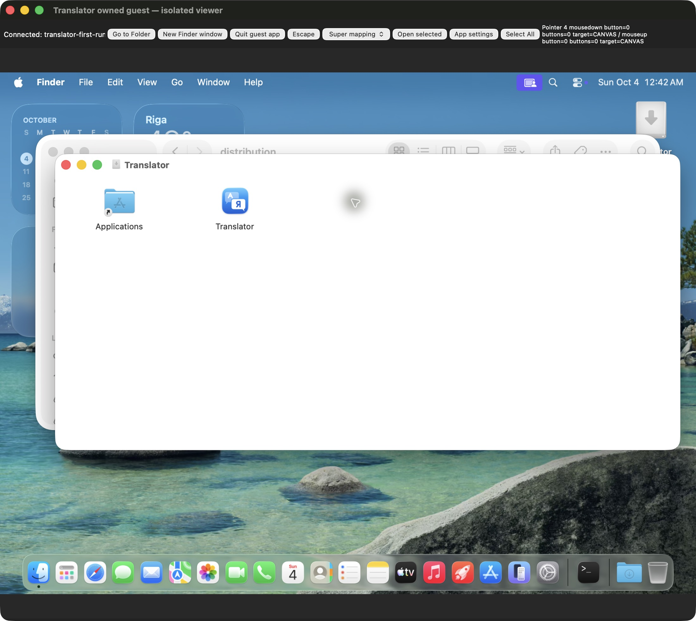

## G065 — actual drag movement и GUI-created Desktop copy меняют диагноз input

- Peer `msg_5e5a6f458679`: observer содержит actual mousemove client280,288→189,288 и mouseup189,288/buttons0/moves2/targetCANVAS. Guest Applications app всё ещё отсутствует, зато Desktop/Translator.app появился после прежнего logical-half GUI control. SSH ничего не копировал. Поэтому input нельзя считать вообще unsupported; есть actual file-copy effect, а правильная установка в Applications пока не доказана.
- Main `msg_b22431c5dc12` разрешил один bounded external proxy pacing control20ms между существующими opaque frames с сохранением bytes/order, без RFB parse/injection/synthetic input и без product/security/TCC изменений. Pacing — гипотеза, не установленная причина; при отсутствии improvement proxy возвращается к прежнему forwarding. Guest-created own Desktop copy учитывается для точной cleanup.
- Main также запросил actual client/canvas geometry и alias hit target: screenshot координаты нельзя переносить между moved windows/relaunches без проверки; clientY288 против image logical320 может отражать titlebar/content origin. Это inference, требующий visible geometry. Read/display собственных viewer DOM metrics допустим; DOM/scripted input запрещён. Нормальный Finder menu Copy/Paste остаётся доступным планом, install/model/Services/D05 по-прежнему не закрыты.

## G066 — текущий срез backlog после exact488659 локальной приёмки

Это накопительный срез на 04.10.2026, около04:00 MSK. Он дополняет прежние FAIL/PASS, а не заменяет их; production source488659 ещё соответствует промежуточному HEADc7/build282, actual Git delivery не выполнена.

| Область | Последнее фактическое доказательство | Состояние и границы |
| --- | --- | --- |
| Python/source | Main322 tests/56.01s, Ruff/format76/strict108, source до/после488659 | PASS этого exact local source; не remote CI |
| Включённый Google/Cambridge | Peer actual packaged488659 online2, Main лично сверил JSON;431/1066ms | PASS online single-source controls; host internet сохранился |
| Ошибка сети и локальный fallback | Peer actual process-denied4886597, Main сверил; notices/disabled/local/fallback | PASS process-scoped матрицы; brokered Apple airgap/physical disconnect не доказаны |
| Primary Google/Apple budget | Main meaningful RED3/RED4→focused58/full322; actual Apple-only531ms непустой | PASS local source/packaged host scope; cold first-model guest отдельно |
| Real DB content | Main exact bundled4886599 queries/3 базы, SHA/mtime до/после совпали | PASS read-only provider data, не fresh-machine download |
| Полный DB first download | Peer source415 actual1.896GB/SHA/DONE/pending0 и no-repeat; Main record cross-review G005 | PASS прежнего immutable scope; DB lock/data не менялись |
| Self-contained DMG/runtime | Main new834a7104 DMG mount/manifest/binary4/native+shell2/seal/detach/cleanup | PASS local mounted runtime, не quarantined internet first launch |
| История/legacy daemon | Source288/291+ actual distinct owner/refusal/entry1→1; current322 regressions | PASS измеренных restart/compatibility scopes; normal guest flow ещё выполняется |
| Native design/error | Original CUA68469f error лично просмотрен; baseline/415/b40 rendering ранее reviewed | Existing identity сохранена; screenshot-specific scope, не all future screens |
| Чистый guest и установка | Enabled assessments, uv/CLT absent, original488659 mounted-DMG JPEG; Desktop copy reported seal0 | IN_PROGRESS: Applications target/first launch/models/Services ещё не приняты |
| Anki synchronized profile | Прежние13 live API/native cases отдельно; current normal names inventory пуст | A16 OPEN: user должен назвать actual existing synced profile/path; данных не угадываем |
| Accessibility/global actions | Temporary flags restored; AX reason/recorder scoped PASS | Spoken VoiceOver, physical/global outside-click/shortcut и часть hardware gates OPEN |
| Developer ID/notarization/Gatekeeper | User подтвердил отсутствие Apple Developer Program; local identity0 | D05 BLOCKED, обход не выполняется; public-ready stable release не заявляется |
| Git/remote/release |11 logical groups/Root-owned files/проверенный proposal; real index empty | Commit/push/release разрешены; required custom-profile agreement ещё pending, actual новых commits/push/CI/tag/release нет |

Полноценная retained session Translator1-Distribution продолжает guest acceptance. Новый субагент вместо неё не создаётся; delegated receipt не выдаётся за завершение. До actual результатов неизвестные пункты остаются открытыми.

## G067 — один pacing trial закрыт без improvement; независимая guest functionality продолжается

- Peer `msg_6ef34add7345`: ровно один approved20ms opaque-frame trial не улучшил menu/drag; pacing source возвращён, exact owned28039 proxy stopped0 и viewer28057 CUA closed0. Unpaced adapter восстановлен. Canvas rect/framebuffer и actual end coordinates сохранены; Applications app всё ещё отсутствует, Desktop owncopy source488659/seal0 присутствует. Pacing cause не подтверждена, дополнительных transport вариантов не запрашиваем.
- Main `msg_9ca41c35262a` разрешил normal documented CUA launch **уже созданной GUI Desktop копии** для независимых first-model/native functional checks после baseline defaultcfg/history/model проверки. Это self-contained functionality на чистом guest, **не Applications installation**. Terminal/devtools/CLI model install/Gatekeeper/TCC/account workaround не разрешены; host models/data unchanged. Services нельзя проверять в неподдержанном Desktop location; Apps/Services remain OPEN.
- После этих checks требуется actual Quit/exact own process cleanup до возможного launch из Applications. Guest model cache может существовать до own VM teardown. Этот шаг возвращает работу к проверке функций, не объявляет обход unresolved installation зелёным и не меняет исходный normal distribution criterion.
- Main лично прочитал [A16 names-only metadata](/Users/den/Documents/dev/translator-evidence/2026-10-03/distribution/continuation/anki-normal-name-metadata.json): normal base exists, collections[]/profile_names[]. Credentials/blobs/note content не читались. Это отсутствие candidate в данном normal path, а не доказательство отсутствия synchronized collection в любом другом месте; user exact profile/path остаётся pending, disputed data не меняются.

## G068 — actual installed pre-commit на полном prospective tree PASS

- Main выполнил [own preflight runner](/Users/den/Documents/dev/translator-evidence/2026-10-03/delivery/check_final_staged_tree.py) на новом **собственном disposable local clone**, exactsource488659 и72 named paths:69 current files +3 proposed profile/checker/baseline. Main profile/HEAD/index не менялись; новых commits/push не создавалось. Проверяется именно full staged tree через установленный normal hook, не только текущий рабочий каталог.
- [Лог](/Users/den/Documents/dev/translator-evidence/2026-10-03/delivery/20261004T010846Z-final-staged-tree-precommit.log), [exact tree/input SHA/result/cleanup](/Users/den/Documents/dev/translator-evidence/2026-10-03/delivery/20261004T010846Z-final-staged-tree-precommit.json): **pre-commit PASS0**, Ruff PASS, format128 files PASS и15 byte-identical legacy exceptions, strict mypy108 PASS; fresh release Translator build48.70s и AppleLangHelper build20.89s PASS. Baseline содержит максимум17 старых файлов; два изменившихся уже не исключены и проходят formatter. Это требуемое поведение hash guard, не расширение исключений.
- Main после исполнения лично проверил exact own probe отсутствие, HEADc7 unchanged и main index empty. Profile SHA **eff60c9bfba5c4492abb1cad98bff1e265ae96ac871809eef51d5c7271ac6eb2** совпадает с concrete proposal. Это preflight review, **не owner agreement**, не actual application profile и не source delivery. Pending custom-profile response сохраняется; real push tests/native wrappers/remote CI нужны после actual commits.

## G069 — guest normal Finder Copy/Paste в Applications реально прошёл

- Peer `msg_00c21c8faf9d`/`msg_4cad78b4d920`: после normal unpaced reconnect actual Finder context menu Copy→Applications alias→enabled Paste Item скопировал приложение. Drag failures сохранены отдельно; новых adapter/proxy вариантов для этого не добавлялось.
- Main лично прочитал [read-only installed metadata/seal log](/Users/den/Documents/dev/translator-evidence/2026-10-03/distribution/continuation/20261004T011212.912551Z-guest-finder-paste-installed-metadata.log): `/Applications/Translator.app` manifest source **488659**,0.3.0/build282/arm64/macOS26, strict deep/designated requirement valid; assessments enabled. Это peer GUI installation и independent Main record-review, не Main GUI execution и не Developer ID/GitHub quarantine proof.
- Main `msg_868f8b6223d2` уточнил дальнейший обычный launch из Applications/first-model/Services. Earlier optional Desktop launch G067 **не понадобился и не выполнялся**; Desktop copy остаётся только для own cleanup. Fresh defaultcfg/history/model baseline до первого launch и actual PID/positive backend readiness должны быть записаны отдельно. Local Finder **Copy/Paste PASS**, именно drag и public first launch пока не закрыты.
- Дополнительный личный context review Main: sanitized export400 physical5251–5370, без обрезки вывода. Исторические сообщения подтверждают выбранные symlink process names/проверку exact PID и ненадёжность short-literal presence/rc после pipe. Нового current auth/production requirement из исторических teammate сообщений не выводится. Полный ранее collective coverage сохраняется; этот120-line read не объявляется полным личным чтением11388 lines.

## G070 — Applications first launch: реальные процессы и исходный native setup

- Peer `msg_e2dcef8170f0`/`msg_a4987ca27e4f` выполнил обычный CUA double-click установленного приложения. Main лично прочитал [PID/path record](/Users/den/Documents/dev/translator-evidence/2026-10-03/distribution/continuation/20261004T011339.650371Z-guest-applications-first-launch-pid-and-paths.log) и [default packaged runtime](/Users/den/Documents/dev/translator-evidence/2026-10-03/distribution/continuation/20261004T011650.418087Z-guest-default-runtime-and-download-readback.log): native1394 из `/Applications`, packaged Engine1400 `-P -m`, Lookup1401; protocol1/history_persistence true/default run-app socket; все6 sources включены, history0. Это peer execution и Main record-review, не повторный GUI запуск Main.
- Исходные DB отсутствовали; после native Download definitions45223936 и fallback71847936 bytes присутствуют, primary.part329036256 bytes ещё загружается. **Это SQLite datasets, не Apple language model.** Apple translation status `supported`, `apple_translation=false`; список English/Apple dictionaries не доказывает работоспособный EN-RU dictionary. Completed hashes/model install/nonempty translation/history/restart/Services остаются отдельными gates.
- Main лично просмотрел **original CUA JPEG**: [visual/byte review](/Users/den/Documents/dev/translator-evidence/2026-10-03/delivery/488659-guest-firstlaunch-main-visual-review.json),613343 bytes/SHA256 **6ffe1f8da9ef7e8134c20265efc25d241f28c7f31d214b594fb29a3a8ca33dd1**. Exact bytes сохранены в [portable JPEG](evidence/488659-guest-firstlaunch.jpg)/[identity](evidence/488659-guest-firstlaunch.json). Видны читаемые Missing primary/fallback/definitions/1.9 GB, Download, Accessibility notice и unchecked Open at login; product content не перекрывается и не обрезан. Внешняя viewer toolbar — disposable acceptance infrastructure, не дизайн приложения.
- First Settings первоначально появился за Finder; обычный title click поднял окно. Наблюдение сохранено; пока это не воспроизведённый source defect и не основание менять утверждённый native стиль. Guest assessments enabled, TCC/login unchanged; quarantined GitHub launch/Developer ID/notarization этим local launch не доказаны. Два новых owned evidence paths добавлены в logical docs group; source488659/HEADc7/index не менялись.

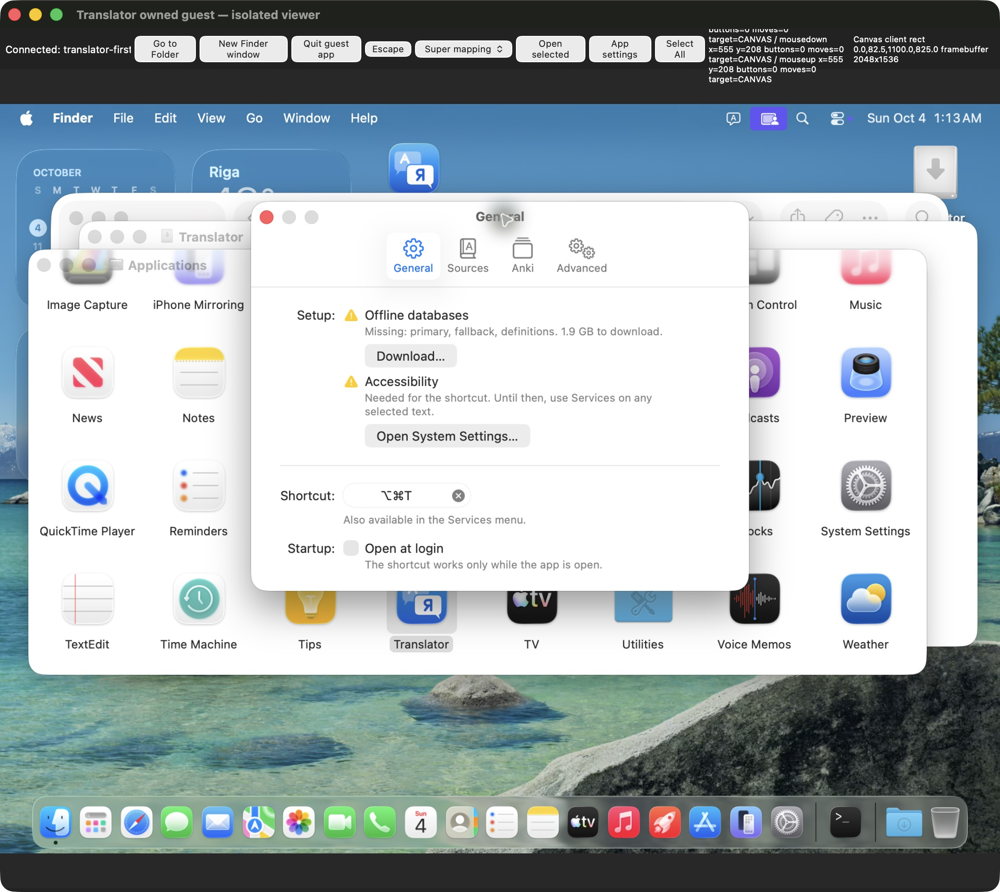

## G071 — A02 table finding сверён с актуальной peer правкой

- Peer current read `20261004T011315.105598Z` подтвердил3 cells исторической A02 row при3-column header. Main лично перечитал current EPIC-02 lines122–127: состояние совпало. Ремонт peer около005714 UTC **предшествовал** finding Root; текущего дефекта таблицы нет и повторное изменение не нужно. Top current matrix с4 columns остаётся отдельной матрицей.
- Это reconciliation разных timestamps, не новое тестирование приложения и не стирание прежнего finding. Main сообщил сходимость peer `msg_c484fbdd4ffc`; consolidated epic/progress по-прежнему принадлежат retained session.

## G072 — source review обычной установки Apple language pair

- Main лично прочитал `Setup.swift`369–475, весь `SettingsSourcesPane.swift` и `AppModel.refreshEngines`: language pair optional, поэтому не дублируется в General required checklist. При `supported`/not installed обычная Sources → Translation показывает English → Russian и Download; текущий view вызывает SwiftUI `translationTask`/`prepareTranslation`, затем `engines.refresh`, чтобы не ждать пятиминутного cached status. Наличие отдельного native UI подтверждено кодом; actual guest system sheet/download/installed/nonempty result этим чтением не закрываются.
- Первые поиски по предположенным именам engine/pane файлов вернули exit2/no such file; `rg --files` нашёл настоящие `SettingsSourcesPane.swift`/`apple.py`/`apple_dcs.py`. Эти ошибочные пути не считаются evidence отсутствия функции. Source edits не выполнялись, замечаний для изменения General layout по этому review нет.
- Peer `msg_6f07ad68dda6` сообщил actual primary.part1422522299 bytes около01:22:36 UTC и устаревший viewer frame; завершение/ошибка download пока не объявляются. Main передал конкретный Sources UI/code path второй сессии. Original screenshot G070 остаётся initial-state evidence, не изображением последующей готовности.

## G073 — логические коммиты уточнены: regression вместе со своей функцией

- Main сверил dependency boundaries daemon/history/paths и [обновил внешний план](/Users/den/Documents/dev/translator-evidence/2026-10-03/delivery/logical-commit-plan.json) на **10 логических коммитов**: gates/types; history/lifecycle; Anki merge; provider failures/budgets; native bootstrap/compatibility/paths; packaging/signing; installer ownership; CI; snapshot failures; cumulative docs/evidence. Каждый source group включает соответствующие regression files, вместо отдельного общего коммита всех tests.
- [Предыдущий11-group plan сохранён](/Users/den/Documents/dev/translator-evidence/2026-10-03/delivery/logical-commit-plan-11groups-before-cohesion-20261004T012600Z.json). Набор изменений совпадает byte-path-for-path: **71 main changed files +3 external proposed gates =74 named paths**, unmapped0/duplicates0/real index empty. [Review и per-file SHA](/Users/den/Documents/dev/translator-evidence/2026-10-03/delivery/488659-logical-commit-cohesion-review.json). Это текущий proposed grouping после двух новых first-run image paths, не74 staged files в главном checkout.
- Исторический G068 whole-tree preflight72 paths остаётся верным своему timestamp: два новых paths — exact portable first-run JPEG/JSON; production source не изменился. После фактического согласования custom profile каждый commit должен пройти установленный normal staged-tree hook, а push — полный outgoing-tree gate. Agreement pending, actual commit/push/tag/release по-прежнему нет; профиль в repo не установлен.

## G074 — текущий guest UI first download всех трёх баз завершён

- Peer `msg_6edaf121412d`: обычный native Download завершил все3 DB на чистом госте. Main лично прочитал [actual hash/size/seal log](/Users/den/Documents/dev/translator-evidence/2026-10-03/distribution/continuation/20261004T012510.346771Z-guest-ui-download-complete-pinned-database-hashes.log) и программно сравнил полный reported lock с current `scripts/db-bundle.lock.json`, затем каждый size/hash record: [independent record-review](/Users/den/Documents/dev/translator-evidence/2026-10-03/delivery/488659-guest-ui-db-main-record-review.json), **PASS3**, total **1 896 546 304 bytes**, bundle strict deep seal valid. GUI/network/hash execution — peer, Main выполнил личную сверку его сохранённых доказательств; повторного network download Main не делал.
- Definitions45223936/SHA b2664e59, fallback71847936/SHA c4f31145, primary1779474432/SHA91a005c5 совпали с полными pinned SHA в review. Initial G070 Missing3 и partial records сохраняются; теперь fresh-guest SQLite first download current488659 закрыт в этом scope. Historical source415 G005 full download отдельно остаётся верным.
- Peer сообщил: после обычного viewer reconnect DB warning исчез, Sources показывает English → Russian/not downloaded/network fallback и пользовательскую Download. Нажат именно этот обычный Apple control; system prepare/installed/nonempty result ещё pending, **SQLite PASS не закрывает language-model gate**. Search новых model/source image files пока не нашёл сохранённого нового JPEG; initial General G070 не выдаётся за ready screenshot.
- Внешний release draft дополнил actual guest Copy/Paste/first packaged launch и сохранил открытые drag/public/model/Services boundaries. Real commits/push/CI/release отсутствуют; custom profile agreement pending, Developer ID/notarization BLOCKED. `git diff --check`0 на этом checkpoint; source edits не выполнялись.

## G075 — обычный Apple system model sheet лично просмотрен

- Peer `msg_21bb92874631` сообщил: native Sources Download открыл системный **Download Languages to Translate**, затем реальные CUA clicks Download English(US)/Russian дали две progress bars. Main лично открыл оригинальный **снимок до этих row downloads**,596309 bytes/SHA256 **b3c672b54fada7ca5c7c9f64ebaa04dfdc2abc49cfbf6a70bab9d49ac1b246bb**; [visual/byte review](/Users/den/Documents/dev/translator-evidence/2026-10-03/delivery/488659-guest-apple-prompt-main-visual-review.json). Читаемые system title/оба языка/Download/Done; product/system content не перекрывается. Progress bars — последующее peer наблюдение, на этом оригинале их ещё нет.
- Exact original bytes без crop/edit сохранены как [portable JPEG](evidence/488659-guest-apple-prompt.jpg)/[identity](evidence/488659-guest-apple-prompt.json). Scoped **PASS — actual system sheet через штатный native Sources control**. Model installation completed и непустой offline EN-RU этим screenshot не доказаны; drag/public quarantine тоже остаются отдельными gates. Два owned evidence paths добавлены в docs commit group.
- Main лично прочитал [последующий DB/default/history ping record](/Users/den/Documents/dev/translator-evidence/2026-10-03/distribution/continuation/20261004T012750.800470Z-guest-complete-db-default-history-status-readback.log): DB3 present/current user store/pending_bytes0, history0 и Apple false/supported. Guest TCC/login/security и host language models не менялись. Data-only receiver закрыт peer; нового GUI capture Main не выполнял.

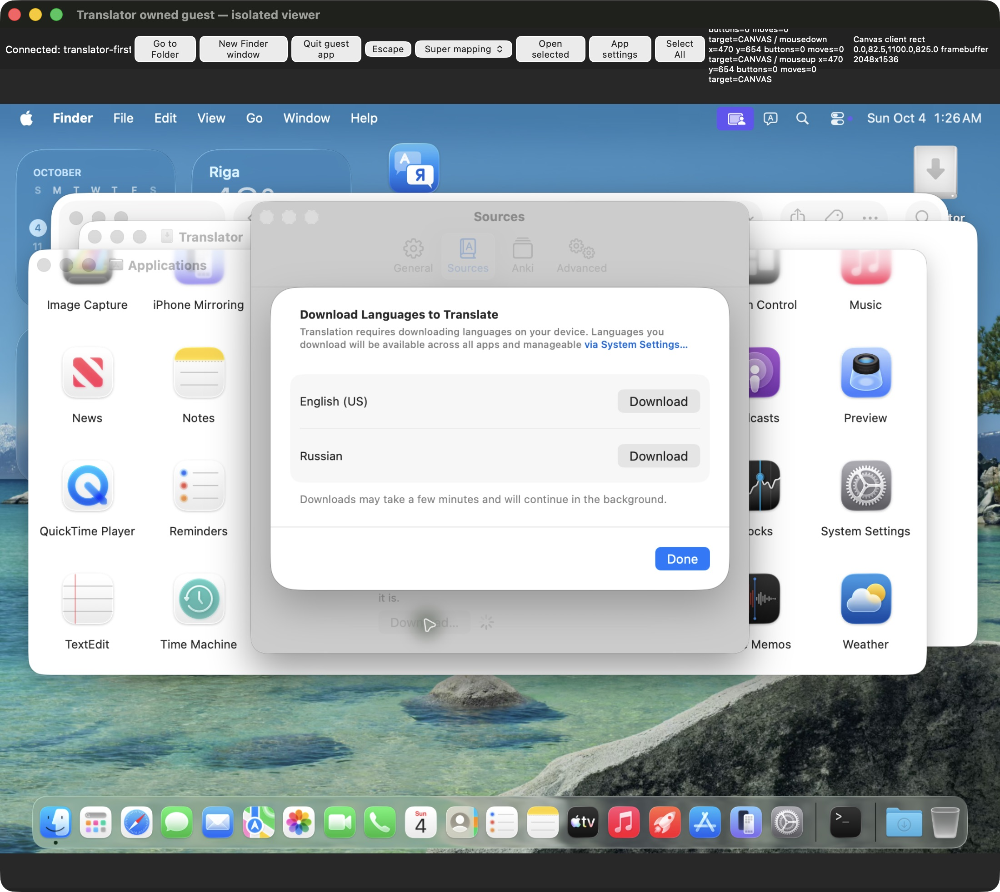

## G076 — конкретное согласование normal Git profile остаётся отдельным gate

- Main повторно лично сверил [действующую локальную политику](/Users/den/.config/agent-access/git-gates/README.md:67): **«Custom profiles require owner/user agreement for their real gates.»** Existing commit/push/release authorization пользователя сохраняется; повторного разрешения этих действий не запрашиваем. Отдельный concrete custom profile SHA **eff60c9bfba5c4492abb1cad98bff1e265ae96ac871809eef51d5c7271ac6eb2** не изменился после actual normal-hook preflight G068.
- Через async UI уточнено согласование именно prepared profile/checker/17 SHA-bound legacy baseline и текущих10 logical commits. Вопрос содержит exact reviewable file links, реальные commit/push commands и измеренный installed-hook result. Ответ pending; elapsed time не считается agreement, main profile/index/HEAD не меняются. Это требование local policy и user AGENTS approved-profile rule, не auto-review rejection и не отсутствие Git authorization вообще.
- Независимые guest model/Services/history проверки продолжаются полноценной второй сессией; pause/completion не объявляется. Если пользователь попросит изменить реальные gates, сначала подготовить и проверить конкретную новую конфигурацию, без empty/no-op profile или hooks bypass.

## G077 — первый Apple language pair действительно установлен в госте

- Peer `msg_ca2b3abcd40e`: обычный Done вернул native Sources с зелёным Language pair installed. Main лично прочитал и программно проверил [actual installed/consent record](/Users/den/Documents/dev/translator-evidence/2026-10-03/distribution/continuation/20261004T013301.011170Z-guest-installed-model-apple-only-ui-readback.log): тот же packaged PID1400/helper из Applications, `apple_translation=true`, `translation_status=installed`, `stale=false`; DBready/pending0/history0. [Independent review](/Users/den/Documents/dev/translator-evidence/2026-10-03/delivery/488659-guest-apple-installed-main-record-review.json). Actual system UI install — peer; Main independently reviewed record, installed screenshot buffer ещё не сохранён/просмотрен Main.
- Реальные native Sources clicks оставили **только Apple Translation**, другие5 источников false; `settings.get` и ping.enabled совпали. Этот explicit source consent исключает Google/Cambridge и dictionaries/examples/definitions для предстоящего translation control. Это не физический network disconnect и не проверка brokered Apple airgap.
- **PASS — fresh-guest model readiness/consent**, не first nonempty translation. Первый synthetic TextEdit Services запрос ещё должен показать перевод до API warmup; Main передал этот порядок `msg_1f33e16e6266`. Затем history/reopen/restart/source restore. All prior missing/supported/prompt states сохранены; source/style edits не выполнялись.

## G078 — существующий A02 offline gap передан второй сессии с точными границами

- Main `msg_4cbc7579d78a` попросил **после первого Services/history/restart** оценить bounded guest-only internet-loss control для уже объявленного A02. Process sandbox или отключённые сетевые источники не изолируют системный Apple broker. Нужны positive external network control до/после, exact rollback и сохранение SSH/viewer management; host network/firewall/security не изменяются.
- Сначала ожидается конкретный reversible механизм и измеренный guest baseline; новый PF/proxy variant или отключение единственного management interface не разрешены этим сообщением. Physical host-cable acceptance остаётся отдельным UNKNOWN. Это запрос по существующему backlog, не actual network mutation, не новый production defect и не PASS offline.

## G079 — найден настоящий Services metadata gap A23

- Peer `msg_8f693037a414`: actual TextEdit1574/Untitled содержит собственное полностью blue-selected предложение через обычный Edit → Select All; в Services видны другие text/search providers, Translator отсутствует при canonical Applications app1394/Apple-only/history0. Remote super+a вставил literal a и исправлен только own character; этот failed modifier control не выдаётся за product shortcut defect. Original menu capture пока только сохранён в peer buffer, Main его ещё не просмотрел.
- Main лично прочитал production builder, standalone `Resources/Info.plist` и native provider registration: оба NSServices определения **не содержат NSRequiredContext**, native `NSApp.servicesProvider=self`/`NSUpdateDynamicServices` присутствуют. [Apple primary Services Properties](https://developer.apple.com/library/archive/documentation/Cocoa/Conceptual/SysServices/Articles/properties.html) требует эту настройку даже без фильтра, с пустым dictionary; иначе зарегистрированная service автоматически не появляется в меню. Это documented metadata violation и **обоснованная связь** с actual symptom; causal/fixed runtime ещё предстоит доказать. NSStringPboardType разрешён Apple, root cause ему не приписывается.
- Main лично прочитал installed Info и selected LS record: canonical `/Applications/Translator.app` зарегистрирован, services flag/Translate with Translator/translateSelection/NSStringPboardType присутствуют; DMG/Desktop тоже зарегистрированы отдельно. Первый combined log output был обрезан, Apps tail дочитан отдельным read; весь LS inventory не объявляется прочитанным. Guest rg absent не считается отсутствием service; peer read-only bundled-engine extraction дал положительный record.
- [Source review](/Users/den/Documents/dev/translator-evidence/2026-10-03/delivery/a23-services-metadata-main-source-review.json); Main отправил `msg_6f0f9991e76d` **до user update**, передал второй сессии exact builder/test и новый `macos/Translator/Resources/Info.plist`. Нужно minimal empty context в обеих декларациях → meaningful metadata RED/GREEN → новый immutable bundle/DMG → обычный guest update/Services/first translation. UI/style/provider API не меняются; ручное LS registration/Services checkbox workaround не подменяет исправление. Old488 FAIL сохраняется, новый source ещё не готов и не принят.

## G080 — Markdown gate после новых portable evidence PASS

- Main запустил именно installed `gates.py.docs_check` и additional absolute/relative existence на8 текущих MD: [review](/Users/den/Documents/dev/translator-evidence/2026-10-03/delivery/20261004-a23-current-docs-installed-links-review.json). Все literal targets существуют/missing0; original first-run/Apple prompt portable links входят в scope. Это timestamp до данной записи, не проверка будущих additions/URL/anchors/истинности содержимого. `git diff --check`0/index empty проверены отдельно; full source gates не повторялись без новых source changes.
- Внешний proposed commit plan дополнил A23 requirement и planned `macos/Translator/Resources/Info.plist` в packaging group вместе с builder/test.10 logical groups сохраняются; точный dirty map после фактического peer edit нужно обновить. Gates owner agreement всё ещё pending, HEADc7/actual commits/push/release отсутствуют.

## G081 — Main самостоятельно подтвердил A23 на immutable generated metadata

- [Own metadata read](/Users/den/Documents/dev/translator-evidence/2026-10-03/delivery/a23-immutable-generated-metadata-main-red.json): Main через `uv run`/plistlib прочитал настоящее generated Info.plist уже проверенного immutable source488 app и отдельно standalone Info.plist из HEADc7. В обоих **NSRequiredContext отсутствует —2 RED declaration-contract cases**; executable/provider message/port/menu/send type positive controls2 PASS. Это собственная metadata verification, не новый CUA запуск, pytest или UI PASS.
- G059 связывает immutable app с source488; новая запись добавляет actual Info byte hashes и source-контракт. Ресурсы/профиль/registry не менялись. Native provider body/визуальная система не требуют изменений по этому finding; updated artifact/manual-free Services runtime пока pending.
- Peer `msg_c06161fa08c3` **принял exact ownership** builder + standalone plist + existing packaging regression. Он подтвердил RED/GREEN → fresh immutable artifact → normal Applications Replace/app/TextEdit relaunch, без preference/registry/TCC/visual/Git-index действий. Dispatch receipt не считается исправлением или завершением; Main ожидает реальные logs/hash/retest.
- Root `msg_fe1c68606d9b` заранее уточнил: если старое per-user service disabled state переживёт update, его нужно зафиксировать отдельно до любого fixture-only toggle. Готовность first-install automatic menu нельзя выводить из manual enable. External release draft теперь фиксирует installed-model readiness и временный A23 hold до исправления, а не продолжает заявлять модель не установленной.

## G082 — A23 minimal source fix/meaningful regression сверены Main

- Peer `msg_f78c3a977bc7` изменил только builder/standalone plist/existing packaging test. Main лично прочитал все3 diff и [RED log](/Users/den/Documents/dev/translator-evidence/2026-10-03/distribution/continuation/20261004T014748.605601Z-a23-service-declaration-regression-red.log): **3 KeyError:NSRequiredContext failures** на production metadata/template/standalone context contract. Old legacy assertions ошибочно требовали отсутствие ключа; теперь parsed plist проверяет empty dictionary, сохраняя произвольное слово/фразу/предложение без Word filter.
- Main лично сверил [GREEN source-only log](/Users/den/Documents/dev/translator-evidence/2026-10-03/distribution/continuation/20261004T014808.462010Z-a23-service-declaration-regression-green.log): **16 PASS/2 built deselected**, [static checks](/Users/den/Documents/dev/translator-evidence/2026-10-03/distribution/continuation/20261004T014808.462014Z-a23-owned-lint-format-plist-diff.log): Ruff/format, bash syntax, plutil и diff0. Execution — peer, Main record/source-review. Built2 и normal UI ещё не PASS; test names сами по себе не доказывают видимый menu.
- Peer `msg_6e6e9febed57`: новый source digest **c248d674a64b71546d3766d508431ac9dcde995af75e9f294f5064e4020b73fd**, immutable `build-services-context` ещё собирается. Последующий test change добавляет explicit nonsecret **TRANSLATOR_TEST_APP** для actual seal/metadata checks; default CI dist сохраняется. Старый local dist не перезаписывается и не выдаётся за исправленный artifact.
- Main `msg_d2bceb8ae13e` взял следующий **full make verify с exact fresh app path**, после готового manifest/seal; peer фокусируется на packaging18 и guest normal update/Services. Предыдущий own full322 относится к source488, не переименовывается. Проверяемые A19/A20–A22 frozen code SHA должны остаться прежними; новый source/table/artifact identity фиксируются отдельно. UI/style/body provider не изменились.

## G083 — Main full verify нового sourcec248 завершён PASS

- Main выполнил [own runner](/Users/den/Documents/dev/translator-evidence/2026-10-03/delivery/check_a23_full_verify.py), [full log](/Users/den/Documents/dev/translator-evidence/2026-10-03/delivery/a23-main-full-verify.log), [inputs/manifest/seal/cleanup review](/Users/den/Documents/dev/translator-evidence/2026-10-03/delivery/a23-main-full-verify-review.json): **322 Python PASS/56.53s**, Ruff PASS, format76 PASS, strict mypy108 PASS. Весь `make verify` actual0 с explicit fresh `build-services-context/Translator.app`; оба built packaging tests входят, stale repo dist не использовался.
- До/после source SHA **c248d674a64b71546d3766d508431ac9dcde995af75e9f294f5064e4020b73fd**, все10 frozen A19/A20–A22/A23 path hashes и artifact manifest совпали; pre/post codesign strict deep0, HEADc7 unchanged/index empty. Own explicit pytest basetemp действительно удалён после PASS. Metadata fix не меняет предыдущие source488 результаты: G054322/56.01s сохраняются отдельно.
- Peer `msg_0ed4d889d0dd` сообщил packaging **18PASS**/Ruff/format/strict test types и fresh DMG SHA **662cbf64df1b6a1b5ab0a148d888dc08ac014f64454091e4225bfae75bcb488d**. DMG/new guest menu result ещё не независимо проверены Main этим full source gate. Current guest model/data source488 сохранены перед normal update; first Services/translation/history/restart pending. Main сообщил own PASS `msg_fa922c137bbd`; actual Git delivery по-прежнему pending profile agreement.

## G084 — лично просмотрены и перенесены original installed/selection/Services RED images

- Peer `msg_f6c1e0fb4ff3` сохранил и лично просмотрел три original CUA JPEG, fixed data-only receiver57069 closed0. Main **лично открыл все три originals в original resolution**, пересчитал каждый SHA/size, перенёс exact bytes без crop/reencode в owned repo evidence: [aggregate visual/byte review](/Users/den/Documents/dev/translator-evidence/2026-10-03/delivery/a23-source488-originals-main-visual-review.json). Peer GUI execution отделён от Main visual review.
- [Installed model](evidence/488659-guest-apple-installed.jpg)/[identity](evidence/488659-guest-apple-installed.json):624210 bytes/SHA **0617836b1a74e570dcaf7102086eaa8005bd489d751bea02ac269a09ae7ea389**. Читаемые English → Russian/installed/green; все6 sources ещё checked **до Apple-only переключений**, переводов не было. Snapshot-specific native rendering/readiness PASS; offline output этим не доказан.
- [Synthetic selection](evidence/488659-guest-synthetic-selection.jpg)/[identity](evidence/488659-guest-synthetic-selection.json):545814 bytes/SHA **4819bfc761c961d8bd86c1e558d27f71a7763db71b3c713d1508c687e1252d5c**. Untitled TextEdit, own sentence полностью blue-selected: positive selection control. Это реальный guest UI с синтетическим текстом, не mock и не личная история пользователя.
- [Missing Services menu](evidence/488659-guest-services-missing.jpg)/[identity](evidence/488659-guest-services-missing.json):622621 bytes/SHA **530a01acd9a095be605036918905a6597daa5f8abc93c6bfad5fdbd8351e486d**. Весь submenu с другими Text/Searching providers и нижним Services Settings читаем, Translator отсутствует. **A23 actual runtime RED source488**, не fixed-c248 screenshot и не hardware shortcut/outside-click test. Шесть новых owned paths добавлены в docs logical group; old outcomes не стираются.

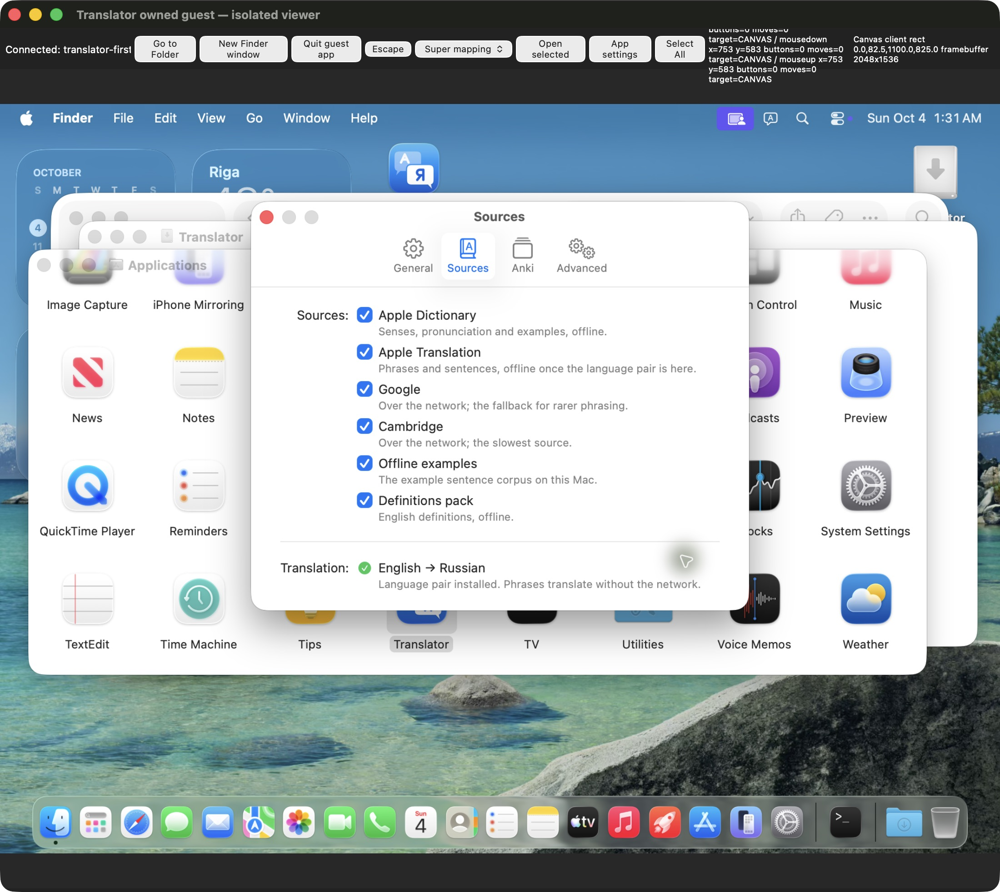

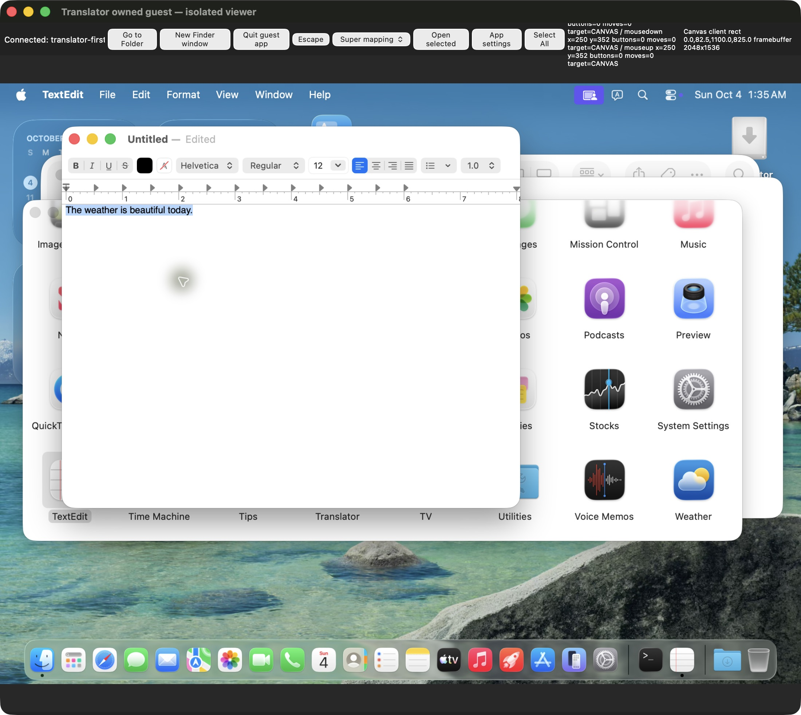

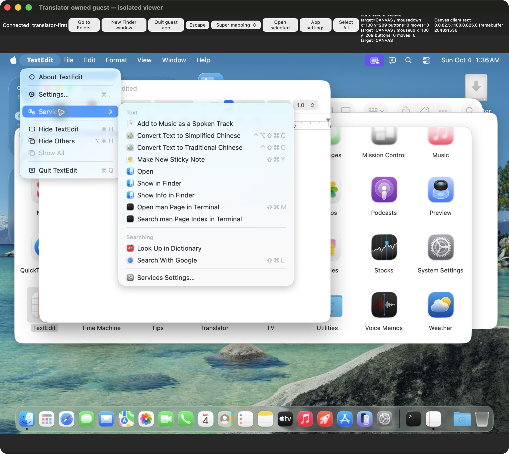

## G085 — Main лично принял новый mounted DMG c248 и exact cleanup

- Main выполнил [новый own runner](/Users/den/Documents/dev/translator-evidence/2026-10-03/delivery/verify_c248d6_dmg.py), [run log](/Users/den/Documents/dev/translator-evidence/2026-10-03/delivery/c248d6-dmg-independent-run.log), [independent review](/Users/den/Documents/dev/translator-evidence/2026-10-03/delivery/c248d6-dmg-independent-review.json): SHA **662cbf64df1b6a1b5ab0a148d888dc08ac014f64454091e4225bfae75bcb488d**, hdiutil verify0/read-only attach0, Applications symlink→/Applications, mounted manifest exactly matches verified app **sourcec248**, все4entry binary hashes совпали. Parsed mounted Info действительно содержит empty NSRequiredContext.
- [Actual mounted runtime](/Users/den/Documents/dev/translator-evidence/2026-10-03/delivery/c248d6-dmg-mounted-runtime.json): native launcher62056/shell62065 **PASS2** с own poisoned cwd/minimal PATH/empty isolated DB; положительный protocol/history_persistence ping, poison false, own processes stopped0/socket/profile removed/postseal0. Detach0 и exact own mount directory removed. Старый G059 source488/DMG834a7104 не переименовывается и не стирается.
- Minimal-env helper ping в данном host launcher scope сообщает Apple supported/false; это не test переводов или глобальный inventory установленных моделей. Guest native installed/true G077 относится к другому конкретному OS/user setup. Main отдельно сверил старый source488 mounted runtime для границы этого наблюдения; из одного flags-only ping не выводит удаление модели или новый source defect.
- Main сообщил actual PASS второй сессии `msg_dc0925b06f0c`; public quarantine/Gatekeeper/Developer ID и её normal guest Services ещё не доказаны этой проверкой. Actual Git commits/push/release отсутствуют, profile agreement pending. Source/artifact code frozen, новое full Python/source тестирование после G083 без причины не повторяется.

## G086 — bounded host flags discrepancy сохранён и проверен current-time controls

- Main сравнил old488 mounted record (installed/true) с newc248 mounted record (supported/false); это реальное расхождение. Source/transport PASS G085 не выдаётся за model/output PASS. Root сообщил peer `msg_f89dbbaf8d99` до user update, не приписывал одному ping удаление модели или causal source regression.
- Два собственных bounded current-time probes тем же checker, minimal PATH/own poisoned cwd/empty isolated data: [old488 native control](/Users/den/Documents/dev/translator-evidence/2026-10-03/delivery/a23-host-old488-current-native-ping.json) и [newc248 native control](/Users/den/Documents/dev/translator-evidence/2026-10-03/delivery/a23-host-newc248-current-native-ping.json) оба **transport PASS/installed true/stale false**, own process/socket/profile cleanup подтверждён. Это direct immutable app paths, не ещё один mounted-DMG run. Точную причину прежнего mounted supported/false установить этим нельзя; observation остаётся UNKNOWN в своём scope, не стирается и не превращается в зелёный перевод.
- Native backend/helper/shell **signed bytes exact equal** между488 иc248. Main отдельно [сравнил native main body](/Users/den/Documents/dev/translator-evidence/2026-10-03/delivery/a23-main-native-body-comparison.json): снял signatures **только с двух own comparison copies**, не запускал их, original hashes до/после unchanged; unsigned copy SHA обоих **efa87ca8fc59afbb4bf56307e837e41376e17cf1dc36945527c83cb14849d05e**, byte equality true. Own fixture удалён. Это data comparison, не security/quarantine bypass или изменение original app signatures.
- Model prepare/delete/TCC/login/security/global network не менялись; guest первый перевод не прогревался API. Main сообщил bounded outcomes `msg_39578a9beaf0`; дополнительных host probes без нового observed failure не планирует. Guest updated Apps installed/true из peer `msg_4ccbf0edb16e` — отдельный процесс/OS/user result, actual Services/first translation ещё pending.

## G087 — первый настоящий Services перевод sourcec248: independent record review PASS

- Peer `msg_06d453e8f10c`/`msg_ab3768cb7478`: normal Finder Replace/app+TextEdit relaunch без Services preferences/cache/registry workaround дал автоматически enabled Translate with Translator, затем первый реальный Services click перевёл собственную synthetic фразу **The weather is beautiful today. → Сегодня прекрасная погода.** Без API translate/debug warmup; только Apple Translation, другие5 sources false. Menu/popup originals сохранены в capture buffers peer; Main пока их не просмотрел и screenshot PASS не объявляет.
- Main лично прочитал все4 exact logs и независимо проверил JSON assertions: [record review](/Users/den/Documents/dev/translator-evidence/2026-10-03/delivery/c248d6-guest-first-services-main-record-review.json). Installed source точно **c248d674a64b71546d3766d508431ac9dcde995af75e9f294f5064e4020b73fd**, build282/empty NSRequiredContext/sealPASS; initial DB3 ready/pending0, Apple installed/true/stale false, settings и enabled Apple-only, history0. Последующий history.list содержит ровно entry1 с exact непустым Russian result: **0→1 PASS**. Execution — peer; Main выполнил independent personal record review, без повторного GUI action.
- Positive process rows: native1834→engine1836→lookup1837, TextEdit1858. Дополнительный packaged Engine1886/parent1763 — read-only request controller, не orphan daemon. Первый JSON parser Main получил Extra data на JSON+PID log; corrected JSON-line parsing прошёл все9 checks. Ошибка checker сохраняется и не считается дефектом приложения.
- Local first Services/translation/historical write доказаны в указанном scope. Actual History reopen/restart, guest-wide network loss, physical shortcut и original screenshot review остаются отдельными gates. Old source488 missing-menu RED G084 сохраняется. Public quarantine/Developer ID/notarization и actual Git delivery этим результатом не закрыты.

## G088 — разрешён только read-only guest PF preflight для A02

- Peer `msg_578203bcbaca` сообщил guest IPv4 default192.168.64.1/en0 и HTTPS200, а также IPv6 scoped utun0–3. Одного удаления IPv4 default недостаточно для доказанного broker-wide internet loss. До этого actual popup outside TextEdit title click дал dismiss/TextEdit active; execution peer, отдельный screenshot/record review Main ещё pending.
- Main `msg_70898098852b` разрешил **read-only sudo PF preflight только exact owned guest**: identity, enabled baseline, parent/wildcard rule order, quick-pass/skip-interface/state bypass risk. Activation/global rules reload/state flush/network preference edits этим разрешением не разрешены, host PF/network/TCC/login не меняются.
- До изменения сети peer должен представить конкретный guest-only script с own anchor, management subnet/loopback сохранением, IPv4+IPv6 coverage, baseline digest, owned enable reference только при необходимости и automatic ≤5min rollback. Main review до mutation; при отсутствии безопасного existing dispatch gate остаётся UNKNOWN. History/restart и оригиналы menu/popup должны быть сохранены до network-loss сценария. Этот request не является offline PASS.

## G089 — release draft и named commit map согласованы с actual c248 evidence

- Main переписал только внешний [release draft](/Users/den/Documents/dev/translator-evidence/2026-10-03/delivery/RELEASE-NOTES-v0.3.0.md) вокруг итогового поведения и actual currentc248 result; [предыдущий draft сохранён целиком](/Users/den/Documents/dev/translator-evidence/2026-10-03/delivery/RELEASE-NOTES-v0.3.0-before-c248-20261004T0223Z.md). [Timestamp/SHA reconciliation](/Users/den/Documents/dev/translator-evidence/2026-10-03/delivery/c248d6-release-draft-reconciliation.json). Epics/history не заменялись. В draft явно retained ad-hoc/prerelease boundary, D05 blocker, intermediate build282/HEADc7 и pending final commit/CI/GitHub asset; это **не публикация**.
- Личная read-only [сверка current10-group plan](/Users/den/Documents/dev/translator-evidence/2026-10-03/delivery/c248d6-current-logical-plan-path-review.json) подтверждает полный exact changed/untracked path map без дубликатов/unmapped и unchanged HEADc7/empty real index. Source digest всё ещё c248; реальные normal commit/push hooks, remote SHA и окончательный version/build будут проверены при actual delivery после pending custom-profile agreement. Previous72/74-path snapshot records остаются валидными своему времени, не переименовываются в current count.
- Main source full322 и mounted DMG2 уже завершены G083/G085; без новых source changes они не повторялись. Изменения draft/docs не превращают peer GUI report в лично просмотренный Main image или gate readiness; новые Services/History originals и read-only PF preflight остаются следующими независимыми проверками.

## G090 — read-only PF baseline и normal Quit cleanup лично сверены

- Peer `msg_97c501c6a003`: реальное native History показывает entry1/EN+RU; normal double-click вернул непустой Russian popup, read-only history остаётся1. Main пока не просмотрел original History/popup; `guest-first-history-visible.log` пуст, поэтому он **не используется как доказательство видимого результата**. Canonical Finder relaunch ещё выполняется.
- Main лично прочитал exact command records и targeted primary excerpts: [independent review](/Users/den/Documents/dev/translator-evidence/2026-10-03/delivery/c248d6-guest-pf-preflight-and-quit-main-record-review.json). Exact guest192.168.64.2/sourcec248, PF Disabled/zero states, root только com.apple wildcard, AirDrop/ApplicationFirewall leaf rules и children пусты, skip flags отсутствуют; management TCP только guest22/5900↔host192.168.64.1. Primary local man подтверждает immediate-child alphabetical wildcard и final quick across anchors. Большой matching-excerpts inventory был отфильтрован; полный man record не объявляется лично прочитанным. Первый общий cat был обрезан, essential command rows дочитаны отдельно.
- Broad pfctl wildcard вернул exit0, но stderr **DIOCGETRULES: Invalid argument**; это сохранённая неполная enumeration, не полный positive control. Targeted leaf queries заменили её для данного scope. Main передал exact last-moment baseline/digest/rollback requirements peer `msg_d9b95c182105`; **PF activation всё ещё pending concrete script review**, интернет не объявляется отключённым.
- Normal tray Quit cleanup: positive controller probe2062, exact old native1834/engine1836/helper1837 rows отсутствуют, default socket gone, synthetic history file сохранён. Это measured lifecycle record PASS, не restart persistence или visual History PASS. Host network/firewall/TCC/login/security untouched; profile agreement и actual Git delivery не изменились.

## G091 — current Services/popup/History originals лично просмотрены; restart1→1 PASS

- Main лично открыл все три **original-resolution CUA JPEG sourcec248** и сверил exact bytes после копирования: [aggregate review](/Users/den/Documents/dev/translator-evidence/2026-10-03/delivery/c248d6-guest-originals-and-restart-main-review.json). Capture/guest GUI execution — peer, Main выполнил personal original visual review/byte verification/parsed restart readback. Данные только собственные synthetic; outer isolated viewer/desktop не являются UI продукта.
- [Enabled Services](evidence/c248d6-guest-services-enabled.jpg)/[identity](evidence/c248d6-guest-services-enabled.json): **550983 bytes/SHA db20a31381c65beb653227cdca51e0318b216c4ebd1068c75c4acf88f7c0b976**. Translate with Translator действительно читаем и enabled в обычном TextEdit Services submenu. Actual source488 registered/missing RED G084 остаётся рядом с новым currentc248 GREEN; manual Services checkbox/LS registration не выполнялись.
- [First Services popup](evidence/c248d6-guest-first-services-popup.jpg)/[identity](evidence/c248d6-guest-first-services-popup.json): **522209 bytes/SHA 4d5bd00c2c606d052a8b240f7fbec81faf1b74a3062ad43fe4420c41e09c7834**. Полностью читаемые synthetic EN sentence/Russian result/Copy Translation в существующем native popup. General позади показывает Accessibility needed и рекомендацию Services; TCC не менялся. Add to Anki disabled в guest без настроенной коллекции не считается verified Anki flow или новым дефектом. Product type/material/chrome остаются native; visual redesign не делался.
- [Restart History](evidence/c248d6-guest-restart-history.jpg)/[identity](evidence/c248d6-guest-restart-history.json): **512128 bytes/SHA 54fdb478614082d17222f562f9ade26fd955f9ba83c65ce79c7f22bf2a66ef68**. Читаемая единственная EN/RU запись, Search/native window chrome, no content clipping. Main отдельно лично прочитал и проверил [normal Finder relaunch record](/Users/den/Documents/dev/translator-evidence/2026-10-03/distribution/continuation/20261004T022427.688979Z-guest-c248-finder-relaunch-persistence.log): новый native2085→engine2087→lookup2088, DBready/pending0, Apple-only/installed/true/stale false, count1/exact entry1. В сочетании с normal Quit G090 — **current guest history restart1→1 PASS**. Read-only request controller2092 не объявляется orphan daemon.
- Шесть новых portable owned paths объявлены peer заранее `msg_a07a14740130`, exact copies без crop/edit/reencode добавлены в docs commit group. Source/root HEAD/index не менялись; record/images не закрывают physical shortcut, guest-wide network isolation или публичный Gatekeeper. Temporary root probe directory prefixes пусты, personal installed native69352/engine69342/helper69367 positive rows присутствуют; это scoped cleanup inventory, не exhaustive search всей машины. Owned Tart88749 продолжается для следующей приёмки.

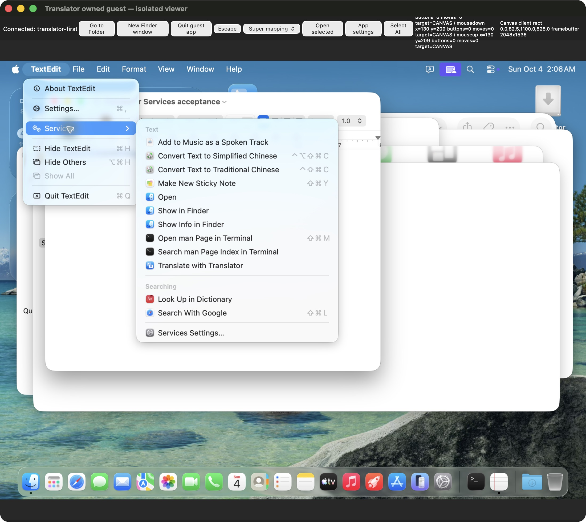

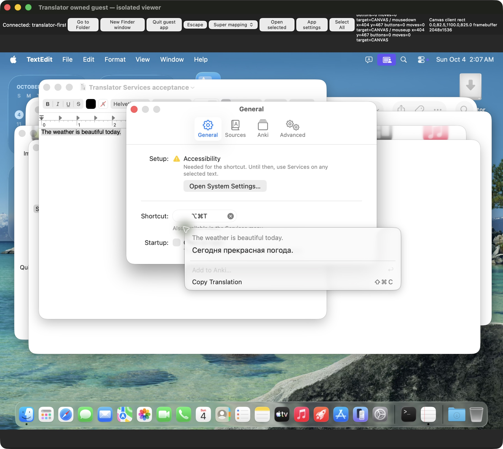

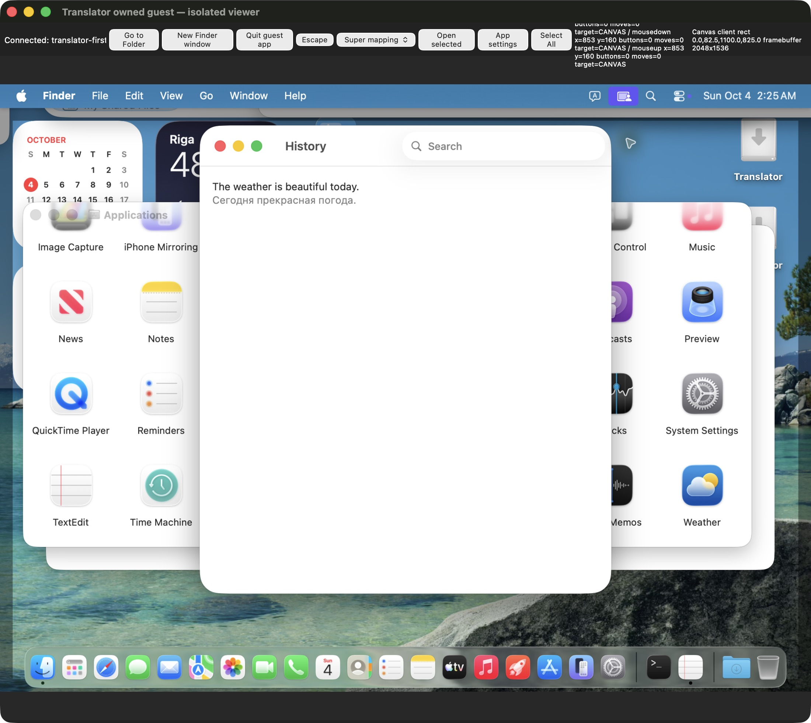

## G092 — current protected forge auth/remote/release read-only refresh

- Main повторно прочитал exact forge skill/protocol и использовал защищённый helper для remote/auth: current GitHub gorodtx/selection_translator_anki.git/HTTPS, accountgorodtx/userHTTP200. **API auth не доказывает actual push auth.** Credentials/variable values/raw env не читались и не выводились; helper не менял remote/account.
- [Текущая read-only API запись](/Users/den/Documents/dev/translator-evidence/2026-10-03/delivery/c248d6-current-remote-release-readiness.json): remote branch mac **c7ff962dbf8e1f44bf1022cc2dd0da95ca452a3a**, protectedfalse; all paginated releases прочитаны, latest code release **v0.2.8**, v0.3.0 release absent. Отдельный successful matching-refs query всех страниц подтверждает отсутствие exact v0.3.0 tag; release absence сам по себе не использовался для вывода о tag.
- Latest branch workflow [36465712814](https://github.com/gorodtx/selection_translator_anki/actions/runs/36465712814) completed/success **на HEADc7 28.09.2026**, не на текущем dirty sourcec248. 73 total runs — API count; query намеренно latest1, все73 logs не объявляются прочитанными. Source/workflow review подтверждает future tag notarize fail-closed inputs, но их реальное job presence не выводится из YAML; D05 user-confirmed Apple Program absent сохраняется.
- Mutations **NONE**: actual commit/push/tag/release отсутствуют, current proposal agreement pending. Эта проверка обнаружила no remote divergence/tag collision на указанное время; final delivery всё равно требует normal outgoing checks, protected actual push/remote SHA, current CI и скачанный public asset. Peer original image receipt `msg_148e49af021c` совпал со всеми тремя G091 SHA/bytes; Main visual/portable review не зависел от пересказа peer.

## G093 — P027 cross-review, retained capture identity и current docs gate PASS

- Main лично перечитал current EPIC-02 top/A02/A23 и полный P027 после peer `msg_36313cbbd927`. First genuine Services/translation/history0→1/recall/normal restart1→1 и offline pending совпали с собственными G087–G091; source488 RED сохранён. Только current A22 row ещё содержала stale first-model guest pending — Main сообщил точную cell peer `msg_f59fff3f6d28` в том же ходе. Historical P024 не переписывается, оформление/дизайн не менялись.
- Main лично прочитал original identity sidecars и receiver-cleanup record, **пересчитал FNV1a32 каждого original JPEG**:816371607/917960974/3305011850 совпали с retained CUA buffers и file values; SHA/bytes совпали с original/portable copies. [Aggregate G091 review дополнен exact identity SHA/FNV](/Users/den/Documents/dev/translator-evidence/2026-10-03/delivery/c248d6-guest-originals-and-restart-main-review.json), portable JSON получил размеры2200×1964 и явный independently verified match. Это data verification ранее лично просмотренных original screenshots, не новый capture/edit.
- Main выполнил [own текущий checker](/Users/den/Documents/dev/translator-evidence/2026-10-03/delivery/check_current_docs.py) через установленный gates.py.docs_check + literal absolute/relative existence: [stable before/after8-doc hash review](/Users/den/Documents/dev/translator-evidence/2026-10-03/delivery/20261004T023518Z-current-docs-installed-gate-review.json). **1900 targets/missing0/inputs stable/diff0 — PASS**. Scope до данной записи; URLs/anchors/content truth/visual этим не проверяются. Новые currentc248 portable links входят в scope; peer1893 относится к более раннему timestamp.
- Source tests не повторялись, actual Git delivery не выполнена. Peer готовит только внешний guest PF script; activation остаётся pending exact Main review, host network untouched. Custom-profile agreement по-прежнему pending; sourcec248/full322/mounted2 сохраняются без изменения.

## G094 — конкретный guest network script review: rollback contract RED до активации

- Main лично прочитал внешний initial script76211 и frozen [98a6 proposal](/Users/den/Documents/dev/translator-evidence/2026-10-03/distribution/continuation/vm-share/guest-pf-offline-98a6e8ac.py), **SHA98a6e8ac8cc2072f869d47ce6aecc9d200b966921b4c6479ae382b5448091917/10513bytes**. Compile без запуска main PASS. Guest-only identity/baseline digest, exact SSH/VNC-only no-state allows, inet/inet6 quick block, watchdog ready-before-load, 180s deadline и private owned enable receipt предусмотрены. Это proposal review, не PF execution.
- Найдены два конкретных требования до activation: wrapper отвергает normal successful release diagnostic; rollback/watchdog и post-restore snapshot требуют mutable Applications manifest, поэтому cleanup зависит от сохранности самого проверяемого продукта. Main отправил findings `msg_d1e4de9293ef`, затем independently measured contract RED `msg_0b53744c9008`, до user report. Peer immutable98a6 пока не разрешён для запуска; исправляется только внешний acceptance fixture, production source не меняется.
- [Own deterministic RED](/Users/den/Documents/dev/translator-evidence/2026-10-03/delivery/guest-pf-98a6-script-main-contract-red.json): mocked subprocess успешный exit0/ALTQ+pf disabled stderr вызвал **Unexpected PF diagnostic: pf disabled**. Actual PF/system state не менялись. Личное read-only strings системного Mac binary содержит эту строку и successful reference-release diagnostics; [primary upstream OpenBSD code](https://github.com/openbsd/src/blob/master/sbin/pfctl/pfctl.c) пишет successful disable message в stderr. Это supporting evidence; exact guest Apple -X ветка этим не исполнена и OpenBSD не выдаётся за текущий Darwin source. Два guessed Apple OSS URLs404/current network_cmds tree без pfctl сохранены как unsuccessful retrieval, не authoritative proof отсутствия Apple implementation.
- Нужны revised immutable SHA, narrow command-specific diagnostics handling и rollback без mutable app dependency, затем повторное read-only inspect/dry-run/contract checks и личное Main review. Owned reference/anchor только свои, чужие PF refs не трогать; no global disable/reload/flush и no host network changes. Offline gate остаётся OPEN; это обычное source review требование, не auto-review rejection или новый user permission request.

## G095 — revised network fixture contract GREEN, bounded guest-only run согласован Main

- Main лично прочитал **весь** revised immutable [798bb240 script](/Users/den/Documents/dev/translator-evidence/2026-10-03/distribution/continuation/vm-share/guest-pf-offline-798bb240.py), SHA **798bb240018ab4c88d7cb2c36311f4b9661303ecf126d689600484a7d28cb427/10894bytes**. Rollback/watchdog/status и post-rollback snapshot больше не требуют mutable app manifest; фиксированные darwin/home/UID501/IP guest guards остаются. Product source по-прежнему обязателен при inspect/activate; 180s ready-before-load watchdog и exact own -E/-X ref сохранены.
- [Own deterministic contract6 GREEN](/Users/den/Documents/dev/translator-evidence/2026-10-03/delivery/guest-pf-798b-script-main-contract-green.json): numeric -X successful diagnostic принят, тот же diagnostic на другой команде/нечисловом ref и unrelated stderr отвергнуты; rollback identity работает без manifest, activation identity всё ещё требует его. Все subprocess/identity values в этой проверке mocked; **host/guest PF не исполнялся Main**. Initial98a6 RED сохраняется, green не выдается за runtime rollback.
- Main лично прочитал [actual guest readonly inspect/dry-run](/Users/den/Documents/dev/translator-evidence/2026-10-03/distribution/continuation/20261004T024216.237905Z-guest-reviewed-cleanup-fix-readonly-inspect.log): exact guest script SHA, Disabled/0states/no skip/root+parent+nat digest **908ba66eb49dc5ca68d5f8cf52d7d968fc7b40316bdbef68bcf86bf15f0c7c8b**, rules syntax PASS. [Before network controls](/Users/den/Documents/dev/translator-evidence/2026-10-03/distribution/continuation/20261004T023924.121757Z-guest-network-before-v4-v6-controls.log): curl4 HTTPS200/23.12.156.37; curl6 HTTPS200/**IPv4-mapped ::ffff:23.12.156.37**. Поэтому native external IPv6 positive baseline остаётся UNKNOWN, несмотря на предусмотренные inet6 all rules.
- Main отдельным orchestration сообщением разрешил **один bounded A02 run** только reviewed immutable798b/exact own VM после visibly confirmed fresh selection и last-moment unchanged baseline. Нужны actual active-rule/counter/timestamp controls вокруг genuine Services, management alive, prompt rollback/Disabled/empty ownanchor/baseline digest/positive network recovery/watchdog exit. No host network/firewall/TCC/login/security, no global reload/flush/disable/proxy. Source consent после теста возвращается native UI. Это approval подготовленного reversible fixture в существующем пользовательском scope, **ещё не offline PASS**.

## G096 — approved run/input preparation и текущая A22 cell сверены

- Exact Main A02 approval **msg_88ebad178bb8/02:44:58 UTC** пересёкся с peer status `msg_f3b7b8dffea3/02:44:57`, который ещё ожидал разрешение. Main сообщил actual already-sent approval `msg_4934eb176db8`, не давал новую broader permission. Peer также отдельно выполнил шесть mocked fixture contracts GREEN/PFcommands0; Main не присваивает их как своё выполнение, own six G095 уже measured independently.
- Peer `msg_42b32a904466` сообщил: long/short WKWebView typeText и обычные keys оставляли terminal punctuation/Cyrillic character, cause UNKNOWN. Translator translation не вызывалась; это input infrastructure observation, не functional product FAIL и не разрешение менять host keyboard/TCC. Вместо нового adapter/proxy/clipboard/event injection согласован **data-only plain document fixture** и обычное Finder/TextEdit открытие через CUA.
- Main лично прочитал [собственный synthetic document fixture](</Users/den/Documents/dev/translator-evidence/2026-10-03/distribution/continuation/vm-share/Offline Services acceptance.txt>): **48bytes**, `The small blue bird is sitting near the window.` плюс newline. Это новая фраза, отличная от сохранённой weather entry; сама file existence не подтверждает выделение, перевод или offline. Перед активацией требуется visibly confirmed exact selection. Source/user data/host input preferences не менялись.
- Current A22 table line36 теперь содержит **first-model guest cold genuine Services nonempty PASS P027**, guest-wide/physical network loss отдельно pending. Это лично проверенное устранение stale boundary G093; исторический P024 сохранён. Guest PF run ещё не measured, никакой offline/public/Git PASS по этой подготовке не выставляется.

## G097 — actual fresh selection prerequisite и shared source freeze

- Peer `msg_8dc5a18018af`: normal My Shared Files → distribution navigation обновил Finder view, обычный double-click открыл48-byte bird document, native Edit → Select All visibly выделил **всё новое предложение**; enabled Services и original screenshot сохранены. Translate RPC/warmup не было. Final guest readonly inspect/dry-run сообщает798b/exact908/Disabled/zero states/no skip, activation0; следующий шаг — approved single bounded run. Execution peer, Main original selection screenshot пока не просмотрел; offline PASS не объявляет.
- Main заранее согласовал альтернативу fresh-word selection `msg_8935fb4a6844` только если существующий собственный English документ доступен: такая альтернатива **не понадобилась** после normal document opening. Ни новый input adapter, ни настройки клавиатуры не менялись; failures typed input G096 остаются infrastructure limitation, не defect переводчика.
- Main read-only shared Git checkpoint: HEAD всё ещёc7ff962, cached diff empty, c7 является ancestor HEAD; source digest точно **c248d674a64b71546d3766d508431ac9dcde995af75e9f294f5064e4020b73fd**, proposal SHA eff60c9 unchanged. Retained peer terminal operational status running подтверждён metadata-only чтением; tail/private content не выводился, running не считается task completion. Нового source тестирования/actual commit/push/release не было.

## G098 — genuine свежий перевод при guest internet deny: record review PASS, exact rollback RED сохранён

- Peer `msg_47c8910c5421` выполнил **единственную approved activation02:56:43** script798b/ownanchor/180s/watchdog2622. Main лично прочитал девять exact before/active/history/direct-IP/rollback/recovery/deadline records и независимо проверил12 assertions: [own record review](/Users/den/Documents/dev/translator-evidence/2026-10-03/delivery/c248d6-guest-offline-and-rollback-main-record-review.json). Execution — полноценная retained session; Main не запускал PF или GUI translation повторно.
- Before HTTPS200/history1; при активном PF curl4 и mapped6 DNS timeout28/HTTP000, отдельный **direct known Apple IP HTTPS** тоже timeout28. PF Enabled/zero states и exact inet/inet6 quick blocks зафиксированы **до и после** genuine Services action; inet4 blocked packets292→308, SSH/VNC pass counters положительны. Новая собственная фраза **The small blue bird is sitting near the window. → Маленькая голубая птичка сидит возле окна.**, history **1→2**, old weather entry exact unchanged. Это непустой fresh-text offline result, не History replay или API translate warmup. Original popup/selection пока не просмотрены Main; source consent before-restoration readback запросил `msg_f35d838c0313`.
- **Scope PASS: доступная IPv4 интернет-связь гостя действительно закрыта, OS broker не исключён PF правилами, свежий перевод работает, network recovery measured.** inet6 all rule присутствует/blocked packets0; native external IPv6 positive baseline UNKNOWN, mapped curl6 не выдаётся за native IPv6 runtime proof. Physical host disconnect/hardware shortcut этим не проверены.
- Manual rollback02:58:12 удалил own filter rules/освободил own ref, но **assert parent_anchors baseline FAIL**: ядро удержало пустое имя ownanchor. Main лично прочитал immediate read-only state: PF Disabled/zero states/own rules+children empty, root/nat/Apple leaves/interfaces неизменны, **единственная rules-digest delta — retained empty anchor name**, full actual621140a7 вместо baseline908ba66e. Следующий external4/mapped6 снова HTTPS200. Exact908 restoration/restored.json **не PASS**; новый source/app defect из этого fixture finding не выводится.
- Deadline watchdog после уже выполненного own-reference release повторил -X и exit1; positive readback03:00:15 доказывает2622 absent/PFDisabled/ownrulesempty. Это **не successful automatic rollback proof**. Main сообщил scoped cleanup path peer `msg_7e83f50f665e`: никакого global flush/reload/disable/secondactivation, сохранить RED, export originals/restore6 sources/normalQuit, затем exact own disposable VM disposal удаляет ephemeral kernel residual. VM cleanup ещё pending; весь эпик/общественный release не закрыты.

## G099 — original offline screenshots лично просмотрены, settings restoration независимо сверена

- Main лично открыл **оба original CUA JPEG в original resolution**, затем [own exact-copy/readback runner](/Users/den/Documents/dev/translator-evidence/2026-10-03/delivery/copy_offline_originals.py) пересчитал SHA/size/FNV и сверил peer identity: prerequisite **589034bytes/a42bed0a/FNV3222236325**, popup **567072bytes/01a24972/FNV3931998770**. Exact bytes перенесены в4 owned portable paths, без crop/reencode/edit. [Own review](/Users/den/Documents/dev/translator-evidence/2026-10-03/delivery/c248d6-guest-offline-originals-and-sources-main-review.json) — **PASS original copy + posttest restoration**, capture/guest actions выполнила retained session, не Main.
- На prerequisite frame enabled **Translate with Translator** читается, blue selection видна частично; меню закрывает полный текст. Полное предложение подтверждают отдельные synthetic file/history records G096/G098, а не этот frame. Старый5b80 DMG filename в Finder позади — fixture inventory; identity реально запущенногоc248 app зафиксирована runtime manifest/PID logs отдельно. На popup полностью читаются **The small blue bird is sitting near the window. → Маленькая голубая птичка сидит возле окна.**, Copy Translation доступна. Anki disabled соответствует guest без collection; General Accessibility needed/use Services/login unchecked сохранены. Existing native macOS стиль не менялся. Сам image не доказывает PF deny — это timestamped records G098.

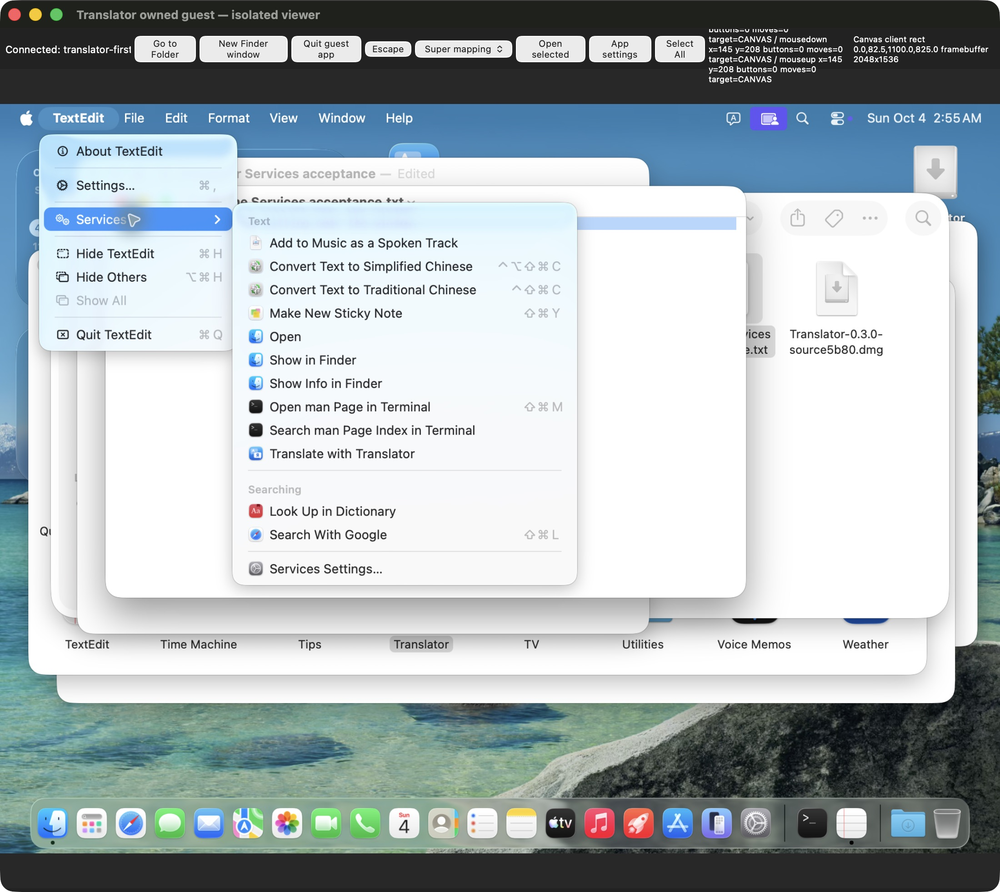

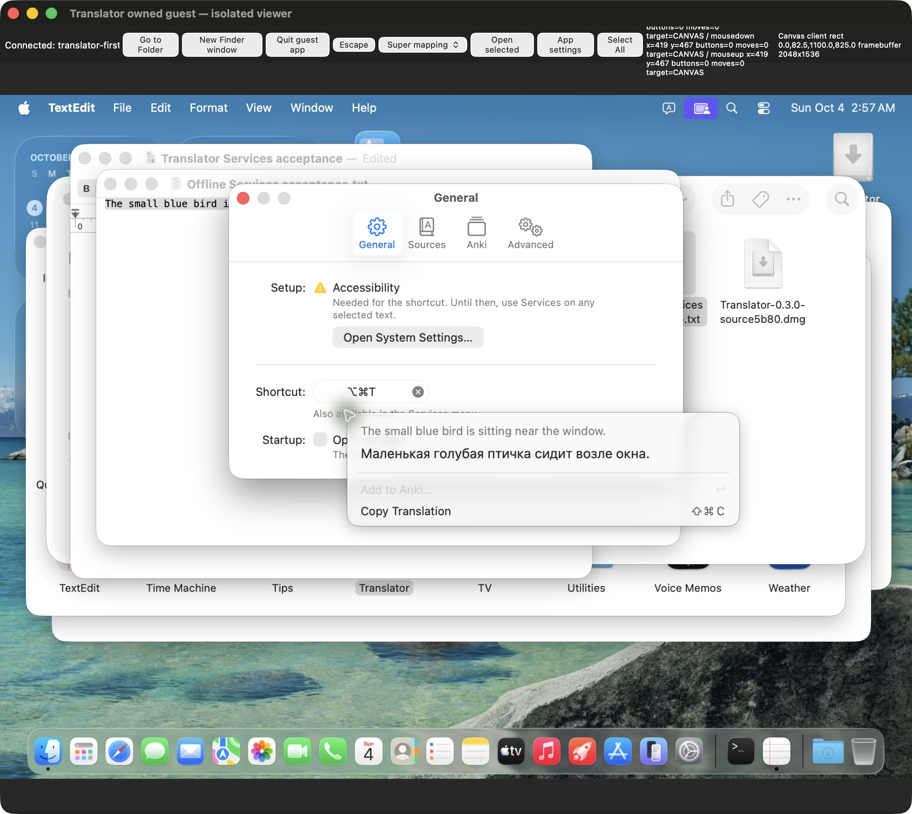

- Main лично прочитал [actual03:02:57 restoration readback](/Users/den/Documents/dev/translator-evidence/2026-10-03/distribution/continuation/20261004T030257.043917Z-guest-sources-ui-restoration-readback.log) и собственными assertions проверил **все6 sources true/ping.enabled match**, models installed/stalefalse, all3 DB ready/pendingbytes0 и **history2**. Это read-only запись **после** native UI возврата пяти чекбоксов; нового contemporaneous during-offline settings.get нет. Earlier Apple-only readback/pre-restore visual report отдельно, не переименованы в свежий RPC.
- Main лично прочитал [exact owned cleanup inventory](/Users/den/Documents/dev/translator-evidence/2026-10-03/distribution/continuation/p028-owned-cleanup-inventory.json) и направил peer `msg_078ae311bfe6`: только own viewer41159/proxy29288/SSHsocket/VM88749/named clone в own TART_HOME, обычный native Quit до disposal; shared public OCI/cache, immutable app/DMGs/logs/originals/Anki/host settings сохраняются. Inventory ещё **не cleanup execution proof**. Exact PF digest/watchdog RED G098 остаётся даже после будущего удаления ephemeral guest kernel.
- External10-group named commit plan дополнен4 original paths/A02 requirement; status теперь pending gate agreement/final delivery, A23 packaged acceptance выполнен G083/G085/G091. Ни actual commit/push/tag/release, ни всей задачи COMPLETE здесь не объявлено.

## G100 — независимая live проверка P028 cleanup PASS, прежние PF RED сохранены

- Main лично прочитал P028 report, normal guest tray Quit и host viewer/proxy/master/VM stop/delete records: guest2085/2087/2088/watchdog2622/socket отсутствуют, zero PF enable references; normal viewer close/PTY0, exactproxy SIGTERM/PTY0, own master exit0, vendor exact stop0/Runningfalse/PID88749 absent, exact named disposable clone delete0. Исполнение — peer; отчёт без самостоятельной live сверки не был объявлен Main собственным PASS.
- [Own read-only runner](/Users/den/Documents/dev/translator-evidence/2026-10-03/delivery/check_p028_owned_cleanup.py) после disposal независимо проверил **8 exact own host PIDs absent**, loopback18749 listener/socket/clone absent, own host mounts0; vendor list положительно показывает **2 retained public OCI cache records**, pin e12d678b совпадает. Host user native69352/engine69342/helper69367 **живы с ожидаемыми executable/PPID**, не завершались. [Own review](/Users/den/Documents/dev/translator-evidence/2026-10-03/delivery/p028-main-independent-owned-cleanup-review.json): **PASS owned disposal/evidence preservation**; чужие процессы/host state не менялись.
- Main заново hash-проверил immutable current DMG662cbf64, оба original offline JPEG, все4 sanitized baseline/state/watchdog metadata/log против сохранённых guest SHA. Private enable-output/reference в export отсутствуют; source app/manifest/evidence/public cache/спорные Anki данные сохранены. Guestkernel/его mounts/emptyanchor уничтожены disposal; повтор current guest PF state после удаления не заявляется и historical full-digest/watchdog **FAIL остаётся FAIL**.
- Первый собственный runner остановился на неверном vendor `tart list --json`: [точная checker failure](/Users/den/Documents/dev/translator-evidence/2026-10-03/delivery/p028-main-cleanup-initial-command-failure.json). Main лично прочитал `list --help`, исправил на **--format json**, полный исправленный runner exit0. Это ошибка measurement command, не дефект Translator и не успешный первый запуск. Нового source/PF/GUI теста, actual Git delivery или whole-epic COMPLETE не было.

## G101 — current release draft и полный named commit plan после offline приёмки

- Main обновил только внешний [Russian release draft](/Users/den/Documents/dev/translator-evidence/2026-10-03/delivery/RELEASE-NOTES-v0.3.0.md): currentServices/menu/history1→1, fresh guest-wide IPv4 deny/history1→2, personally viewed originals и независимо measured own cleanup теперь отражены; прежние pending assertions перестали описывать текущий результат. [Полный draft до этого изменения](/Users/den/Documents/dev/translator-evidence/2026-10-03/delivery/RELEASE-NOTES-v0.3.0-before-offline-20261004T031800Z.md) сохранён. Native IPv6/physical/spoken VoiceOver/current Anki/public Gatekeeper остаются отдельными UNKNOWN/BLOCKED; historical PF digest/watchdog RED явно сохранены. Это подготовленный prerelease текст, **не publication**.
- [Own read-only exact coverage runner](/Users/den/Documents/dev/translator-evidence/2026-10-03/delivery/check_c248_offline_delivery_plan.py), [review/draft SHA](/Users/den/Documents/dev/translator-evidence/2026-10-03/delivery/c248d6-offline-current-logical-plan-and-draft-review.json): **90 current changed/untracked paths +3 proposed gate paths =93 named paths/10 coherent commits**, unmapped0/duplicates0. Каждый файл принадлежит одной группе; proposed3 ещё отсутствуют в repo. HEADc7/mac/indexempty/ancestor/sourcec248/proposal eff60c9 до/после совпали. Это plan validation, не actual staged tree/hook execution/Git delivery.
- Retained peer `msg_8628575bc1bf` передала [P028 final doc freeze](/Users/den/Documents/dev/translator-evidence/2026-10-03/distribution/continuation/p028-final-doc-freeze.json):5 exact consolidated docs + report83619bef, journal mutable до finalhandoff. Main лично перечитал current EPIC top/A02/A22/P028/portable links и report; они сходятся с G098–G100. Full322/native169/helper17 не повторяются без source change. Global policy owner agreement на concrete gate profile всё ещё pending; elapsed time/prepare/peer completion не заменяют его. Epic2 IN_PROGRESS; вторая полноценная сессия retained, новая subagent не создана.

## G102 — итоговая текущая documentation gate и peer freeze независимо проверены

- Main независимо hash-сверил **все5 frozen consolidated docs и P028 report** с handed-back manifest: [own exact-byte review](/Users/den/Documents/dev/translator-evidence/2026-10-03/delivery/p028-main-doc-freeze-byte-review.json), PASS. Root progress и peer journal не объявлены immutable; manifest ограничен указанными5 файлами. Это не новый runtime/CI/source gate.
- Main выполнил installed `gates.py.docs_check` + own literal absolute/relative existence на8 MD после G099–G101/portable4/P028: [03:20:52 UTC review](/Users/den/Documents/dev/translator-evidence/2026-10-03/delivery/20261004T032052Z-current-docs-installed-gate-review.json), **2132 targets/missing0/inputs before-after stable/gitdiffcheck0 PASS**. Gate stamp относится к inputs **до** этой записи; URL/anchors/visual/content truth им не проверяются. Current direct links данной записи указывают на уже существующие saved records. Peer2120 относится к его раннему stamp, не присваивается Main.
- Вся доступная P028 сеть/визуальные originals/settings/normalQuit/own cleanup приёмка сверена двумя полноценными сессиями, результаты/провалы накапливаются. Main не запускает второй PF run, не повторяет unchanged source322 и не обходит Git gates. Для delivery нужен конкретный ответ на prepared owner-profile request; для полного epic остаются действующие public D05/physical/A08/A16 boundaries. Ни automatic agent continuation, ни retained session не заменяют отсутствующий Apple Developer Program, live пользовательское наблюдение или agreement. Работа не помечена выполненной.

## G103 — готовый Git профиль представлен владельцу после concrete local review

- Main повторно предъявил **тот же unchanged eff60c9 профиль** через async user question после готовых10 logical groups/current93-path map/actual full source gates/current guest acceptance/owned cleanup/doc reconciliation. Это exact profile agreement, **не повтор general commit/push/release permission**. Показаны concrete commit Ruff/format/strictmypy/Swiftbuild и push fullpytest/native tests; legacy format допускается только при exact unchanged SHA, changed/new никогда не исключаются.
- Источник обязательного agreement — [local shared Git policy, строка67](/Users/den/.config/agent-access/git-gates/README.md:67), **«Custom profiles require owner/user agreement for their real gates.»** Это явное правило policy, не автоматически придуманный риск или требование наличия Apple Program для любых локальных коммитов. Prepared profile/preflight3 files готовы к normal named staging после ответа; actual profile application/commit/push/tag/release **ещё отсутствуют**, pending/elapsed time не трактуется как согласие.
- Требования Apple DeveloperID/notarization и user-dependent hardware/VoiceOver/Anki остаются отдельными scope boundaries; согласование Git profile не закрывает их. Эпик2 сохраняет IN_PROGRESS, retained полноценная Distribution session доступна; новых агентов для обхода owner agreement или внешнего blocker не создаётся.

## G104 — порядок remote delivery сверён с actual workflow, permission остаётся pending

- Main перечитал current forge SKILL + полный protocol и **все current workflow job sections**; единственный workflow file — macos.yml. Это local source read, **не новая GitHub API/auth/store/job-env проверка**. Secret references/names в YAML не являются значениями или доказательством effective env; raw credentials/`.env` не читались. Измеренный remote stamp G092 остаётся своим временем **02:30–02:32 UTC**, не выдаётся за live GitHub состояние03:26.
- Branch gates/build/runtime/seal/packaging передают artifacts через upload-artifact; **workflow сам не создаёт GitHub Release**. Publish/download/remote SHA/CI должны выполняться и проверяться Main отдельными реальными операциями после actual commits/push. Tag notarize требует всех6 signing inputs и explicit Apple Accepted; неполный набор завершает job error. Это source-level fail-closed контракт, не текущий runtime secret inventory или CI verdict. Local ad-hoc prerelease не закрывает D05 и не должен изображать весь tag workflow/public install зелёным.
- После G103 query фактического owner ответа пока нет. Exact93 named-path/10-group plan, approved scope commit/push/release и previous checks сохранены; prepared3 files всё ещё не применены, normal Git gates не обходятся. Main `git diff --check`0 после G103 подтверждён; эта новая запись не объявляется self-verified предыдущим doc gate. Незавершённые gates/объём эпика сохранены для продолжения, завершение приложения/публикация не заявлены.

## G105 — пользователь разрешил профиль/доставку; pinned DB release повторно проверен без скачивания

- Пользователь04.10 прямо ответил «я разрешаю всё», попросил продолжить обеими полноценными сессиями, дать быстрые факты о cleanup/release и ограничил **общий расход40% daily usage**. Это принимается как согласование предъявленного exact eff60c9 Git profile плюс ранее разрешённой доставки; вопрос G103 закрыт, новых разрешений на commit/push не требуется. Prepared3 files перенесены exact bytes в repo, индекс пока пуст; Root запускает normal named commits. Новых subagents/VM/fullGUI waves нет. Peer retained terminal positively connected/idle и получил один prompt с `input_accepted/turn_started`, повтор старого Dispatch не выполняется.
- Main лично прочитал build_db_bundle_assets.sh/build_release_assets.sh/release_preflight.sh/release_metadata.py. `rg --files` первоначально не показывал часть dev scripts из-за ignore rules; actual `git ls-files` + directory inventory подтвердили, что все7 tracked dev files существуют. Missing-file defect не объявляется. **build_release_assets.sh строит code-only Linux archives и использует lock; release_preflight.sh всегда повторно копирует/хеширует3 DB**. Для текущего Mac release используется native builder/DMG packaging и уже pinned bundle, old DB preflight не вызывается.
- [Own current remote verification](/Users/den/Documents/dev/translator-evidence/2026-10-03/delivery/20261004-current-existing-db-release-review.json)08:03:48UTC: опубликованный [db-a6f07d1e1c28](https://github.com/gorodtx/selection_translator_anki/releases/tag/db-a6f07d1e1c28) содержит все3 точных size/GitHub SHA256 и manifest256bytes/tag hash. **1,896,546,304bytes повторно используются; DB downloaded/built/uploaded0**. Это API asset metadata match, не повтор личного хеша загруженных SQLite. API auth accountgorodtx/user200 и remote mac/c7 подтверждены отдельно; push auth ещё не actual delivery. `git ls-files` SQLite/DMG/ZIP/tar.gz —0, базы в Git не входят. History remote v0.2.6–.8 code-only, ранниеv0.2.0/.1/.4/.5 имели DB assets — факты не смешаны.
- Peer `msg_c5c88f716035` приняла bounded P029: быстрый статус, own disk inventory/cleanup proposal, independent reuse audit, cumulative docs. Root сообщил exact ownership/index/delivery; docs10-я группа ждёт peer freeze. Daily-usage rate metric в доступных tools/local session-tail не найден, поэтому точный remaining/delta не выдуман; UI процент/окно уточнены async. Работа ограничена необходимыми checks/cleanup/Git hooks, без повторения unchanged322/fullmodel/download.

## G106 —9 normal commits PASS, A24 meaningful RED→GREEN и проверенный disk cleanup

- Root самостоятельно выполнил9 exact named logical commits с global pre-commit/commit-msg без bypass: [actual paths/SHAs/exits/times](/Users/den/Documents/dev/translator-evidence/2026-10-03/delivery/actual-first-nine-logical-commits.json), полные logs actual-commit-01…09 сохранены рядом. HEAD **d6e89eecbb85**, parents линейны, index после каждой операции пуст. First hook реально проверилRuff/format/strict107+обаSwiftreleasebuild; native group5/packaging6/snapshot9 также прошли соответствующие build gates. **Локальные коммиты — PASS; push/CI/release пока не выполнены.**
- Peer source finding в legacy preflight подтверждён: повторное копирование/хеширование DB и отсутствующий size в generated metadata против current size-bearing lock. Root создал actual regression **8FAIL/3PASS**, включая forbidden DB builder sentinelexit99 и KeyError:size; [RED](/Users/den/Documents/dev/translator-evidence/2026-10-03/delivery/a24-release-preflight-contract-red.log). Затем исправил owned dev metadata/preflight/docs/tests: default tiny published-asset validation, explicit --build-db, portable checksum CLI, generated size fields. **Final13 targeted PASS/2.71s**, Ruff/format/strict3/bash PASS; [own review](/Users/den/Documents/dev/translator-evidence/2026-10-03/delivery/a24-targeted-review.json). Missing/digest/size/tag/draft и unreadable API/mismatch fail до code build; local SQLite вообще не требуются code-only тесту. Actual public pinned CLI PASS, базовые DB bytes/download/upload не изменялись. Product digest **c248 unchanged**; full322 не повторялся, новая fullsuite остаётся mandatory push gate.
- Peer inventory измерил distribution **29,153,968,128 allocatedbytes**, own VM OCI **27,648,626,688**. Root лично прочитал inventory/result и сделал live `du`: VMhome **0**, current distribution около1.51GB — сходится с [own cache cleanup result](/Users/den/Documents/dev/translator-evidence/2026-10-03/distribution/continuation/p029-cache-cleanup-result.json). Это опровергает трактовку прежнего process/clone cleanup как полной очистки диска. Exact own stopped OCI cache удалён по user latest+Root concrete approval, pin/config/metadata retained. Наблюдаемый filesystem available delta27,964,006,400 не выдаётся за exclusive APFS reclaim.
- Root лично прочитал [11-path cleanup proposal](/Users/den/Documents/dev/translator-evidence/2026-10-03/distribution/continuation/p029-cleanup-proposal.json) и разрешил точные oldpurebuild/Tart/archive/shareduplicates: ещё~515MBallocated; retain canonicalDMGs/currentapp/logs/JPEG/profilefixtures/Anki. Найден единственный literal manifest link в oldproviderbuild: сохраняется exact small manifest leaf. Remaining cleanup execution/doc freeze ещё pending. Пользователю подготовлен [Russian interim fact report](/Users/den/Documents/dev/translator-evidence/2026-10-03/delivery/USER-STATUS-20261004.md); работа продолжается, dailybudget40% сохраняется, источник счётчика UNKNOWN.

## G107 — финальный A24 normal-hook commit, durable14 GREEN и независимая проверка cleanup

- Root normal hooks выполнили coherent unpublished A24 amendment: **a7650ba5e44eaf72e1488f2035a8e6dd2c3c1b05**,5 exact named paths. Ruff/format129+15 unchanged legacy/strict108 PASS; это десятый actual local commit, не push/CI/publication. Original0ae и GREEN13 остаются dated intermediate evidence; они не объявлены текущим HEAD/final result.
- Последний tag-only дефект также исправлен: explicit --build-db publication instructions не меняют actual asset-verification result из-за одного remote tag. Corrected harness воспроизвёл [meaningful RED1](/Users/den/Documents/dev/translator-evidence/2026-10-03/delivery/a24-unverified-tag-contract-red.log); ранний harness с --help выходил до проверки функции и является measurement error. [Durable final actual14 PASS/2.40s](/Users/den/Documents/dev/translator-evidence/2026-10-03/delivery/a24-final-targeted-green.log), [cumulative review](/Users/den/Documents/dev/translator-evidence/2026-10-03/delivery/a24-targeted-review.json). Productionc248 unchanged; новый fullsuite измеряется только mandatory push gate.
- Root лично прочитал final peer9-app/11-entry cleanup records и независимо проверил все20 exact entries:19 отсутствуют, один literal-linked manifest714bytes/SHA сохранён. [Live own review](/Users/den/Documents/dev/translator-evidence/2026-10-03/delivery/p029-main-live-cleanup-review.json): distribution425556KiB (~435.8MB на Root timestamp), own VMhome0; canonicalc248DMG SHA662cbf unchanged; userhost69352/69342/69367 positively alive. Peer final08:24:40 snapshot435,273,728allocated и initial29,153,968,128 дают net reduction28,718,694,400allocated; это не exclusive APFS reclaimed bytes. Логи/RED/JPEG/profiles/Anki retained; два exact own A24 temporary fixture dirs удалены после сохранения логов.
- Root отправил crossed-report reconciliation msg_16b5b541e3f2 retained fullsession: только final14/amendedSHA/current top/A24 wording, без нового теста/cleanup/VM. После final owned-doc freeze Root проверит ссылки и выполнит final documentation commit, actual committed build и protected remote delivery. Незакрытые D05/physical/heard VoiceOver/exact synced Anki не заменяются receipts или fullsuite.

## G108 — final documentation staging scope и remote readiness сверены

- Root exact pending map: **33paths/33planned**, unmapped0/missing0/indexempty; sourceHEADa765/mac unchanged. [Installed current8-doc gate](/Users/den/Documents/dev/translator-evidence/2026-10-03/delivery/20261004T083928Z-current-docs-installed-gate-review.json):2248literal targets/missing0/stable/diff0 PASS; относится к stamp08:39:28 до final peer append. Native/source fulltests не повторялись. Root final docs commit ждёт только retained-session small reconciliation freeze; actual freshprompt32bb480a stagesinputaccepted/turnstarted, новая сессия не создана.
- Forge remote/auth08:36 accountgorodtx/user200/HTTPS target сверены; это APIauth, не push. Exact remotev0.3.0tag query08:39 returned[]; latest macCI36465712814/c7completed-success относится к старой базе и не объявляется CI новых10commits. Credentials/rawenv не читались/не выводились.
- Дополнительный bounded own evidence-tree du: Rootdelivery1228KiB, существенных leftover build/cache там нет; Anki339932KiB остаётся disputed сохранённым scope, не удаляется. Root verified20cleanup paths/hostPIDs/canonicalDMG уже записаны G107; эта запись не утверждает полную очистку всего пользовательского Mac. Final committed build/normal push/CI/publication/download выполняются последовательно.

## G109 — final five-doc handoff independently matched; normal documentation commit начинается

- Peer msg_0fbf4851db50 завершила только small A24reconciliation: source final logic/actual durable14GREEN и meaningful tagRED прочитаны, без rerun. Root независимо совпадением exactSHA всех5docs подтвердил [finalfreeze](/Users/den/Documents/dev/translator-evidence/2026-10-03/delivery/p029-main-final-five-doc-freeze-review.json). Peer edits stopped, shared files/index переходят Root; dated13/0ae и PF/watchdogRED сохранены. Existing public/physical/exactAnki blockers не сняты.
- После final links gate Root поимённо коммитит33 documentation/evidence paths обычными hooks, затем единожды строит committed revision0.3.0 и verifies runtime/package. Gitpush/tag/release по-прежнему ещё не выполнены на stampэтой записи; результаты будут дописаны после реальных операций.

- Own documentation runner initially stopped after named staging, before commit/hooks: its NUL-delimited list retained one empty terminal item. Actual33 named staged paths were correct. Parser fixed by discarding empty item; existing index accepted only if exactly the same33 owned paths. No unstaging/reset/bypass/foreign staging performed; normal commit retry follows.

## G110 — actual committed artifact/branch delivery и новые measured CI/helper findings

- Finaldocumentation15f7665normalhookPASS; [actual11](/Users/den/Documents/dev/translator-evidence/2026-10-03/delivery/actual-commit-11-docs.json). [Build293/revision15f/sourcec248/DMG25,229,245bytes/ec77](/Users/den/Documents/dev/translator-evidence/2026-10-03/delivery/final-artifact-review.json), [actual native/shell runtime2/2, seal0, owncleanup](/Users/den/Documents/dev/translator-evidence/2026-10-03/delivery/final-bundle-runtime.json) и [own proof read](/Users/den/Documents/dev/translator-evidence/2026-10-03/delivery/final-artifact-own-proof-read.json) PASS. [Actual code-onlypreflight](/Users/den/Documents/dev/translator-evidence/2026-10-03/delivery/actual-code-only-preflight.log) verifiedexistingDB/noSQLitecopied/5smallLinuxassetsPASS. Printed oldgnomeinstructions не исполнялись; Rootdelivery explicitmac.
- Первыйprotectedpush timedout90s/remoteunchangedFAIL сохранён [before-fixreceipt](/Users/den/Documents/dev/translator-evidence/2026-10-03/delivery/actual-branch-push-review-before-helper-fix.json). [Helper scopedfix](/Users/den/Documents/dev/translator-evidence/2026-10-03/delivery/protected-helper-release-fix-review.json):push900/read90/explicitnonforce tags,4new+23existing/Ruff/formatPASS, trust/hooks/credentials unchanged. BoundedPreToolUse отклонил combined reportcommand по literalphrase в JSONtext; фактическое shell исполнение не было, затем reportwrite отделён от protectedhelperoperation без bypass.
- [Actual protectedretry](/Users/den/Documents/dev/translator-evidence/2026-10-03/delivery/actual-branch-push-review.json)386.32s/dry0/actual0/verifiedremote15fPASS; finalappsealпослеgates0. Raw fullteststdout helper подавляет, новые localcounts не выдумываются. Actual [CI37190551447](https://github.com/gorodtx/selection_translator_anki/actions/runs/37190551447):Linux/helpergreen, PythonmacOSgate322PASS/3SKIP/7errors120.13s; [joblog](/Users/den/Documents/dev/translator-evidence/2026-10-03/delivery/branch-ci-gate-full.log) устанавливаетSwift6.1vsrequired6.2 cause. NativeIPCcases не скрываются skip: gatehostmacos26 + explicitSDKprecheck исправлены, [meaningfulRED1](/Users/den/Documents/dev/translator-evidence/2026-10-03/delivery/ci-native-toolchain-contract-red.log)→[20targetedGREEN](/Users/den/Documents/dev/translator-evidence/2026-10-03/delivery/ci-native-toolchain-contract-green.log)/Ruff/formatPASS. Remote correction ещё pending.
- Root сообщил finding и exact5-path ownership peer msg_932f4bb9d6dc после её frozenhandoff; peeredit/VM/testwave не запускаются. A25 и helperknowledge дописаны epic; existingRED сохраняются. Correctivecommit/newcommittedidentity необходимы перед publication, tag/release ещё отсутствуют.
